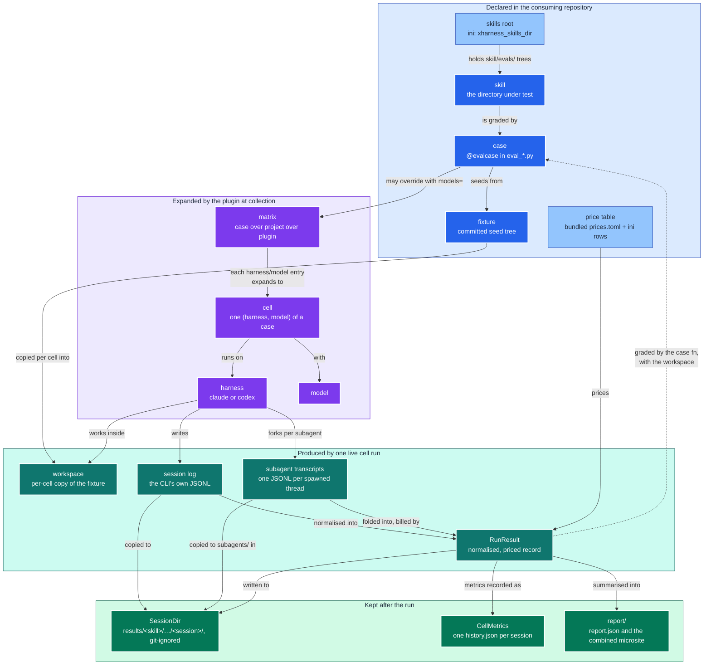

# Architecture: how a graded verdict stays tied to a real run

The hard problem in this plugin is not orchestration but evidence. A harness that
grades the wrong transcript, or an empty one, produces the same green output as one
that works. Every design choice below exists to make that silent failure impossible,
for two CLIs whose session-log identity mechanisms differ at the root.

This page explains the design. For commands see [README.md](README.md); for the
decisions as records see [docs/adrs/](docs/adrs/README.md).

## The pipeline in one picture

```mermaid
flowchart LR
    CASE["eval_*.py case"]
    PLUG["plugin.py<br/>collect, expand matrix"]
    WS["workspace.py<br/>pristine copy"]
    RUN["harness/<br/>ClaudeHarness | CodexHarness"]
    LOG["session log<br/>this run's own"]
    NORM["SessionLog.to_result<br/>RunResult"]
    PRICE["pipeline.derive<br/>price, coverage, case"]
    GRADE["case assertions"]
    REP["report.json"]

    CASE --> PLUG --> WS --> RUN --> LOG --> NORM --> PRICE --> GRADE --> REP

    classDef new fill:#7c3aed,color:#fff
    classDef data fill:#0f766e,color:#fff
    classDef good fill:#047857,color:#fff
    class CASE,PLUG,WS,RUN new
    class LOG,NORM data
    class PRICE,GRADE,REP good
```

One cell flows left to right: a case is expanded into cells, each cell gets a fresh
workspace, the harness runs its CLI, its own log is located and folded into a
`RunResult`, then priced, graded, and reported.

Everything from the `RunResult` rightwards is `pipeline.py`, and a replay
(`python -m pytest_xharness_eval.replay`) rejoins the same flow at the session log
rather than repeating it -- one sequence, two entry points (ADR 0034).

Detailed flow, including the two capture contracts

The Claude branch derives the log path before the process starts. The Codex branch
makes only one log possible. Both end in the same `RunResult`.

## Two CLIs, two capture contracts

The two CLIs give the harness different levers, so the correlation between a run and
its log is established in two different ways.

| Concern | Claude (`claude` 2.1.237) | Codex (`codex` 0.148.0) |
|---------|---------------------------|-------------------------|
| Headless invocation | `claude -p --output-format json` | `codex exec --json` |
| Log location | `~/.claude/projects/<cwd-slug>/<session-id>.jsonl` | `$CODEX_HOME/sessions/YYYY/MM/DD/rollout-<ts>-<id>.jsonl` |
| Caller-chosen id | `--session-id <uuid>` | none |
| Correlation contract | derive the path from the UUID the harness minted | point `CODEX_HOME` at a private directory so exactly one rollout can exist |
| Cost in output | `total_cost_usd` on stdout, absent from the log | absent everywhere |
| Token accounting | per assistant message `usage` block, repeated on every content-block record of that message | one `token_count` event per model call: `last_token_usage` for the call, `total_token_usage` cumulative |
| Cache-write TTL | `usage.cache_creation.ephemeral_1h_input_tokens` / `ephemeral_5m_input_tokens` | not billed |

Two facts were learned from live runs and are encoded in `harness/claude.py` and
`harness/codex.py`, each beside the dialect it belongs to. First, Claude's cwd slug replaces every non-alphanumeric character
with `-`, including underscores. Second, Codex's `input_tokens` already includes
`cached_input_tokens`, so the cached share is subtracted before pricing.

The Codex contract carries an accepted risk: `CODEX_HOME` is also where Codex keeps
its credentials, so the private directory is seeded with `auth.json` and
`.credentials.json` before the run (ADR 0005).

## Isolation keeps the score about the skill

If the developer's own user-level skills or `CLAUDE.md` answer the prompt, the score
describes the developer's machine, not the skill under test. Each adapter therefore
scopes ambient configuration out and the skill under test in.

| Lever | Claude | Codex |
|-------|--------|-------|
| Ambient settings off | `--setting-sources ""` | `--ignore-user-config` |
| Working directory | process cwd, plus `--add-dir` | `-C <workspace>` |
| Skill under test in | `--add-dir <skill dir>` | copied to `$CODEX_HOME/skills/<skill>` |
| Permissions | `--permission-mode bypassPermissions` | `--sandbox workspace-write` |

The workspace itself is a plain copy of the fixture tree under the work directory,
discarded and rebuilt for every cell. No git repository is created, which puts
git-dependent skills out of scope for now (ADR 0004).

## Paths come from the rootdir, not from the package

The plugin is installed, so nothing about the consuming repository can be derived
from `__file__`. Three locations are ini keys resolved against pytest's `rootpath`:
the skills root, the work directory, and an optional price override file (ADR 0014).
The matrix follows the same shape: a project sets `xharness_matrix` once, a case may
override it with `models=`, and the plugin's bundled default is the floor (ADR 0015).

The consequence worth knowing: pytest picks the rootdir from the first config file it
finds walking up from the arguments. A repository with no `[tool.pytest.ini_options]`
table gets a rootdir equal to the common ancestor of the arguments, which for
`pytest skills/x/evals` is the `evals/` directory itself, and no cell is collected.
The report header names the resolved skills root and marks it `(missing)` so this is
visible on the first line of output.

## Pricing is the plugin's job, not the CLI's

Neither session log carries cost. Claude reports `total_cost_usd` on its stdout
envelope; Codex reports nothing. The plugin therefore prices every run itself from
its bundled `prices.toml`, layered with the project's `xharness_prices` ini rows, using
four rates per model: input, output, cache read, and cache write.

Keeping the cache tiers separate matters. In the reference Codex run, 174,336 of
202,639 tokens were cache reads. Priced flat at the input rate the run would report
about USD 0.25; priced by tier it reports USD 0.07. The `Usage` dataclass keeps the
tiers apart for that reason.

Claude's own `total_cost_usd` serves as a reconciliation oracle. In the reference
run it read USD 0.91 against the table's USD 0.76; the gap is the one-hour cache
write premium the table does not yet model. Treat absolute figures as approximate
and relative comparison across cells as robust.

An unpriced model stops the sweep at collection, before any money is spent
(ADR 0007). The `--dry-run` option exercises the same check without a CLI.

## Grading is not prescribed

The plugin does not decide what a correct run looks like. A case is an ordinary
Python function that receives the `RunResult` and the workspace, and composes
whatever checks it needs with plain `assert`. The reference case grades in three
layers: the run is real evidence, the run is priced, the skill did its job. For the
annotated version read `eval_palette_mandate.py`, the reference case kept beside the
skill it grades in the consuming repository.

One invariant holds regardless of how a case grades: a check that cannot evaluate
raises, it never passes. A grader that cannot fail produces a permanently green suite
that proves nothing.

## Vocabulary

| Term | Meaning |
|------|---------|
| case | One `@evalcase` function in an `eval_*.py` module: a prompt, a skill, a fixture, a matrix |
| cell | One (harness, model) pair of a case; the unit pytest collects, runs, and reports |
| harness | The agent CLI a cell runs on, `claude` or `codex`; the first half of a cell id |
| matrix | The list of `harness/model` entries a case expands into cells; three scopes, case over project over plugin; `--harness`, `--model`, and `-k` narrow it |
| skills root | The directory under the rootdir holding `<skill>/evals/` trees; ini key `xharness_skills_dir` |
| fixture | A committed seed directory under `evals/fixtures/<name>/` that a workspace is copied from; several cases may share one |
| workspace | The per-cell copy of the fixture under the work directory that the agent works in |
| session log | The JSONL file the CLI writes for one session; the evidence a verdict is tied to |
| Harness | The class behind a harness name: how its CLI is invoked, how its log correlates back to the run, how its records classify, and what its shell tools mean for coverage. `harness.get(name)` is the only way to reach one; an unregistered name raises rather than defaulting (ADR 0034) |
| SessionLog | One captured session in a provider's dialect *plus the side-channel that dialect needs* -- Claude's stdout envelope, Codex's exit code -- so every caller gets one uniform `to_result` (ADR 0034) |
| RunResult | The normalised record of one cell: identity, usage, tool calls, files written, cost. `RunResult.folded(calls, subagents, ...)` is the one constructor an adapter builds one through, so `turns` and `usage` are derived from the ledgers rather than supplied (ADR 0035) |
| Usage | Token counts normalised across both dialects and kept apart by billed tier, for one call, one subagent, or a whole run. Frozen: a total accumulates only by producing a new total (`+`, `Usage.total`), so "a run's usage is its whole bill -- the primary ledger plus every subagent" is an invariant of the type rather than a rule the caller has to remember, and a second fold cannot bill a subagent twice (ADR 0033, ADR 0035) |
| CaseRef | The case a result names -- suite, name, skill, fixture, prompt -- as one type for the live cell and both replay paths, which used to hand-build the record three times; the `case` block of `result.json` (ADR 0025, ADR 0035) |
| CostEstimate, AppliedRates | What one run costs under one price row: `CostEstimate.of(usage, rates)` is the total, the per-tier split and the provenance, and `RunResult.apply_cost` writes all of it in one call, so the four cost fields are never written apart. `AppliedRates` is the `Rates` row plus the `applied_at` stamp, and is the `rates_applied` block of `result.json` (ADR 0021, ADR 0035) |
| CostStatus | `priced` or `unpriced`, with no third state (ADR 0007); a `StrEnum`, so the wire format carries the same bare word it always has (ADR 0035) |
| pipeline | The single sequence run over a `RunResult` by both a live cell and a replay: derive (price, coverage, case), capture (log, subagents, result), record metrics; `pipeline.py` (ADR 0034) |
| settings | One resolved view of a project's configuration, built either from the live `pytest.Config` or, for a replay, from the pytest config on disk; `settings.py` (ADR 0034) |
| CacheLayout, SessionDir | The cache tree as a value object, and one session's evidence directory within it. `CacheLayout` owns `build/`, `results/`, `report/`, every file name under them and the five-level `sessions()` walk; `SessionDir` owns `log.jsonl`, `result.json`, `history.json` and `subagents/`, and the relative link the page fetches them by. `Settings.cache` is a `CacheLayout`, so nothing reassembles a path under the cache root (ADR 0032, ADR 0037) |
| captured | `<cache>/results/{skill}/{harness}/{model}/{run}/{session}/`, where each run's log, `RunResult` and metrics record are written; git-ignored (ADR 0032) |
| CellMetrics, Outcome | One graded cell's metrics record -- the `history.json` written beside its evidence and one line of the combined `report/history.jsonl` -- as a type: flat, built of builtins, and carrying `status_word()` and its own `cache` field. `Outcome` is the four values grading observed and no log can supply (node, verdict, wall clock, start), which a replay carries forward while recomputing everything else. The record crosses to the xdist controller as a plain mapping and is a type on both sides (ADR 0016, ADR 0018, ADR 0037) |
| history | One `history.json` per session (turns, tool calls, duration, wall clock, USD, tokens), combined into `<cache>/report/history.jsonl`; git-ignored with the rest of the cache (ADR 0032) |
| call, turn | One model API call inside a cell's session (a *SessionTurn* in the report); `RunResult.calls` is the ledger of them, each with its usage, tools issued, results fed in, text, thinking, and the log lines it came from (ADR 0019, 0021). `turns` counts them; the CLI's own count is `reported_turns` |
| subagent | A parallel thread the session spawned (Claude's Agent tool sidecars under `subagents/`, Codex's forked rollouts), captured beside `log.jsonl` and folded through the same ledger; `RunResult.subagents` lists them, each attributed to the primary turn that spawned it (`parent_turn`), and their usage is inside the run's `usage` and estimate (ADR 0033) |
| estimated cost | `estimated_cost_usd`: this plugin's price-table estimate; `rates_applied` records the rates, row and file behind it (ADR 0021) |
| harness reported cost | `harness_reported_cost_usd`: what the harness CLI itself said the run cost; Claude only |
| total tokens | Every priced token summed over all turns; the cached prefix counts once per turn |
| baseline tokens | The first turn's context: the harness's own prompt before the agent acts |
| report, IndexRow | `<cache>/report/`: `report.html` with `index.json`, `history.jsonl`, `report.tokens.json` and `XHARNESS-REPORT-GLOSSARY.md` beside it -- a static page over the captured JSON, served over HTTP (ADR 0020, 0021, 0032). `IndexRow` is one row of `index.json`: a session summarised from its stored `result.json` and metrics record, with its evidence addressed by relative path (ADR 0037) |
| SessionId, SessionTurnId | How the report addresses a session (the harness-minted session id, a unique prefix accepted) and a turn (`<SessionId>/t<N>`); both copyable from the page and carried in its URL fragment |
| record kind | The catalogued shape of one session-log line, `harness/type[/subtype]`, with a category that colours its pill in the report; each harness's `classify_record` names the kind, `records.py` is the catalogue, and `record_kinds` is the per-run census (ADR 0022, ADR 0034) |
| skill coverage | Which of the skill's catalogued files a run loaded or ran, per turn, and the `not_loaded` / `not_run` sets; `skillcov.py` (ADR 0022). What the project's `xharness_skill_ignore` lines mean, and which files they take off the decision surface, is `ignorerules.py` (ADR 0026, ADR 0035) |
| SkillFile, FileCoverage | One catalogued file of the skill -- path, `FileKind` (doc, script, test, asset), bytes, sha256, ignored -- and that file widened by the turns that loaded or ran it, one list per `Access`. The row widens the record rather than nesting it because the wire format is one flat row per file in `skill_coverage.files` (ADR 0022, ADR 0035) |
| CoverageSummary, SkillCoverage | The counts and denominators the metrics record and the report row read, and the whole coverage answer for one run. `SkillCoverage.over` derives the four path sets and the summary from the annotated rows in one place, so they cannot disagree with each other or with `files` (ADR 0022, ADR 0035) |
| IgnoreRules | The `xharness_skill_ignore` lines that apply to one skill, compiled once at collection into the gitignore-pattern subset that `matches(rel)` answers. It knows nothing of skills, runs or harnesses, and a malformed line raises at configure time rather than silently measuring nothing (ADR 0026, ADR 0035) |
| context window | The model's window as the harness reported it; `context_window_pct` (peak turn) and `final_context_pct` are measured prompt sizes over it, never estimates (ADR 0024) |
| design tokens | `report.tokens.json`: the palette, series, pill colours and fonts the report is themed with; bundled, copied beside every report, overridable per project (ADR 0024) |

### How the terms relate

The table defines each term; the map below shows how they hang together across a
run's lifecycle. Hue encodes who produces the thing: blue is declared in the
consuming repository, violet is computed by the plugin at collection, teal is
evidence produced by a live run, emerald is what survives the run. The light blue
nodes are configuration rather than code.

Read it top to bottom as one cell's life: a case declared beside its skill is
expanded against the matrix into cells; each cell copies the fixture into a fresh
workspace, runs its harness there, and the harness's own session log becomes the
`RunResult` the case function grades. The dashed edge is the only one that points
back up: grading closes the loop between evidence and the case that asked for it.

## Known limits

- Absolute USD figures lag the providers' real rates; the price table is maintained by
  hand and the `--seed-prices` refresh described in ADR 0006 is not yet built.
- The `runresult.schema.json` and golden-comparison primitives described in ADR 0003
  and ADR 0012 are not yet shipped; parity between the two adapters is currently
  enforced by both producing the same dataclass.
- Nothing throttles providers under `pytest-xdist`. Per-cell records travel on
  `TestReport.user_properties`, so verbose status words and `report.json` are
  complete under `-n` (ADR 0016); `--dist loadgroup` is the lever if a provider
  rate-limits a sweep.
- Workspaces have no git context (ADR 0004).
