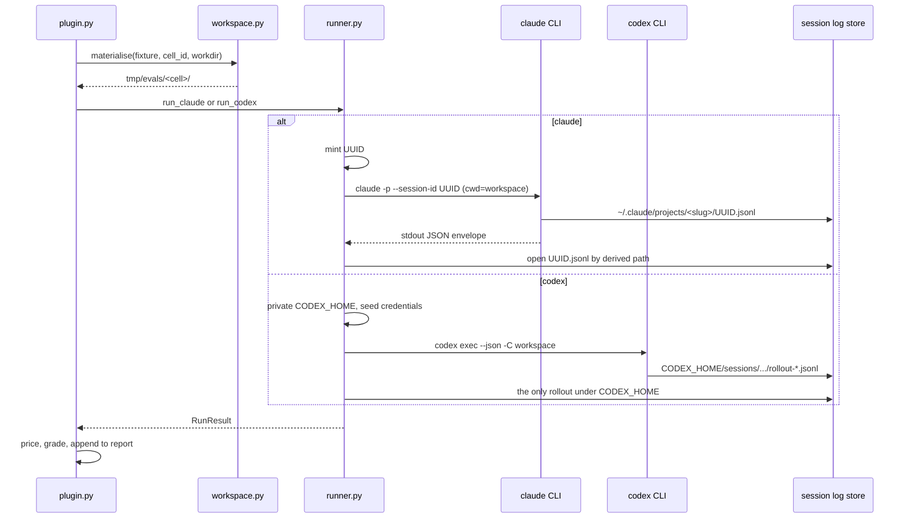
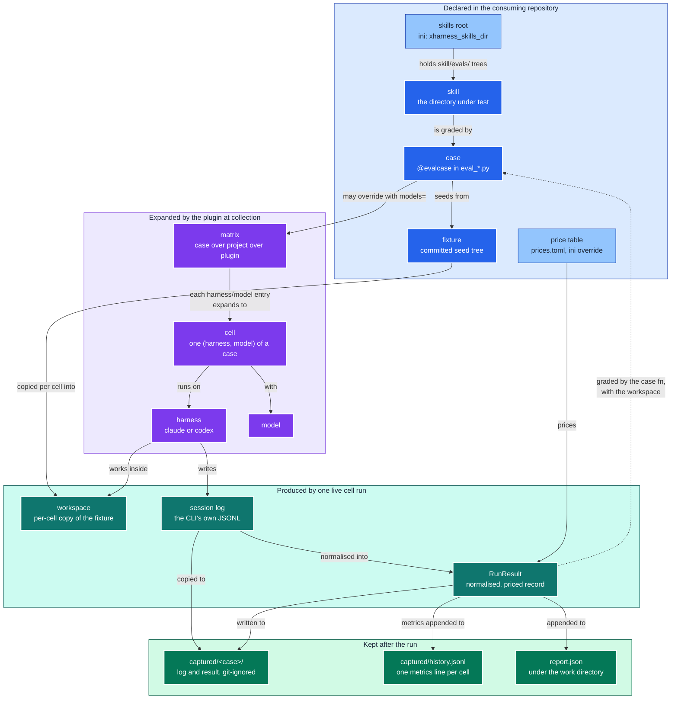

# Architecture: how a graded verdict stays tied to a real run

The hard problem in this plugin is not orchestration but evidence. A harness that
grades the wrong transcript, or an empty one, produces the same green output as one
that works. Every design choice below exists to make that silent failure impossible,
for two CLIs whose session-log identity mechanisms differ at the root.

This page explains the design. For commands see [README.md](README.md); for the
decisions as records see [docs/adrs/](docs/adrs/README.md).

## The pipeline in one picture

```mermaid
flowchart LR
    CASE["eval_*.py case"]
    PLUG["plugin.py<br/>collect, expand matrix"]
    WS["workspace.py<br/>pristine copy"]
    RUN["runner.py<br/>claude | codex"]
    LOG["session log<br/>this run's own"]
    NORM["normalise.py<br/>RunResult"]
    PRICE["pricing.py<br/>USD"]
    GRADE["case assertions"]
    REP["report.json"]

    CASE --> PLUG --> WS --> RUN --> LOG --> NORM --> PRICE --> GRADE --> REP

    classDef new fill:#7c3aed,color:#fff
    classDef data fill:#0f766e,color:#fff
    classDef good fill:#047857,color:#fff
    class CASE,PLUG,WS,RUN new
    class LOG,NORM data
    class PRICE,GRADE,REP good
```

One cell flows left to right: a case is expanded into cells, each cell gets a fresh
workspace, the CLI runs, its own log is located and normalised, priced, graded, and
reported.

Detailed flow, including the two capture contracts

The Claude branch derives the log path before the process starts. The Codex branch
makes only one log possible. Both end in the same `RunResult`.

## Two CLIs, two capture contracts

The two CLIs give the harness different levers, so the correlation between a run and
its log is established in two different ways.

| Concern | Claude (`claude` 2.1.237) | Codex (`codex` 0.148.0) |
|---------|---------------------------|-------------------------|
| Headless invocation | `claude -p --output-format json` | `codex exec --json` |
| Log location | `~/.claude/projects/<cwd-slug>/<session-id>.jsonl` | `$CODEX_HOME/sessions/YYYY/MM/DD/rollout-<ts>-<id>.jsonl` |
| Caller-chosen id | `--session-id <uuid>` | none |
| Correlation contract | derive the path from the UUID the harness minted | point `CODEX_HOME` at a private directory so exactly one rollout can exist |
| Cost in output | `total_cost_usd` on stdout, absent from the log | absent everywhere |
| Token accounting | per assistant message `usage` block | cumulative `token_count` events; the last one wins |

Two facts were learned from live runs and are encoded in `runner.py` and
`normalise.py`. First, Claude's cwd slug replaces every non-alphanumeric character
with `-`, including underscores. Second, Codex's `input_tokens` already includes
`cached_input_tokens`, so the cached share is subtracted before pricing.

The Codex contract carries an accepted risk: `CODEX_HOME` is also where Codex keeps
its credentials, so the private directory is seeded with `auth.json` and
`.credentials.json` before the run (ADR 0005).

## Isolation keeps the score about the skill

If the developer's own user-level skills or `CLAUDE.md` answer the prompt, the score
describes the developer's machine, not the skill under test. Each adapter therefore
scopes ambient configuration out and the skill under test in.

| Lever | Claude | Codex |
|-------|--------|-------|
| Ambient settings off | `--setting-sources ""` | `--ignore-user-config` |
| Working directory | process cwd, plus `--add-dir` | `-C <workspace>` |
| Skill under test in | `--add-dir <skill dir>` | copied to `$CODEX_HOME/skills/<skill>` |
| Permissions | `--permission-mode bypassPermissions` | `--sandbox workspace-write` |

The workspace itself is a plain copy of the fixture tree under the work directory,
discarded and rebuilt for every cell. No git repository is created, which puts
git-dependent skills out of scope for now (ADR 0004).

## Paths come from the rootdir, not from the package

The plugin is installed, so nothing about the consuming repository can be derived
from `__file__`. Three locations are ini keys resolved against pytest's `rootpath`:
the skills root, the work directory, and an optional price override file (ADR 0014).
The matrix follows the same shape: a project sets `xharness_matrix` once, a case may
override it with `models=`, and the plugin's bundled default is the floor (ADR 0015).

The consequence worth knowing: pytest picks the rootdir from the first config file it
finds walking up from the arguments. A repository with no `[tool.pytest.ini_options]`
table gets a rootdir equal to the common ancestor of the arguments, which for
`pytest skills/x/evals` is the `evals/` directory itself, and no cell is collected.
The report header names the resolved skills root and marks it `(missing)` so this is
visible on the first line of output.

## Pricing is the plugin's job, not the CLI's

Neither session log carries cost. Claude reports `total_cost_usd` on its stdout
envelope; Codex reports nothing. The plugin therefore prices every run itself from
its bundled `prices.toml`, layered with any rows from the consumer's own file, using
four rates per model: input, output, cache read, and cache write.

Keeping the cache tiers separate matters. In the reference Codex run, 174,336 of
202,639 tokens were cache reads. Priced flat at the input rate the run would report
about USD 0.25; priced by tier it reports USD 0.07. The `Usage` dataclass keeps the
tiers apart for that reason.

Claude's own `total_cost_usd` serves as a reconciliation oracle. In the reference
run it read USD 0.91 against the table's USD 0.76; the gap is the one-hour cache
write premium the table does not yet model. Treat absolute figures as approximate
and relative comparison across cells as robust.

An unpriced model stops the sweep at collection, before any money is spent
(ADR 0007). The `--dry-run` option exercises the same check without a CLI.

## Grading is not prescribed

The plugin does not decide what a correct run looks like. A case is an ordinary
Python function that receives the `RunResult` and the workspace, and composes
whatever checks it needs with plain `assert`. The reference case grades in three
layers: the run is real evidence, the run is priced, the skill did its job. For the
annotated version read `eval_palette_mandate.py`, the reference case kept beside the
skill it grades in the consuming repository.

One invariant holds regardless of how a case grades: a check that cannot evaluate
raises, it never passes. A grader that cannot fail produces a permanently green suite
that proves nothing.

## Vocabulary

| Term | Meaning |
|------|---------|
| case | One `@evalcase` function in an `eval_*.py` module: a prompt, a skill, a fixture, a matrix |
| cell | One (harness, model) pair of a case; the unit pytest collects, runs, and reports |
| harness | The agent CLI a cell runs on, `claude` or `codex`; the first half of a cell id |
| matrix | The list of `harness/model` entries a case expands into cells; three scopes, case over project over plugin; `--harness`, `--model`, and `-k` narrow it |
| skills root | The directory under the rootdir holding `<skill>/evals/` trees; ini key `xharness_skills_dir` |
| fixture | A committed seed directory under `evals/fixtures/<name>/` that a workspace is copied from; several cases may share one |
| workspace | The per-cell copy of the fixture under the work directory that the agent works in |
| session log | The JSONL file the CLI writes for one session; the evidence a verdict is tied to |
| RunResult | The normalised record of one cell: identity, usage, tool calls, files written, cost |
| captured | `evals/captured/<case>/`, where each run's log and `RunResult` are written; git-ignored |
| history | `evals/captured/history.jsonl`, one flat metrics line per live cell (turns, tool calls, duration, wall clock, USD, tokens); git-ignored with the rest of `captured/` |

### How the terms relate

The table defines each term; the map below shows how they hang together across a
run's lifecycle. Hue encodes who produces the thing: blue is declared in the
consuming repository, violet is computed by the plugin at collection, teal is
evidence produced by a live run, emerald is what survives the run. The light blue
nodes are configuration rather than code.

Read it top to bottom as one cell's life: a case declared beside its skill is
expanded against the matrix into cells; each cell copies the fixture into a fresh
workspace, runs its harness there, and the harness's own session log becomes the
`RunResult` the case function grades. The dashed edge is the only one that points
back up: grading closes the loop between evidence and the case that asked for it.

## Known limits

- Absolute USD figures lag the providers' real rates; `prices.toml` is maintained by
  hand and the `--seed-prices` refresh described in ADR 0006 is not yet built.
- The `runresult.schema.json` and golden-comparison primitives described in ADR 0003
  and ADR 0012 are not yet shipped; parity between the two adapters is currently
  enforced by both producing the same dataclass.
- Nothing throttles providers under `pytest-xdist`. Per-cell records travel on
  `TestReport.user_properties`, so verbose status words and `report.json` are
  complete under `-n` (ADR 0016); `--dist loadgroup` is the lever if a provider
  rate-limits a sweep.
- Workspaces have no git context (ADR 0004).
