# Architecture: how a graded verdict stays tied to a real run

The hard problem in this plugin is not orchestration but evidence. A harness that
grades the wrong transcript, or an empty one, produces the same green output as one
that works. Every design choice below exists to make that silent failure impossible,
for two CLIs whose session-log identity mechanisms differ at the root.

This page explains the design. For commands see [README.md](README.md); for the
decisions as records see [docs/adrs/](docs/adrs/index.md).

## The pipeline in one picture

```mermaid
flowchart LR
    CASE["eval_*.py case"]
    PLUG["plugin/<br/>collect, expand matrix"]
    WS["model/workspace.py<br/>pristine copy"]
    RUN["harness/<br/>ClaudeHarness | CodexHarness"]
    LOG["session log<br/>this run's own"]
    NORM["SessionLog.to_result<br/>RunResult"]
    PRICE["runtime/pipeline.derive<br/>price, coverage, case"]
    GRADE["case assertions"]
    REP["report.json"]

    CASE --> PLUG --> WS --> RUN --> LOG --> NORM --> PRICE --> GRADE --> REP

    classDef new fill:#7c3aed,color:#fff
    classDef data fill:#0f766e,color:#fff
    classDef good fill:#047857,color:#fff
    class CASE,PLUG,WS,RUN new
    class LOG,NORM data
    class PRICE,GRADE,REP good
```

One cell flows left to right: a case is expanded into cells, each cell gets a fresh
workspace, the harness runs its CLI, its own log is located and folded into a
`RunResult`, then priced, graded, and reported.

Everything from the `RunResult` rightwards is `runtime/pipeline.py`, and a replay
(`python -m pytest_xharness_eval.replay`) rejoins the same flow at the session log
rather than repeating it -- one sequence, two entry points (ADR 0034).

Detailed flow, including the two capture contracts

The Claude branch derives the log path before the process starts. The Codex branch
makes only one log possible. Both end in the same `RunResult`.

## Two CLIs, two capture contracts

The two CLIs give the harness different levers, so the correlation between a run and
its log is established in two different ways.

| Concern | Claude (`claude` 2.1.237) | Codex (`codex` 0.148.0) |
|---------|---------------------------|-------------------------|
| Headless invocation | `claude -p --output-format json` | `codex exec --json` |
| Log location | `~/.claude/projects/<cwd-slug>/<session-id>.jsonl` | `$CODEX_HOME/sessions/YYYY/MM/DD/rollout-<ts>-<id>.jsonl` |
| Caller-chosen id | `--session-id <uuid>` | none |
| Correlation contract | derive the path from the UUID the harness minted | point `CODEX_HOME` at a private directory so exactly one rollout can exist |
| Cost in output | `total_cost_usd` on stdout, absent from the log | absent everywhere |
| Token accounting | per assistant message `usage` block, repeated on every content-block record of that message | one `token_count` event per model call: `last_token_usage` for the call, `total_token_usage` cumulative |
| Cache-write TTL | `usage.cache_creation.ephemeral_1h_input_tokens` / `ephemeral_5m_input_tokens` | not billed |

Two facts were learned from live runs and are encoded in `harness/claude.py` and
`harness/codex.py`, each beside the dialect it belongs to. First, Claude's cwd slug replaces every non-alphanumeric character
with `-`, including underscores. Second, Codex's `input_tokens` already includes
`cached_input_tokens`, so the cached share is subtracted before pricing.

The Codex contract carries an accepted risk: `CODEX_HOME` is also where Codex keeps
its credentials, so the private directory is seeded with `auth.json` and
`.credentials.json` before the run (ADR 0005).

## Isolation keeps the score about the skill

If the developer's own user-level skills or `CLAUDE.md` answer the prompt, the score
describes the developer's machine, not the skill under test. Each adapter therefore
scopes ambient configuration out and the skill under test in.

| Lever | Claude | Codex |
|-------|--------|-------|
| Ambient settings off | `--setting-sources ""` | `--ignore-user-config` |
| Working directory | process cwd, plus `--add-dir` | `-C <workspace>` |
| Skill under test in | `--add-dir <skill dir>` | copied to `$CODEX_HOME/skills/<skill>` |
| Permissions | `--permission-mode bypassPermissions` | `--sandbox workspace-write` |

The workspace itself is a plain copy of the fixture tree under the work directory,
discarded and rebuilt for every cell. No git repository is created, which puts
git-dependent skills out of scope for now (ADR 0004).

## The package listing is the architecture

`src/pytest_xharness_eval/` is not a flat list of modules. Two entry-point modules sit at
the root because something outside the package resolves them by name -- `plugin/`
through the `pytest11` entry point (ADR 0014) and `replay.py` through `python -m` -- and
the six layers each run is pushed through are folders beneath them. `plugin/` is itself
a package: its `__init__` is the hook manifest and each hook's job -- options, collection,
the per-cell run, the record's crossing, the summary -- is a module beside it (ADR 0040):

| Layer | Answers | Depends on |
| --- | --- | --- |
| `model/` | what a run, a case, a cell, a workspace and a cache tree *are* | nothing |
| `harness/` | how one agent CLI is invoked, and how its session log folds | `model/` |
| `derive/` | what a folded run cost, and which of the skill it reached | `model/` |
| `verify/` | the shared `check_*` verifiers and the golden comparison a grader is written with | `model/`, `derive/` |
| `emit/` | the documents that leave: the metrics record and the report microsite | `model/`, `harness/` |
| `runtime/` | how a sweep is wired: settings, and the steps after the CLI returns | everything below |

The order is a rule, not a description: a ruff `TID251` rule fails `make check` when a
layer names one above it, with the exceptions listed once in `pyproject.toml` (ADR 0039).
The one edge that points up is `model/registry.py`, which answers "which harnesses exist"
and "what is this one's shell vocabulary" -- both lookups by registered name, because the
registry is the only dispatch on a harness (ADR 0034).

## Paths come from the rootdir, not from the package

The plugin is installed, so nothing about the consuming repository can be derived
from `__file__`. Three locations are ini keys resolved against pytest's `rootpath`:
the skills root, the work directory, and an optional price override file (ADR 0014).
The matrix follows the same shape: a project sets `xharness_matrix` once, a case may
override it with `models=`, and the plugin's bundled default is the floor (ADR 0015).

The consequence worth knowing: pytest picks the rootdir from the first config file it
finds walking up from the arguments. A repository with no `[tool.pytest.ini_options]`
table gets a rootdir equal to the common ancestor of the arguments, which for
`pytest skills/x/evals` is the `evals/` directory itself, and no cell is collected.
The report header names the resolved skills root and marks it `(missing)` so this is
visible on the first line of output.

## Pricing is the plugin's job, not the CLI's

Neither session log carries cost. Claude reports `total_cost_usd` on its stdout
envelope; Codex reports nothing. The plugin therefore prices every run itself from
its bundled `derive/prices.toml`, layered with the project's `xharness_prices` ini rows, using
four rates per model: input, output, cache read, and cache write.

Keeping the cache tiers separate matters. In the reference Codex run, 174,336 of
202,639 tokens were cache reads. Priced flat at the input rate the run would report
about USD 0.25; priced by tier it reports USD 0.07. The `Usage` dataclass keeps the
tiers apart for that reason.

Claude's own `total_cost_usd` serves as a reconciliation oracle. In the reference
run it read USD 0.91 against the table's USD 0.76; the gap is the one-hour cache
write premium the table does not yet model. Treat absolute figures as approximate
and relative comparison across cells as robust.

An unpriced model stops the sweep at collection, before any money is spent
(ADR 0007). The `--dry-run` option exercises the same check without a CLI.

## Grading is not prescribed

The plugin does not decide what a correct run looks like. A case is an ordinary
Python function that receives one `CaseOutput` (the run record and the workspace the
agent wrote) and composes whatever checks it needs with plain `assert` (ADR 0045).
The checks every case was writing for itself ship as `verify/`, and a case still
writes its own beside it (ADR 0012, ADR 0013). Where a correct answer can be written
down, `verify/golden.py` compares against a committed one facet by facet, each facet
declaring how much variation is still correct (ADR 0046).

The reference case grades in four layers: the run is real evidence and priced, the
right file changed and nothing else appeared, the skill's own material was reached,
and only then the artifact. For the annotated version read `eval_palette_mandate.py`,
the reference case kept beside the skill it grades in the consuming repository; the
whole grader surface is [docs/rollout.md](docs/rollout.md).

One invariant holds regardless of how a case grades: a check that cannot evaluate
raises, it never passes. A grader that cannot fail produces a permanently green suite
that proves nothing.

## Vocabulary

The project's ubiquitous language is [GLOSSARY.md](GLOSSARY.md).

## Known limits

- Absolute USD figures lag the providers' real rates; the price table is maintained by
  hand and the `--seed-prices` refresh described in ADR 0006 is not yet built.
- The `runresult.schema.json` described in ADR 0003 is not yet shipped; parity between
  the two adapters is currently enforced by both producing the same dataclass. The
  grading primitives ADR 0012 left pending did ship, as `verify/` (ADR 0045) and the
  golden comparison (ADR 0046).
- Nothing throttles providers under `pytest-xdist`. Per-cell records travel on
  `TestReport.user_properties`, so verbose status words and `report.json` are
  complete under `-n` (ADR 0016); `--dist loadgroup` is the lever if a provider
  rate-limits a sweep.
- Workspaces have no git context (ADR 0004).
