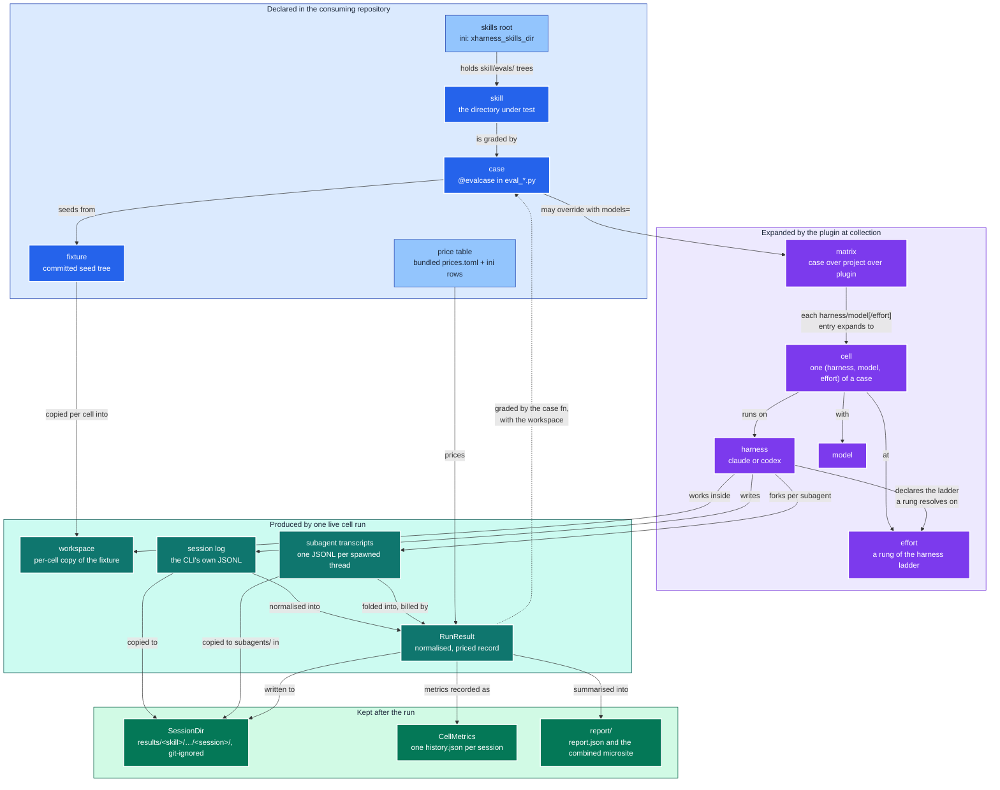

# Glossary

The **ubiquitous language** of this project: every domain term with its one canonical
name. Code identifiers, documentation prose and conversation all use these terms.

Two standing obligations, restated in [AGENTS.md](AGENTS.md):

- **Use these names.** New identifiers, docs and prose use the canonical term here, never
  an ad-hoc synonym.
- **Keep it current.** When a new domain term enters the code, add it here in the same
  change.

| Term | Meaning |
|------|---------|
| case | One `@evalcase` function in an `eval_*.py` module: a task, a skill, a fixture, a matrix |
| task | What a case declares: the sentence a user types *after* naming the skill. It never names the skill, a CLI, or a loading path -- each harness renders its own invocation around it, and the same task therefore produces a different prompt per arm (ADR 0044) |
| invocation | How one harness names a skill to itself: `/<skill> <task>` for `claude` (registered for the session with `--plugin-dir`), `$<skill> <task>` for `codex` (registered under the private `CODEX_HOME/skills/`). `Harness.invoke` is the only place either is spelled; `model/registry.py` is the one edge that asks from beneath (ADR 0011, ADR 0044) |
| EvalSuite | One imported `eval_*.py` module and the cases it declares. A suite belongs to no package, so it is imported by path under a name derived from that path; `EvalSuite.load` and `find_case` are the one loader collection and a replay share, where each used to keep its own (`model/suite.py`, ADR 0040) |
| cell | One (harness, model, effort) point of a case; the unit pytest collects, runs, and reports |
| harness | The agent CLI a cell runs on, `claude` or `codex`; the first half of a cell id |
| matrix | The list of `harness/model` or `harness/model/effort` entries a case expands into cells; three scopes, case over project over plugin; `--harness`, `--model`, `--effort` and `-k` narrow it |
| effort | The reasoning budget a cell asks its CLI for: the third matrix axis, and the optional third component of an entry. An entry that names none leaves the CLI on its own default (ADR 0049) |
| rung | One level of a harness's own effort ladder (`Harness.efforts`, lowest first) -- `low`..`max` for `claude`, `minimal`..`xhigh` for `codex`. A matrix entry may name a rung exactly, and a rung the named harness lacks is a collection error, never the nearest one (ADR 0049) |
| alias | A portable effort word naming a *position* rather than a level: `min`, `mid`, `max`. It resolves against whichever ladder the harness has, once, at matrix expansion -- so one line sweeps both arms at comparable intensity and nothing downstream ever holds a word the CLI would not understand (ADR 0049) |
| skills root | The directory under the rootdir holding `<skill>/evals/` trees; ini key `xharness_skills_dir` |
| fixture | A committed seed directory under `evals/fixtures/<name>/` that a workspace is copied from; several cases may share one |
| workspace | The per-cell copy of the fixture under the work directory that the agent works in |
| session log | The JSONL file the CLI writes for one session; the evidence a verdict is tied to |
| Harness | The class behind a harness name: how its CLI is invoked, how its log correlates back to the run, how its records classify, and what its shell tools mean for coverage. `harness.get(name)` is the only way to reach one; an unregistered name raises rather than defaulting (ADR 0034) |
| SessionLog | One captured session in a provider's dialect *plus the side-channel that dialect needs* -- Claude's stdout envelope, Codex's exit code -- so every caller gets one uniform `to_result` (ADR 0034) |
| RunResult | The normalised record of one cell: identity, usage, tool calls, files written, cost. `RunResult.folded(calls, subagents, ...)` is the one constructor an adapter builds one through, so `turns` and `usage` are derived from the ledgers rather than supplied (ADR 0035) |
| Usage | Token counts normalised across both dialects and kept apart by billed tier, for one call, one subagent, or a whole run. Frozen: a total accumulates only by producing a new total (`+`, `Usage.total`), so "a run's usage is its whole bill -- the primary ledger plus every subagent" is an invariant of the type rather than a rule the caller has to remember, and a second fold cannot bill a subagent twice (ADR 0033, ADR 0035) |
| CaseOutput | What one rollout left behind, as a grader sees it: the `RunResult` and the workspace, with the accessors every suite kept re-deriving (`read`, `wrote`, `added`, `changed`). A grader takes exactly one of these; the two positional arguments it replaced were never two things (`model/output.py`, ADR 0045). Its whole surface is `docs/rollout.md` |
| verifier | A plain function over a `CaseOutput` that returns when its claim holds and raises `AssertionError` naming what went wrong when it does not. The shared ones ship in `verify/checks.py`; anything else is still Python beside the case (ADR 0012, ADR 0013, ADR 0045) |
| golden | A committed, correct artifact at `evals/goldens/<name>/<path>`, mirroring `evals/fixtures/<name>/<path>`. A `GoldenCase` compares a candidate to it facet by facet, each `Facet` declaring a `Tolerance` -- `Exact`, `Superset`, `Jaccard`, `Ratio`, `Count`, `Within` -- and a mismatch reports the per-facet delta rather than a diff (`verify/golden.py`, ADR 0046) |
| CaseRef | The case a result names -- suite, name, skill, fixture, task, prompt -- as one type for the live cell and both replay paths, which used to hand-build the record three times; the `case` block of `result.json` (ADR 0025, ADR 0035) |
| CostEstimate, AppliedRates | What one run costs under one price row: `CostEstimate.of(usage, rates)` is the total, the per-tier split and the provenance, and `RunResult.apply_cost` writes all of it in one call, so the four cost fields are never written apart. `AppliedRates` is the `Rates` row plus the `applied_at` stamp, and is the `rates_applied` block of `result.json` (ADR 0021, ADR 0035) |
| CostStatus | `priced` or `unpriced`, with no third state (ADR 0007); a `StrEnum`, so the wire format carries the same bare word it always has (ADR 0035) |
| Verdict | How a cell graded: `pass`, `fail`, `error` or `dry-run`, and no fifth. A domain noun in `model/verdict.py`, so every layer that names one -- the cell that decides it, the record that stores it, the status word that prints it -- spells it from the same place; `Outcome.verdict` is declared as it, while the record keeps the `.value`, because that record crosses execnet, which serialises builtins only. `Verdict.stored` reads a word no version of this package wrote as *no* verdict rather than a fabricated grade (ADR 0016, ADR 0038, ADR 0041) |
| pipeline | The single sequence run over a `RunResult` by both a live cell and a replay: derive (price, coverage, case), capture (log, subagents, result), record metrics; `runtime/pipeline.py` (ADR 0034, ADR 0039) |
| settings | One resolved view of a project's configuration, built either from the live `pytest.Config` or, for a replay, from the pytest config on disk; `runtime/settings.py` (ADR 0034, ADR 0039) |
| CellRun, Attempt | One cell's live run as a small state machine: materialise the workspace, `invoke` the CLI, `store` (derive then capture), `grade`, `record`. Exactly one of those steps spends money, and it is the only one carrying `pragma: no cover`, so the sequence a replay is pinned against is testable without paying (`plugin/cell.py`, ADR 0002, ADR 0040). An `Attempt` is what one invocation produced plus the two clock facts no log carries |
| CacheLayout, SessionDir, LocatedSession | The cache tree as a value object, and one session's evidence directory within it. `CacheLayout` owns `build/`, `results/`, `report/`, every file name under them and the five-level `sessions()` walk; `SessionDir` owns `log.jsonl`, `result.json`, `history.json` and `subagents/`. `LocatedSession` is a `SessionDir` that knows its five coordinates, and therefore the only one that can be named by `rel` or linked to from the page; only `CacheLayout` builds one (ADR 0038). `Settings.cache` is a `CacheLayout`, so nothing reassembles a path under the cache root (ADR 0032, ADR 0037) |
| captured | `<cache>/results/{skill}/{harness}/{model}[--{effort}]/{run}/{session}/`, where each run's log, `RunResult` and metrics record are written; git-ignored. Five levels deep whether or not a rung was named -- the effort shares the model's level rather than adding one (ADR 0032, ADR 0049) |
| CellMetrics, Outcome | One graded cell's metrics record -- the `history.json` written beside its evidence and one line of the combined `report/history.jsonl` -- as a type: flat, built of builtins, and carrying `status_word()` and its own `cache` field. `Outcome` is the four values grading observed and no log can supply (node, verdict, wall clock, start), which a replay carries forward while recomputing everything else. The record crosses to the xdist controller as a plain mapping and is a type on both sides; `from_dict` drops an unknown key *and* a value that is not of its field's declared type, so every reader may trust the declaration (ADR 0016, ADR 0018, ADR 0037, ADR 0038) |
| history | One `history.json` per session (turns, tool calls, duration, wall clock, USD, tokens), combined into `<cache>/report/history.jsonl`; git-ignored with the rest of the cache (ADR 0032) |
| call, turn | One model API call inside a cell's session (a *SessionTurn* in the report); `RunResult.calls` is the ledger of them, each with its usage, tools issued, results fed in, text, thinking, and the log lines it came from (ADR 0019, 0021). `turns` counts them; the CLI's own count is `reported_turns` |
| executed command | One shell command the harness itself reports as having run, after its own expansion: `call.executed` is the list of them, each with the `tool` the harness named the record, the `command` string and the `cwd` it ran in. Codex's `CommandExecution` item is one; Claude Code logs none, so its list is empty. Skill coverage attributes from it beside the tool call, because it is the one text every wrapper language and shell variable has already been resolved out of (ADR 0048) |
| subagent | A parallel thread the session spawned (Claude's Agent tool sidecars under `subagents/`, Codex's forked rollouts), captured beside `log.jsonl` and folded through the same ledger; `RunResult.subagents` lists them, each attributed to the primary turn that spawned it (`parent_turn`), and their usage is inside the run's `usage` and estimate (ADR 0033) |
| estimated cost | `estimated_cost_usd`: this plugin's price-table estimate; `rates_applied` records the rates, row and file behind it (ADR 0021) |
| harness reported cost | `harness_reported_cost_usd`: what the harness CLI itself said the run cost; Claude only |
| total tokens | Every priced token summed over all turns; the cached prefix counts once per turn |
| baseline tokens | The first turn's context: the harness's own prompt before the agent acts |
| report, IndexRow | `<cache>/report/`: `report.html` with `index.json`, `history.jsonl`, `report.tokens.json` and `XHARNESS-REPORT-GLOSSARY.md` beside it -- a static page over the captured JSON, served over HTTP (ADR 0020, 0021, 0032). `IndexRow` is one row of `index.json`: a session summarised from its stored `result.json` and metrics record, with its evidence addressed by relative path (ADR 0037) |
| RunSummary | `report/report.json` as a type: the cells one pytest session graded and the estimate they add up to, plus `cache_roots()` -- the roots this session wrote evidence into, which is where the combine step's trigger is decided and why a dry run stays free (`emit/summary.py`, ADR 0037, ADR 0040) |
| LegacyCapture | A pre-0032 `<skill>/evals/captured` directory, recognised by shape and migrated into a cache root; transitional code with a known end, kept in one file so it can be deleted in one (`runtime/legacy.py`, ADR 0032, ADR 0040) |
| SessionId, SessionTurnId | How the report addresses a session (the harness-minted session id, a unique prefix accepted) and a turn (`<SessionId>/t<N>`); both copyable from the page and carried in its URL fragment |
| record kind | The catalogued shape of one session-log line, `harness/type[/subtype]`, with a category that colours its pill in the report; each harness's `classify_record` names the kind, `harness/records.py` is the catalogue, and `record_kinds` is the per-run census (ADR 0022, ADR 0034) |
| skill coverage | Which of the skill's catalogued files a run loaded or ran, per turn, and the `not_loaded` / `not_run` sets; `derive/skillcov.py` (ADR 0022). What the project's `xharness_skill_ignore` lines mean, and which files they take off the decision surface, is `derive/ignorerules.py` (ADR 0026, ADR 0035) |
| SkillFile, FileCoverage | One catalogued file of the skill -- path, `FileKind` (doc, script, test, asset), bytes, sha256, ignored -- and that file widened by the turns that loaded or ran it, one list per `Access`. The row widens the record rather than nesting it because the wire format is one flat row per file in `skill_coverage.files` (ADR 0022, ADR 0035) |
| CoverageSummary, SkillCoverage | The counts and denominators the metrics record and the report row read, and the whole coverage answer for one run. `SkillCoverage.over` derives the four path sets and the summary from the annotated rows in one place, so they cannot disagree with each other or with `files` (ADR 0022, ADR 0035) |
| IgnoreRules | The `xharness_skill_ignore` lines that apply to one skill, compiled once at collection into the gitignore-pattern subset that `matches(rel)` answers. It knows nothing of skills, runs or harnesses, and a malformed line raises at configure time rather than silently measuring nothing (ADR 0026, ADR 0035) |
| context window | The model's window as the harness reported it; `context_window_pct` (peak turn) and `final_context_pct` are measured prompt sizes over it, never estimates (ADR 0024) |
| design tokens | `report.tokens.json`: the palette, series, pill colours and fonts the report is themed with; bundled, copied beside every report, overridable per project (ADR 0024) |

## How the terms relate

The table defines each term; the map below shows how they hang together across a
run's lifecycle. Hue encodes who produces the thing: blue is declared in the
consuming repository, violet is computed by the plugin at collection, teal is
evidence produced by a live run, emerald is what survives the run. The light blue
nodes are configuration rather than code.

Read it top to bottom as one cell's life: a case declared beside its skill is
expanded against the matrix into cells; each cell copies the fixture into a fresh
workspace, runs its harness there, and the harness's own session log becomes the
`RunResult` the case function grades. The dashed edge is the only one that points
back up: grading closes the loop between evidence and the case that asked for it.
