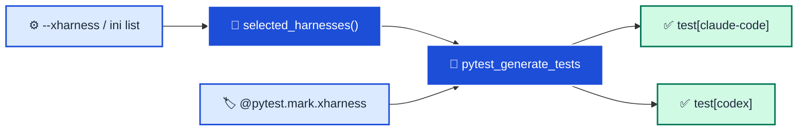

# pytest-xharness-eval 🧪🤖

<p align="center">
    <!-- CICD / Publishing Health -->
    <a href="https://github.com/neozenith/pytest-xharness-eval/actions/workflows/cicd.yml"></a>
    <a href="https://github.com/neozenith/pytest-xharness-eval/actions/workflows/publish.yml"></a>
    <!-- coverage-badge -->
    
    <!-- coverage-badge -->
</p>
<p align="center">
    <!-- project development health -->
    <a href="https://github.com/neozenith/pytest-xharness-eval/graphs/commit-activity"></a>
    <a href="https://github.com/neozenith/pytest-xharness-eval/issues"></a>
    <a href="https://github.com/neozenith/pytest-xharness-eval/pulls"></a>
</p>
<p align="center">
    <!-- License and latest info -->
    <a href="https://github.com/neozenith/pytest-xharness-eval/blob/main/LICENSE"></a>
    <a href="https://github.com/neozenith/pytest-xharness-eval/releases"></a>
    <a href="https://pypi.org/project/pytest-xharness-eval/"></a>
</p>

<p align="center">pytest plugin for <b>cross</b> AI agent <b>harness eval</b>uation.</p>
<p align="center"><i>Write the eval once. Run it against every harness.</i></p>

<!--TOC-->

- [pytest-xharness-eval 🧪🤖](#pytest-xharness-eval-)
  - [Features](#features)
  - [Quickstart](#quickstart)
  - [How it works](#how-it-works)
  - [Configuration](#configuration)
  - [Development](#development)

<!--TOC-->

## Features

- **One suite, many harnesses:** any test that requests the `xharness` fixture is parametrized once per selected harness, so results are directly comparable.
- **Select at the edge:** pick harnesses per run with `--xharness NAME` (repeatable) or set a default list in `pytest.ini` / `pyproject.toml`.
- **Opt-in narrowing:** `@pytest.mark.xharness("claude-code")` confines a test to the harnesses it makes sense for.
- **Nothing implicit:** no harness selected means parametrized tests are *skipped*, loudly, rather than silently run against a default.

----

## Quickstart

```sh
uv add --dev pytest-xharness-eval
```

```python
# tests/test_hello_eval.py
def test_harness_is_named(xharness):
    assert xharness.name
```

```sh
uv run pytest --xharness claude-code --xharness codex
```

```text
xharness-eval: harnesses = claude-code, codex
tests/test_hello_eval.py::test_harness_is_named[claude-code] PASSED
tests/test_hello_eval.py::test_harness_is_named[codex] PASSED
```

----

## How it works



The plugin is registered through the `pytest11` entry point, so installing the package is all that is required — no `conftest.py` wiring.

----

## Configuration

| Surface | Example | Precedence |
|---------|---------|------------|
| CLI flag (repeatable) | `--xharness claude-code --xharness codex` | wins |
| ini list | `[pytest]`<br>`xharness =`<br>`    claude-code`<br>`    codex` | default |
| marker | `@pytest.mark.xharness("codex")` | narrows the above |

In `pyproject.toml`:

```toml
[tool.pytest.ini_options]
xharness = [
    "claude-code",
    "codex",
]
```

----

## Development

```sh
make format   # ruff format + isort
make check    # ruff check + isort --check-only + mypy --strict
make test     # pytest (pytester-based, no mocks) + coverage badge refresh
make build    # wheel into dist/
```

Publishing happens from GitHub Releases via `.github/workflows/publish.yml` (PyPI trusted publishing).
