# pytest-xharness-eval 🧪🤖

<p align="center">
    <!-- CICD / Publishing Health -->
    <a href="https://github.com/neozenith/pytest-xharness-eval/actions/workflows/cicd.yml"></a>
    <a href="https://github.com/neozenith/pytest-xharness-eval/actions/workflows/publish.yml"></a>
    <!-- coverage-badge -->
    
    <!-- coverage-badge -->
</p>
<p align="center">
    <!-- project development health -->
    <a href="https://github.com/neozenith/pytest-xharness-eval/graphs/commit-activity"></a>
    <a href="https://github.com/neozenith/pytest-xharness-eval/issues"></a>
    <a href="https://github.com/neozenith/pytest-xharness-eval/pulls"></a>
</p>
<p align="center">
    <!-- License and latest info -->
    <a href="https://github.com/neozenith/pytest-xharness-eval/blob/main/LICENSE"></a>
    <a href="https://github.com/neozenith/pytest-xharness-eval/releases"></a>
    <a href="https://pypi.org/project/pytest-xharness-eval/"></a>
</p>

<p align="center">pytest plugin for <b>cross</b> AI agent <b>harness eval</b>uation.</p>
<p align="center"><i>Write the eval once. Run it against every harness and every model.</i></p>

<!--TOC-->

- [pytest-xharness-eval 🧪🤖](#pytest-xharness-eval-)
  - [What it does](#what-it-does)
  - [Quickstart](#quickstart)
  - [Narrow a run](#narrow-a-run)
  - [Configuration](#configuration)
  - [How it works](#how-it-works)
  - [What it does not do](#what-it-does-not-do)
  - [Development](#development)
  - [Read next](#read-next)

<!--TOC-->

## What it does

A pytest plugin that runs the `claude` and `codex` CLIs headlessly against a fixture
workspace, captures each run's own session log, prices it, and grades what the agent
left behind. A skill opts in by adding an `evals/` directory; pytest does the rest.

Every eval cell is live and costs money. There is no replay mode. Preview the spend
with `--dry-run` before a sweep. The design rationale lives in
[ARCHITECTURE.md](ARCHITECTURE.md) and the decision log in
[docs/adrs/](docs/adrs/README.md); agents start at [AGENTS.md](AGENTS.md).

----

## Quickstart

1. Install the plugin into the repository that holds your skills. The `pytest11`
   entry point registers it; no `conftest.py` wiring is needed:

   ```sh
   uv add --dev pytest-xharness-eval
   ```

2. Pin pytest's rootdir to the repository root, so the plugin finds `skills/` from
   any argument path. An empty `[tool.pytest.ini_options]` table is enough:

   ```toml
   [tool.pytest.ini_options]
   ```

3. Add an eval beside the skill. Files and functions both carry the `eval_` prefix,
   as `test_` does for pytest. Fixtures are seed workspaces copied fresh for every
   cell; every run output lands under one git-ignored cache root, never in the
   skills tree (ADR 0032):

   ```text
   skills/<skill>/
     SKILL.md
     evals/
       eval_<suite>.py
       fixtures/<name>/
   .xharness_eval_cache/
     build/                                             # per-cell workspaces
     results/{skill}/{harness}/{model}/{run}/{session}/ # log.jsonl, result.json, history.json
     report/                                            # report.json + the aggregated microsite
   ```

   ```python
   from pytest_xharness_eval import evalcase

   @evalcase(prompt="...", skill="<skill>", fixture="<name>")
   def eval_<case>(run, workspace):
       assert run.exit_code == 0
       assert (workspace / "OUTPUT.md").exists()
   ```

4. Preview the matrix. Nothing is invoked:

   ```sh
   uv run pytest skills/<skill>/evals --dry-run
   ```

   ```text
   xharness-eval: skills root = /repo/skills, cache = /repo/.xharness_eval_cache
   xharness-eval: matrix = plugin default (2 entries); a case's models= overrides it
   collected 2 items
   skills/<skill>/evals/eval_<case>.py ss

   ============================ agent eval report ============================
     dry-run          -  skills/<skill>/evals/eval_<case>.py::eval_<case>[claude/claude-opus-5]
     dry-run          -  skills/<skill>/evals/eval_<case>.py::eval_<case>[codex/gpt-5.6-sol]
     total spend: $0.0000 across 2 cell(s)
     report: /repo/.xharness_eval_cache/report/report.json
   ```

5. Run it live, with `-v` so every cell reports its verdict, USD, context, wall
   clock, turns, and tool calls as it lands. Add `-n 2` to run cells in parallel.
   This spends money:

   ```sh
   uv run pytest skills/<skill>/evals -v
   ```

   ```text
   skills/<skill>/evals/eval_<case>.py::eval_<case>[claude/claude-opus-5] PASSED  est $0.5762 (harness $0.5773)  352,451 accumulative_billed_tokens  23,898 baseline_tokens  76.0s  9 turns  8 tools
   ```

   Read the status word as: this plugin's estimate from its price table (and the
   harness CLI's own figure, where it reports one), every billed token summed over
   all turns (the cached prefix is re-read each turn), the harness's own prompt on
   turn 1, wall clock, model calls, tool calls. Every estimate records the rates it
   used and where they came from (`rates_applied`).

   Each cell leaves its verbatim session log (`log.jsonl`), a normalised
   `result.json` with a per-turn ledger, and one `history.json` metrics record in
   its own `results/{skill}/{harness}/{model}/{run}/{session}/` directory — no two
   cells share a file, so parallel workers never contend (ADR 0032). At session end
   the one combine step aggregates everything under `results/` — every skill, every
   run — into `report/`: `report.json`, the accumulated `history.jsonl`, and a
   browsable `report.html` with its glossary (`XHARNESS-REPORT-GLOSSARY.md`)
   beside it. Serve it with `python3 -m http.server --directory .xharness_eval_cache`
   and open `/report/report.html`; it fetches the JSON beside it.

`run` is a `RunResult`: session id, log path, token usage by tier, tool calls, files
written, and USD cost. The reference case, with its assertions written as a tutorial,
is
`eval_palette_mandate.py`, the reference case kept beside the skill it grades in the consuming repository.

----

## Narrow a run

The matrix is the spend dial. These options are the plugin's own; everything else is
stock pytest (`-k`, `-x`, `-m eval`, node ids).

| Option | Effect | Example |
|--------|--------|---------|
| path | One skill or all of them | `pytest skills/x/evals`, `pytest skills/*/evals` |
| `--harness <name>` | Only cells for that harness (`claude` or `codex`), repeatable | `pytest skills/x/evals --harness codex` |
| `--model <substring>` | Only cells whose model id contains the string, or one exact `harness/model`, repeatable | `pytest skills/x/evals --model opus` |
| `-k <expr>` | Boolean slices over cell ids and case names (stock pytest) | `-k "opus or sol"`, `-k "codex and not sol"` |
| `--dry-run` | Enumerate cells and validate pricing, invoke nothing | `pytest skills/x/evals --dry-run` |
| `--collect-only -q` | List cell node ids (stock pytest) | `pytest --collect-only -q skills/x/evals` |

Do not run `pytest skills` from the root: it walks into every skill's `scripts/`
directory and collects their unit tests too. `skills/*/evals` is the full matrix.

A case overrides the matrix with `@evalcase(..., models=["codex/gpt-5.6-sol"])`.

----

## Configuration

The matrix has three scopes, highest precedence first: a case's `models=`, the
project's `xharness_matrix` ini key, and the plugin's bundled default
(`claude/claude-opus-5`, `codex/gpt-5.6-sol`). The report header names which one
applied.

Four ini keys, paths relative to pytest's rootdir:

| Key | Default | Purpose |
|-----|---------|---------|
| `xharness_matrix` | (plugin default) | Project matrix: `harness/model` entries every case sweeps unless it sets `models=` |
| `xharness_skills_dir` | `skills` | Directory holding `<skill>/evals/` trees |
| `xharness_cache_dir` | `.xharness_eval_cache` | The git-ignored root for build workspaces, results and the report (ADR 0032) |
| `xharness_skill_ignore` | (none) | gitignore-style patterns for skill files that are not decision surface; a bare pattern applies to every skill, `<skill>: <pattern>` to the skills matching the selector (ADR 0026) |
| `xharness_report_design_tokens` | bundled | design tokens JSON that themes `report/report.html` (flag: `--xharness-report-design-tokens FILE`) |
| `xharness_report_inline` | `false` | embed every result, log and the tokens into `report/report.html` so it opens over `file://` (flag: `--xharness-report-inline`) |
| `xharness_prices` | (none) | Price rows that add to or override the bundled table: `<model>: input=<usd/MTok> output=<usd/MTok> [cache_read=..] [cache_write=..] [cache_write_1h=..]` (ADR 0030) |

```toml
[tool.pytest.ini_options]
xharness_matrix = [
    "claude/claude-opus-5",
    "claude/claude-sonnet-5",
    "claude/claude-haiku-4-5-20251001",
    "codex/gpt-5.6-luna",
    "codex/gpt-5.6-terra",
    "codex/gpt-5.6-sol",
]
```

An unpriced model stops the sweep at collection, before any spend. Add a price row
to the same ini block, in USD per million tokens (ADR 0030):

```toml
xharness_prices = [
    "gpt-5.6-luna: input=1.25 output=10.00 cache_read=0.125 cache_write=1.25",
]
```

----

## How it works

```mermaid
flowchart LR
    CASE["eval_*.py case"]
    PLUG["plugin.py<br/>collect, expand matrix"]
    WS["workspace.py<br/>pristine copy"]
    RUN["harness/<br/>ClaudeHarness | CodexHarness"]
    LOG["session log<br/>this run's own"]
    NORM["SessionLog.to_result<br/>RunResult"]
    PRICE["pipeline.derive<br/>price, coverage, case"]
    GRADE["case assertions"]
    REP["report.json"]

    CASE --> PLUG --> WS --> RUN --> LOG --> NORM --> PRICE --> GRADE --> REP

    classDef new fill:#7c3aed,color:#fff
    classDef data fill:#0f766e,color:#fff
    classDef good fill:#047857,color:#fff
    class CASE,PLUG,WS,RUN new
    class LOG,NORM data
    class PRICE,GRADE,REP good
```



One cell flows left to right: a case is expanded into cells, each cell gets a fresh
workspace, the CLI runs, its own log is located and normalised, priced, graded, and
reported. The hard part is the middle: the two CLIs need different contracts to tie a
verdict to the right log. [ARCHITECTURE.md](ARCHITECTURE.md) explains both.

----

## What it does not do

- It does not replay recorded runs. Every cell invokes the real CLI (ADR 0002).
- It does not give the agent a git repository. The workspace is a plain copy of the
  fixture, so skills that read git history are out of scope (ADR 0004).
- It does not mock either CLI, in tests or in evals.
- It does not price an unknown model as zero. It refuses to run (ADR 0007).
- It does not throttle providers. `-n N` runs N cells at once; each cell is
  isolated (own workspace, own `CODEX_HOME`, own Claude session). If a provider
  rate-limits you, `-n 2 --dist loadgroup` keeps each harness's cells on one
  worker (parallel across harnesses, serial within one).

----

## Development

```sh
make format   # ruff format + isort
make check    # ruff check + isort --check-only + mypy --strict
make test     # pytester-based suite, no mocks, coverage badge refresh
make build    # wheel into dist/
```

The functions that spawn a CLI (`runner.run_claude`, `runner.run_codex` and their
helpers, `plugin.EvalItem._run_live`) are excluded from coverage with a stated reason
rather than faked. They are exercised by the paid evals in a consuming repository.

Publishing happens from GitHub Releases via `.github/workflows/publish.yml` (PyPI
trusted publishing).

### The report page

`report/report.html` is built from `report-ui/`, a bun workspace (Vite, React,
TypeScript, Tamagui, Plotly, Tailwind, Vitest, Playwright) that emits one
self-contained HTML file (ADR 0028, ADR 0031). bun is needed only to change the
page; the plugin ships the built file.

```sh
make ui-dev CAPTURED=path/to/.xharness_eval_cache      # hot reload against real cached data
make ui-check                                          # tsc + eslint + prettier
make ui-test                                           # vitest component tests
make ui-e2e CAPTURED=path/to/.xharness_eval_cache TIER=small  # Playwright permutation sweep
make ui-smoke CAPTURED=path/to/.xharness_eval_cache    # build, populate inline, boot over file://
make ui-promote                                        # ship the build as assets/report.html (CI checks it is current)
```

----

## Read next

- [docs/token-accounting.md](docs/token-accounting.md): how `accumulative_billed_tokens` (billed across turns) and `peak_context_tokens` (the largest prompt) are derived from what each provider reports, with a worked session
- [ARCHITECTURE.md](ARCHITECTURE.md): why the two CLIs need different capture
  contracts, how pricing works, and the vocabulary the code uses.
- [AGENTS.md](AGENTS.md): operating instructions and hard boundaries for agents.
- [docs/adrs/README.md](docs/adrs/README.md): the decision index.
