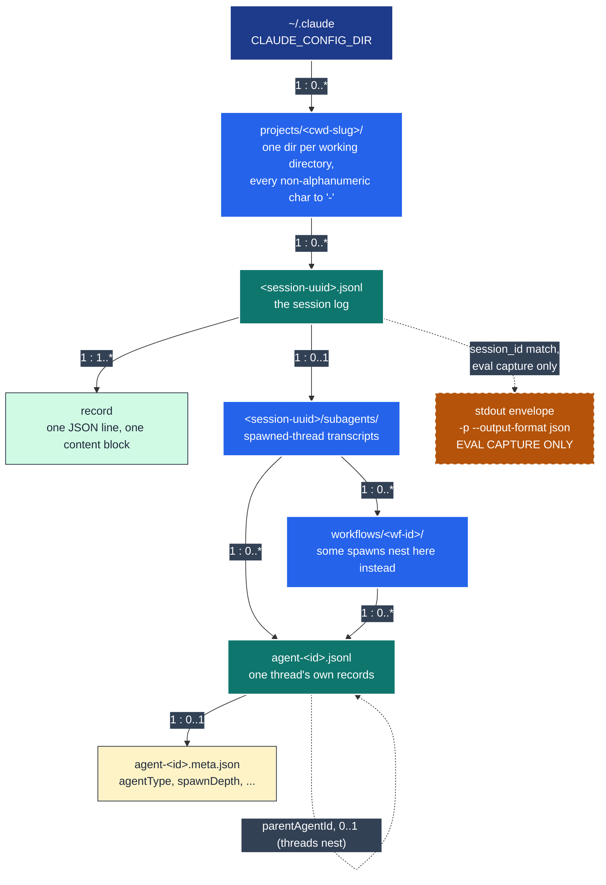
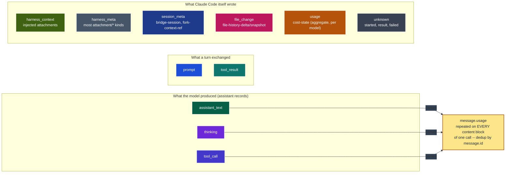

# The Claude Code session log

A reference for what a `~/.claude` session actually contains, so the next reader
stops re-deriving it from raw JSONL. Every fact below was checked against the real
corpus in a live `~/.claude` (122 top-level sessions, 313 subagent transcripts, 439
`.jsonl` files, 122,200 records total at the time of writing) and against this
project's own code, `src/pytest_xharness_eval/harness/{records.py,claude.py}` --
which only ever sees an eval capture, so the corpus is deliberately the wider of the
two, and several rows below record exactly that difference. See also
[`docs/token-accounting.md`](token-accounting.md) for how the token and cost figures
are derived once usage is deduplicated, and [`GLOSSARY.md`](../GLOSSARY.md) for
*call*/*turn*, *subagent* and *session log*.

Both diagrams are flowcharts, not `erDiagram`, so every entity and category can
carry the project's own category colours (`harness/records.py`'s `CATEGORIES`).
Cardinality is written on the edge as `parent : child` (`1 : 0..*` etc.), the same
convention both diagrams use.

## 1. Structural ERD: what is on disk



What the diagram cannot say on its own:

- **A session has zero-or-many spawned threads**, never a fixed count, and a thread
  has **zero-or-one** meta file: a sidecar can go missing without the transcript
  being invalid.
- **Threads nest.** `parentAgentId` on a `.meta.json` names another agent's id, not
  the primary session -- the self-loop on `Agent` above. See fact table row 3.
- **The stdout envelope is not part of the log.** It exists only for the one
  `claude -p --output-format json` invocation an eval capture makes; a real,
  interactive `~/.claude` session never has one on disk at all. This is *why*
  `contextWindow` is `null` on every real session (fact table row 2) --
  `modelUsage[<model>].contextWindow` lives only in that envelope
  (`harness/claude.py::_context_window`), and there is nothing else in the `.jsonl`
  that carries it.
- A truncated final line costs one record, never the session; the diagram's
  `1 : 1..*` on `SessionFile -> Record` holds regardless.

## 2. ERD by message type, grouped by category

`harness/records.py` classifies every record into a `kind` (`claude/<type>[/<subtype>]`)
and every kind into one of twelve categories. A real home directory produces a good
deal that an eval capture never does, so the corpus below is wider than that table.
The diagram below is the category level -- the full kind-by-kind table (grounded in
a histogram over the real corpus, not the code alone) follows it.



Claude uses eleven of the twelve categories a session-log record can belong to --
never `tool_exec`, which is Codex-only (a Claude tool result is always one
`tool_result` record, win or lose; there is no separate "the shell ran" record the
way Codex's `event_msg/item_completed/CommandExecution` is one).

**Which kinds carry usage.** Only the `assistant` record type ever carries a
`message.usage` object, and it carries the *same* object on every content block of
one call (text, thinking, tool_use alike) -- never on `claude/assistant/synthetic`,
which is Claude Code's own "API Error ..." notice with no model call behind it.
`claude/cost-state` is a second, unrelated source of usage: the harness's own
per-model aggregate for the *whole session*, not one call, and it must never be
summed into the per-call ledger (a different scale entirely -- see
[token-accounting.md](token-accounting.md)).

### Full kind catalogue (real corpus, 58 distinct kinds over 122,200 records)

Measured with:

```sh
# classify every record under ~/.claude the way harness/claude.py::_classify does,
# then histogram
python3 - <<'PY'
import json, glob, os, re
from collections import Counter

LEADING_TAG = re.compile(r"\s*<([A-Za-z_][\w.-]*)[\s>/]")
def leading_tag(t): m = LEADING_TAG.match(t) if isinstance(t, str) else None; return m.group(1) if m else None
def msg_text(c): return c if isinstance(c, str) else "\n".join(str(b.get("text") or "") for b in c if isinstance(b, dict)) if isinstance(c, list) else ""
def block_types(c): return {str(b.get("type")) for b in c if isinstance(b, dict)} if isinstance(c, list) else set()
def is_synth(m): return str(m.get("model") or "").startswith("<")

def classify(rec):
    rtype = rec.get("type") or "unknown"
    if rtype == "user":
        content = (rec.get("message") or {}).get("content")
        if not isinstance(content, str) and "tool_result" in block_types(content):
            return "claude/user/tool_result"
        return "claude/user/injected" if leading_tag(msg_text(content)) else "claude/user/prompt"
    if rtype == "assistant":
        msg = rec.get("message") or {}
        if is_synth(msg): return "claude/assistant/synthetic"
        kinds = block_types(msg.get("content"))
        if "tool_use" in kinds: return "claude/assistant/tool_use"
        if "thinking" in kinds and "text" not in kinds: return "claude/assistant/thinking"
        return "claude/assistant/text"
    if rtype == "attachment":
        return f"claude/attachment/{(rec.get('attachment') or {}).get('type') or 'unknown'}"
    return f"claude/{rtype}"

hist = Counter()
for f in glob.glob(os.path.expanduser("~/.claude/projects/**/*.jsonl"), recursive=True):
    for line in open(f, encoding="utf-8", errors="replace"):
        if line.strip():
            hist[classify(json.loads(line))] += 1
for k, v in hist.most_common(): print(k, v)
PY
```

| Category | Kinds observed (count in real corpus) | In `records.py`? |
|---|---|---|
| `prompt` | `user/prompt` (1,138), `user/injected` (324) | yes |
| `tool_call` | `assistant/tool_use` (28,782) | yes |
| `tool_result` | `user/tool_result` (28,781) | yes |
| `thinking` | `assistant/thinking` (14,179) | yes |
| `assistant_text` | `assistant/text` (6,454) | yes |
| `harness_meta` | `assistant/synthetic` (20), `ai-title` (2,327), `atis-latch` (3,025), `last-prompt` (3,038), `queue-operation` (1,792), `system` (843), `custom-title` (409), `agent-name` (360), `pr-link` (124), plus **26 `attachment/*` subtypes** (`total_tokens_reminder` 13,251, `output_style` 5,467, `batching_reminder_sent` 561, `bash_output_audience_note` 536, `edited_text_file` 484, `skill_listing`\* 476, `deferred_tools_delta`\* 432, `agent_listing_delta`\* 176, `queued_command` 140, `auto_mode` 139, `environment` 138, `nested_memory` 121, `command_permissions` 89, `remote_session_change` 65, `date` 56, `instructions` 53, `session_context` 53, `silent_turn_reminder` 50, `date_change` 47, `prompt_snapshot` 20, `file` 19, `goal_status` 17, `model` 10, `output_style_instructions` 7, `task_reminder`\* 7, `invoked_skills` 5, `hook_system_message` 5, `compact_file_reference` 5, `deferred_tools_record` 4, `read_truncation_notice` 4, `plan_mode` 1, `plan_mode_exit` 1, `dynamic_skill` 1) | 7 of the marked kinds only (`*`) |
| `harness_context` | `attachment/deferred_tools_delta`, `attachment/agent_listing_delta`, `attachment/skill_listing`, `attachment/task_reminder` (counts above) | yes |
| `session_meta` | `bridge-session` (1,628), `fork-context-ref` (3) | no |
| `file_change` | `file-history-delta` (747), `file-history-snapshot` (435) | no |
| `usage` | `cost-state` (70) | no |
| **`unknown` (true gap)** | **`started` (67), `result` (55), `failed` (2)** | **no** |

`unknown` is the one row that is a true gap: `claude/started`, `claude/result` and
`claude/failed` are subagent-transcript bookkeeping records
(`{"type":"started","key":"...","agentId":"..."}`) that match no explicit kind and
no prefix rule in `records.py`, so it degrades them to the bare `unknown` category
rather than something like `harness_meta`. 124 records across the corpus, all inside
`agent-*.jsonl` transcripts, never in a primary session file. The catalogue is not
*wrong* -- `unknown` is a safe fallback, not a crash -- but a reader building a
subagent timeline should know these three kinds exist and currently render as
"unknown" pills.

Every other gap between `records.py` and the real corpus (the `attachment/*`
subtypes it has never listed, `bridge-session`, `file-history-*`, `cost-state`,
`fork-context-ref`) is caught safely: the Python plugin only ever reads an *eval
capture*, which never produces the session-management records a real interactive
session writes constantly, so this is a scope difference, not a bug.

## 3. Facts that have already cost real debugging time

| # | Fact | Measured | Command |
|---|------|----------|---------|
| 1 | A Claude response repeats **identical** `usage` across every content block of one call. Summing `message.usage` per line over-counts by the number of blocks. | Measured on a real 122,200-line corpus session (`.claude/projects/-Users-jpeak-play-agentic-dotfiles/5ff683b3-...`, 857 raw `assistant` lines, 228 distinct `message.id`): naive **5,030,714**, deduped **536,080** (9.4x -- the inflation factor is the average blocks-per-turn, here 3.76). | `jq -s 'map(select(.type=="assistant"))|group_by(.message.id)|map(.[0].message.usage.output_tokens)|add' "$SESSION"` vs the same without `group_by`/`.[0]` |
| 2 | **Every** real session has `contextWindow: null`. The window lives only in an eval capture's stdout envelope (§1), never in a real `.jsonl` -- there is no key to grep for. | 114 of 114 real top-level sessions with `>=1` `assistant` record (of 122 total; 8 have none). All 114 fold to `contextWindow: null` by construction: `harness/claude.py::_context_window` sources it from `envelope.modelUsage[...]`, and no real session file has an `envelope` field at all. The corpus is a live, growing home directory, so the exact count drifts; the fact does not. | `grep -rl '"contextWindow"' ~/.claude/projects` finds **zero** real session `.jsonl` files (58 files match the bare *substring* "contextWindow", but every one of them is a transcript of a conversation *about this very codebase*, quoting the field name in prose or a diff -- not the field itself) |
| 3 | Threads nest: `spawnDepth` reaches (at least) 3, `parentAgentId` names another *agent*, not the primary, and only `agentType`+`spawnDepth` are always present. | 313 real `agent-*.meta.json` files, **8** distinct key combinations, `agentType` and `spawnDepth` in all 313, no other key in all 313. `spawnDepth` histogram: depth 1 -> 205, depth 2 -> 68, depth 3 -> 40. All 38 distinct `parentAgentId` values resolve to another meta file's agent id in this corpus (0 unresolved -- a fold must still tolerate an unresolved parent, which this corpus simply happens not to exercise). | `find ~/.claude -name 'agent-*.meta.json' \| xargs -I{} jq -r 'keys \| sort \| join(",")' {} \| sort \| uniq -c` |
| 4 | Records are **not** strictly timestamp-ordered; `startedAt`/`endedAt` must be `min`/`max` over all records, never the first and last line's timestamps. | Re-measured broader than the original claim. Comparing the very first and last record against the true `min`/`max` of the whole file: **37 of 122** real sessions have a first-or-last record that is *not* the true extreme (deltas from 1ms to 99ms) -- always on the *start* side in this corpus (every session's true `max` equalled its last record). Looking instead at adjacent-line inversions (a later line with an earlier timestamp than the one before it): **84 of 122** sessions have at least one; of those, **29** are small (<=2ms, consistent with same-call block-write jitter) and **55** show much larger swings (up to hours) that look like queued messages or `--resume` splicing old and new history together, not block jitter -- a separate, open phenomenon worth flagging rather than folding into this fact. Either way the conclusion is the same and, if anything, understated by "4 sessions": never trust first/last as a proxy for earliest/latest. | `python3 -c "import json,glob,os; [print(f) for f in glob.glob(os.path.expanduser('~/.claude/projects/*/*.jsonl')) if (lambda ts: ts and (ts[0]!=min(ts) or ts[-1]!=max(ts)))([r['timestamp'] for r in map(json.loads, open(f, errors='replace')) if r.get('timestamp')])]"` lists the 37 violators; per-file `jq -s 'map(.timestamp)|{first:.[0],last:.[-1],min:min,max:max}'` on any one confirms the deltas |

## 4. How to total tokens for a Claude session

Short answer, spelled out fully in [token-accounting.md](token-accounting.md):

1. Walk the `assistant` records, **group by `message.id`**, and take only the
   **first** record's `message.usage` per group (row 1 above) -- this is one `Call`.
2. Per call, `context_tokens = input_tokens + cache_read_input_tokens +
   cache_creation_input_tokens`; the run's `peak_context_tokens` is the `max` of
   that over every call, **not** a sum, and **not** compared against `total_tokens`.
3. The run's `total_tokens` is the **sum**, over every call, of
   `input_tokens + output_tokens + cache_read_input_tokens +
   cache_creation_input_tokens` (`reasoning`/thinking tokens are already inside
   `output_tokens` -- never add them again).
4. Fold every subagent transcript (`agent-*.jsonl`) the same way and add its calls'
   usage into the run total (ADR 0033) -- a spawned thread is billed by the provider
   exactly like the primary.
5. `contextWindow` (row 2 above): only present when an eval-capture envelope exists.
   On a real session, leave it `null` rather than guessing a value the log never
   carried.

`harness/claude.py::_call_usage` and `ledger_of` are the one place this arithmetic
is implemented; nothing else should reimplement it.
