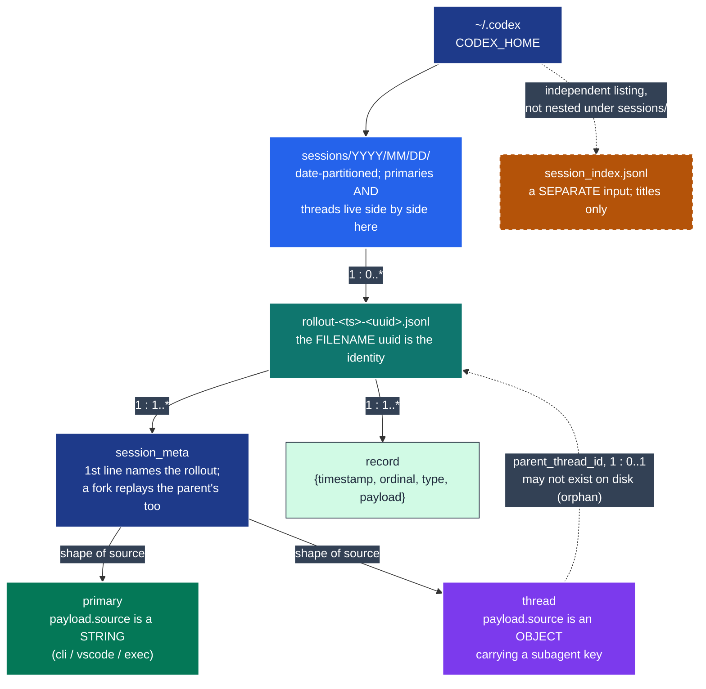
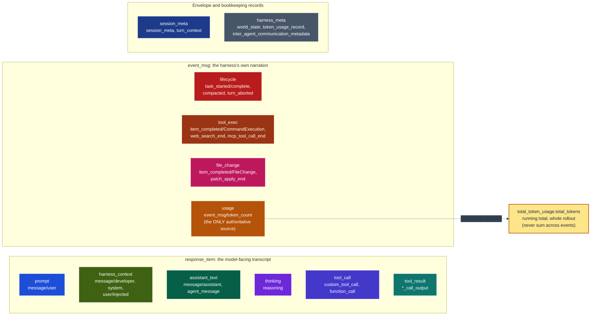

# The Codex rollout log

A reference for what a `~/.codex` home directory actually contains, so the next
reader stops re-deriving it from raw JSONL. Every fact below was checked against the
real corpus in a live `~/.codex` (281 rollout files under `sessions/`, one
`session_index.jsonl` with 37 rows) and against this project's own code,
`src/pytest_xharness_eval/harness/{records.py,codex.py}` -- which only ever sees one
isolated `CODEX_HOME`, so the corpus is deliberately the wider of the two, and
several rows below record exactly that difference. See also
[`docs/token-accounting.md`](token-accounting.md) for how the token and cost
figures are derived, and [`GLOSSARY.md`](../GLOSSARY.md) for *call*/*turn*,
*subagent* and *session log*.

Both diagrams are flowcharts, not `erDiagram`, so every entity and category can
carry the project's own category colours (`harness/records.py`'s `CATEGORIES`).
Cardinality is written on the edge as `parent : child` (`1 : 0..*` etc.).

## 1. Structural ERD: what is on disk



What the diagram cannot say on its own:

- **The filename uuid is the identity, never `payload.session_id`.** A thread's
  `payload.session_id` usually names an *ancestor*, not itself, so one value can be
  shared by dozens of separate rollout files (fact table row 2). Two threads sharing
  a `payload.session_id` are still two distinct sessions.
- **A home directory has many primaries, not one.** The Python plugin's private,
  seeded `CODEX_HOME` asserts exactly one; a shared real home directory has 86 of
  them side by side in the same `sessions/` tree as their threads (fact table row
  3), so "exactly one primary" is a fact about the *plugin's isolation*, not about
  the log format.
- **An orphan is not corruption.** A thread whose `parent_thread_id` names no
  rollout on disk (the dashed self-loop back to `Rollout`) is still a session in its
  own right; a home directory is not a closed world.
- `session_index.jsonl` is not inside `sessions/` and is not keyed by filename --
  it is a separate title index, keyed by the same id `session_meta.payload.id` uses,
  and it carries duplicates (fact table row 6).

## 2. ERD by message type, grouped by category

`harness/records.py` classifies every record into a `kind` (`codex/<type>[/<subtype>]`)
and every kind into a category. A real, shared home directory produces a good deal
that the plugin's isolated `CODEX_HOME` never does, so the corpus below is wider
than that table. The diagram below is the category level -- the full table (grounded
in a histogram over the real corpus) follows it.



Codex uses all twelve categories a session-log record can belong to -- unlike
Claude, which has no `tool_exec` kind at all (§2 of `claude-session-log.md`): Codex
separates "the shell ran" (`tool_exec`) from "a tool call happened"
(`tool_call`/`tool_result`) as distinct event kinds, where Claude folds both into
one `tool_result` record.

**Which kinds carry usage.** `event_msg/token_count` is the only kind the fold
actually uses: its `payload.info.last_token_usage` is one call's usage,
`payload.info.total_token_usage` is the cumulative running total (fact table row
1). A second, later-observed record kind, `token_usage_record`, carries the *same*
accounting from a different angle -- worth knowing about even though nothing in
this project folds it yet: its `payload.usage` is the true per-call figure (matches
`last_token_usage`), `payload.turn_token_usage` accumulates within one turn and
resets at a turn boundary, and `payload.thread_token_usage` is the identical
cumulative total `token_count`'s `total_token_usage.total_tokens` already reports
(confirmed by direct comparison: both sequences are the same numbers by a different
route on the rollout cited in row 1 below). Three granularities, one underlying
count -- pick `thread_token_usage` (or `token_count`'s `total_token_usage`) for a
whole-rollout total, never `turn_token_usage` for that purpose.

### Full kind catalogue (real corpus, 38 distinct kinds over 281 rollouts)

Measured with:

```sh
python3 - <<'PY'
import json, glob, os
from collections import Counter
hist = Counter()
for path in glob.glob(os.path.expanduser("~/.codex/sessions/**/rollout-*.jsonl"), recursive=True):
    for line in open(path, encoding="utf-8"):
        rec = json.loads(line)
        rtype, payload = rec.get("type"), rec.get("payload") or {}
        if rtype == "response_item":
            sub = payload.get("type", "unknown")
            key = f"codex/response_item/message/{payload.get('role')}" if sub == "message" else f"codex/response_item/{sub}"
        elif rtype == "event_msg":
            sub = payload.get("type", "unknown")
            if sub == "item_completed":
                item = payload.get("item") or {}
                key = f"codex/event_msg/item_completed/{item.get('item_type') or item.get('type')}"
            else:
                key = f"codex/event_msg/{sub}"
        else:
            key = f"codex/{rtype}"
        hist[key] += 1
for k, v in hist.most_common(): print(k, v)
PY
```

| Category | Kinds observed (count) | In `records.py`? |
|---|---|---|
| `usage` | `event_msg/token_count` (8,212) | yes |
| `thinking` | `response_item/reasoning` (8,012), `event_msg/item_completed/Reasoning` (7,013), `event_msg/agent_reasoning` (397) | reasoning + item_completed only |
| `tool_call` | `response_item/custom_tool_call` (6,289), `response_item/function_call` (697) | yes |
| `tool_result` | `response_item/custom_tool_call_output` (6,288), `response_item/function_call_output` (697) | yes |
| `tool_exec` | `event_msg/item_completed/CommandExecution` (4,946), **`.../McpToolCall` (440, no explicit entry)**, **`.../SubAgentActivity` (374, no explicit entry)**, **`.../ImageView` (270, no explicit entry)**, **`.../CollabAgentToolCall` (212, no explicit entry)**, **`.../Extension` (165, no explicit entry)**, `event_msg/web_search_end` (24), `event_msg/mcp_tool_call_end` (24) | `CommandExecution` only |
| `assistant_text` | `response_item/message/assistant` (2,234), `event_msg/item_completed/AgentMessage` (1,390), `event_msg/agent_message` (800), `response_item/agent_message` (395) | assistant, item_completed only |
| `prompt` | `response_item/message/user` (1,597, some `/injected`), `event_msg/item_completed/UserMessage` (277), `event_msg/user_message` (717) | user, item_completed only |
| `lifecycle` | `event_msg/task_started` (1,248), `event_msg/task_complete` (1,115), `event_msg/turn_aborted` (72), **`compacted`** (32, see below), `event_msg/context_compacted` (1), **`.../ContextCompaction` (20, no explicit entry)** | task_started/complete only -- **`compacted` and `token_usage_record` fall to bare `unknown` in `records.py`, see below** |
| `session_meta` | `session_meta` (393 -- more than 281 because a fork replays its parent's too), `turn_context` (1,236) | yes |
| `harness_context` | `response_item/message/developer` (727) | yes |
| `harness_meta` | `world_state` (865), `event_msg/thread_settings_applied` (920), **`token_usage_record`** (299, see below), **`inter_agent_communication_metadata`** (395, see below), `event_msg/sub_agent_activity` (4) | world_state only |
| `file_change` | `event_msg/item_completed/FileChange` (652), `event_msg/patch_apply_end` (59) | FileChange only |

**The one real gap, in `records.py` only: `compacted`, `token_usage_record` and
`inter_agent_communication_metadata` classify as bare `codex/<type>` with no
`response_item/` or `event_msg/` prefix, and `records.py`'s prefix-fallback table
only knows those two prefixes -- so all three degrade all the way to `unknown`,
not even a plausible category, in the Python plugin.** All three want a catalogue
entry and correct attribution (`lifecycle`, `usage` and `harness_meta`
respectively) rather than silent discard, and `compacted` is the one that matters
most: it is the record that explains a context-window drop (fact table row 5).

The bolded `item_completed/*` subtypes with "no explicit entry" are a softer gap:
the catalogue does not name them, but still classifies them correctly via the
`event_msg/item_completed/` prefix rule (-> `lifecycle`), so nothing breaks -- they
would just all render under one undifferentiated pill today.

## 3. Facts that have already cost real debugging time

| # | Fact | Measured | Command |
|---|------|----------|---------|
| 1 | `token_count`'s `total_token_usage.total_tokens` is a **cumulative** running total per rollout, never a per-call figure. Summing it across calls inflates by roughly the square of the call count. | Real rollout `2026/09/04/rollout-...-01a06a17-....jsonl`: the sequence runs 33,036 -> 73,186 -> 122,523 -> 180,990 -> 239,881 -> ... -> **17,091,598** over 139 `token_count` events, strictly non-decreasing. The corpus is live and still growing, so the exact digits drift between readings; the phenomenon and its order of magnitude do not. | `jq -c 'select(.type=="event_msg" and .payload.type=="token_count") \| .payload.info.total_token_usage.total_tokens' "$ROLLOUT"` |
| 2 | `payload.session_id` is shared by dozens of separate rollout files; only the filename uuid identifies a rollout. | Top value in the real corpus: `01a04623-...-e0d7698796d9` shared by **94** files. Second: **17** files. (Both counts drift as the home directory grows; the collision does not.) | `find ~/.codex/sessions -name '*.jsonl' -exec sh -c 'head -1 "$1" \| jq -r ".payload.session_id // empty"' _ {} \; \| sort \| uniq -c \| sort -rn \| head` |
| 3 | Classification is the **shape** of `session_meta.payload.source`: a string is a primary, an object carrying a `subagent` key is a thread. | All 281 real rollouts: **86 primaries** (`"cli"` 73, `"vscode"` 12, `"exec"` 1) + **195 threads** (`{subagent:{thread_spawn:...}}` 123, `{subagent:{other:...}}` 72). | `find ~/.codex/sessions -name '*.jsonl' -exec sh -c 'head -1 "$1" \| jq -r ".payload.source \| type"' _ {} \; \| sort \| uniq -c` (then split the `"string"` bucket by value, the `"object"` bucket by its `subagent` key) |
| 4 | The parent link is `parent_thread_id`, not `forked_from_id`. | All **195/195** threads carry `parent_thread_id`; only **75/195** carry `forked_from_id`. Attaching by `forked_from_id` alone would orphan 120 of 195 real threads (61.5%). | `find ~/.codex/sessions -name '*.jsonl' -exec sh -c 'head -1 "$1" \| jq -e ".payload.parent_thread_id" >/dev/null 2>&1 && echo has_parent' _ {} \; \| wc -l` counted against the same with `.payload.forked_from_id` |
| 5 | A `compacted` record resets the *reported* context; the run did not shrink. | Rollout with 2 `compacted` records: at each one, the next `token_count`'s `last_token_usage.input_tokens` drops to **0** (from 234,299 and 223,370 respectively) while `total_token_usage.total_tokens` is **unchanged** across the boundary (9,959,753 -> 9,959,753; 28,039,876 -> 28,039,876) -- the cumulative bill does not reset, only the per-call context figure does. | Walk `compacted` line numbers, compare the nearest `token_count` before/after on `last_token_usage.input_tokens` and `total_token_usage.total_tokens` |
| 6 | `session_index.jsonl` carries duplicate ids; the greatest `updated_at` wins. | 37 rows, **10 distinct ids duplicated** (2-3 rows each). Example `01a06a69-...`: three rows with the same id, titles `"execute this plan docs/spikes/2026-0"` -> `"Execute Braze startup timing plan"` -> `"braze-inapp-timing-investigation"`, timestamps 03:14:34 < 03:14:38 < **03:17:17** -- the last, most-specific title is also the greatest `updated_at`. | `jq -r '.id' ~/.codex/session_index.jsonl \| sort \| uniq -c \| awk '$1>1'` |

## 4. How to total tokens for a Codex session

Short answer, spelled out fully in [token-accounting.md](token-accounting.md):

1. Find the **last** `event_msg`/`token_count` record in the rollout (or the
   trailing forked-thread rollouts, folded in separately). Its
   `payload.info.total_token_usage.total_tokens` **is** the run's total -- do not
   sum the per-event totals, and do not sum `payload.info.last_token_usage` across
   events either unless you specifically want a cross-check (it should reconstruct
   the same number: `total_tokens = input_tokens + output_tokens`, reasoning
   already inside `output_tokens`).
2. Per call, split OpenAI's raw `input_tokens` into disjoint tiers the way
   `harness/codex.py::_call_usage` does (`input_tokens - cached_input_tokens -
   cache_write_input_tokens`, `cache_read_tokens = cached_input_tokens`,
   `cache_write_tokens = cache_write_input_tokens`) so the arithmetic matches
   Claude's disjoint shape and each tier prices once.
3. `peak_context_tokens` is the `max` over calls of the reconstructed raw
   `input_tokens` for that call (`context_tokens = input + cache_read +
   cache_write`, which undoes step 2) -- never a sum, and never compared against
   `total_tokens`.
4. Watch for `compacted` (row 5): a mid-rollout drop in `last_token_usage` is not
   the conversation shrinking, so do not let it suppress a true `peak_context_tokens`
   recorded earlier in the same rollout.
5. Fold every thread whose `parent_thread_id` names this rollout (row 4) the same
   way and add its usage into the run total (ADR 0033) -- a spawned thread is
   billed by the provider exactly like the primary.

`harness/codex.py::_call_usage`, `_Ledger.token_count` and `fold` are the one place
this arithmetic is implemented; nothing else should reimplement it.
