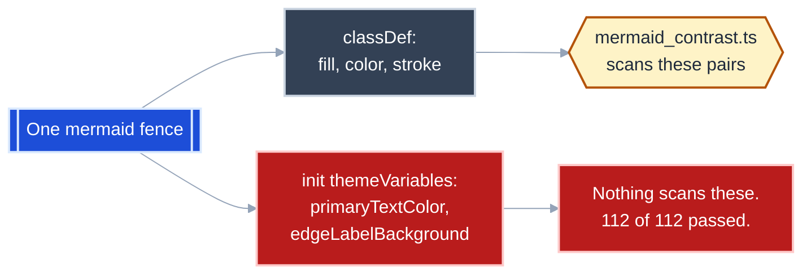

# Finding: the contrast gate cannot see the theme variables, and the prescribed header hides every edge label

**Date:** 2026-08-31
**Found while:** authoring [`maintainable.md`](maintainable.md) with the
`mermaidjs-diagrams` skill.
**Status:** fixed in `maintainable.md`; unfixed upstream in the skill's own
reference files.

## What broke

The skill prescribes this `%%{init}%%` header verbatim for every fence that uses
custom colour, in both `resources/color_theming.md` and
`resources/document-types/educational.md`:

```
%%{init: {"theme":"base","flowchart":{"htmlLabels":false},"themeVariables":{"primaryTextColor":"#ffffff","textColor":"#ffffff","lineColor":"#94a3b8"}}}%%
```

With it, **every edge label renders as white text on Mermaid's pale
`edgeLabelBackground`** -- unreadable in the dark-transparent variant and the
default-white variant alike. Node text is fine, because each node's `classDef`
sets its own `color:`. Only the edges are lost, which is why it survives a
skim: the diagram looks right, and the words on the arrows are simply gone.

## Why both gates passed anyway

`mermaid_contrast.ts` reported **112 pass, 0 fail across 8 diagrams** on the
version of the document whose every edge label was invisible.



The gate audits `classDef` and `style` directives. Edge-label colour is set in
`themeVariables`, which it never reads. `mermaid_complexity.ts` is structural and
`render_mermaid.sh` verifies PNG magic bytes and dimensions -- a fully legible
diagram and a diagram with eight invisible labels are byte-plausible alike. All
three gates are green on a document no reader can follow.

This is the skill's own stated failure mode, reproduced in the skill's own
boilerplate: *"the author can read it fine on their screen; readers quietly give
up."*

## The lever is `primaryTextColor`

Determined by rendering three probe fences, not by reading the theme source:

| Probe | Edge label |
|---|---|
| `primaryTextColor:#1e293b` | **legible** |
| `tertiaryTextColor:#1e293b`, `primaryTextColor:#ffffff` | invisible |
| `textColor:#1e293b`, `primaryTextColor:#ffffff`, `htmlLabels:true` | invisible |

`textColor` and `tertiaryTextColor` are not the lever, despite `textColor` being
the name the skill's own comment attaches the concern to.

## The fix

```
%%{init: {"theme":"base","flowchart":{"htmlLabels":false},"themeVariables":{"primaryTextColor":"#1e293b","textColor":"#1e293b","lineColor":"#94a3b8","edgeLabelBackground":"#f1f5f9"}}}%%
```

`#1e293b` on `#f1f5f9` is 13.35:1 (AAA), verified with `color_contrast.ts`. This
is safe **only when every node carries an explicit `color:` in its `classDef`**,
which the skill already mandates -- `primaryTextColor` then governs nothing but
the edge labels. A fence with unstyled nodes needs its node text checked before
adopting it.

## What to change upstream

| File | Change |
|---|---|
| `resources/color_theming.md` | Correct the prescribed header; add `primaryTextColor` to the §3 "always pair fill with color" rule as the edge-label case |
| `resources/document-types/educational.md` | §5 "Two mandatory mechanics" -- same header correction |
| `scripts/mermaid_contrast.ts` | Parse `%%{init}%%` `themeVariables` and score `primaryTextColor` against `edgeLabelBackground` (both defaulted when absent) |

## The transferable rule

**A gate that scans one colour surface certifies only that surface.** Treat a
green `mermaid_contrast.ts` as necessary and not sufficient, and look at a
rendered PNG from both variants before calling a diagram done -- which is what
found this, after the gate had already passed twice.
