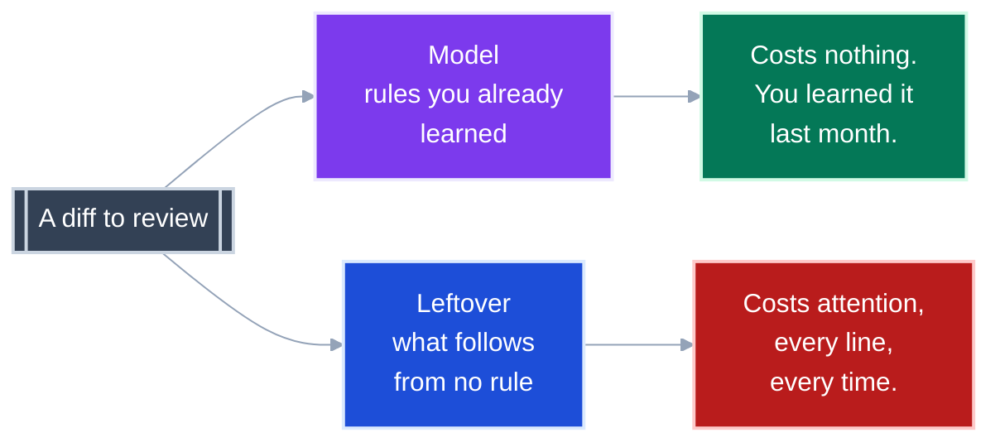

# Measuring maintainability: the locked-in learnings

**Status:** exploration, no gate adopted. **Before you start:** arithmetic, and `log2(8) = 3`.

This file holds only what the research established and would defend.
Each section is a finding that was measured against this repository or traced to a primary source.

| File | Holds |
|---|---|
| [GOAL.md](GOAL.md) | the mission statement every finding is checked against |
| **README.md** | the learnings, locked in |
| [OPEN_QUESTIONS.md](OPEN_QUESTIONS.md) | everything undecided, unmeasured or unvalidated |
| [GLOSSARY.md](GLOSSARY.md) | every metric's formula, with a worked example |
| [extraction-apis.md](extraction-apis.md) | what an LSP and tree-sitter can each be asked for, by exact method name |
| [ast-data-models.md](ast-data-models.md) | the primitives each graph provider stores, as one ERD per provider |
| [examples/](examples/) | two toy codebases, and what all five providers emitted for each |
| [tools/](tools/) | the call-graph extractors, with the one-off scripts archived in git |

A learning moves here from OPEN_QUESTIONS.md only when it has evidence behind it.
A number here that stops holding is removed, not caveated.

---

<details>
<summary><b>Table of Contents</b></summary>
<!--TOC-->

- [Measuring maintainability: the locked-in learnings](#measuring-maintainability-the-locked-in-learnings)
  - [The gate we already have measures almost nothing](#the-gate-we-already-have-measures-almost-nothing)
  - [Length predicts comprehension and cyclomatic complexity does not](#length-predicts-comprehension-and-cyclomatic-complexity-does-not)
  - [A spring is a count, and a damper has to be a ratio](#a-spring-is-a-count-and-a-damper-has-to-be-a-ratio)
  - [Reviewing cost is the leftover, never the total](#reviewing-cost-is-the-leftover-never-the-total)
  - [Nothing tells you when to stop refactoring, and that is a theorem](#nothing-tells-you-when-to-stop-refactoring-and-that-is-a-theorem)
  - [A new name costs more in a bigger codebase](#a-new-name-costs-more-in-a-bigger-codebase)
  - [Deduplication is not tidying, and leverage tells them apart](#deduplication-is-not-tidying-and-leverage-tells-them-apart)
  - [One number cannot do both jobs](#one-number-cannot-do-both-jobs)
  - [Every metric family is blind in a different direction](#every-metric-family-is-blind-in-a-different-direction)
  - [Conductance scores what you cannot see by reading](#conductance-scores-what-you-cannot-see-by-reading)
  - [Conductance has no fixed threshold](#conductance-has-no-fixed-threshold)
  - [Score both halves of a partition, or it degenerates](#score-both-halves-of-a-partition-or-it-degenerates)
  - [The file boundary carries more signal than the folder](#the-file-boundary-carries-more-signal-than-the-folder)
  - [What we still cannot extract](#what-we-still-cannot-extract)
  - [Prior art: what the industry already settled](#prior-art-what-the-industry-already-settled)
  - [The readability scale we use to talk about docs](#the-readability-scale-we-use-to-talk-about-docs)
  - [The compact rule](#the-compact-rule)
  - [References](#references)
  - [Recovering the working documents](#recovering-the-working-documents)

<!--TOC-->
</details>

---

## The gate we already have measures almost nothing

`ruff` `C901` at `max-complexity = 10` reports zero violations across 310 functions.

```
$ uvx ruff check src/ --select C901
All checks passed!
```

Two other tools disagree, independently.

| Function | `ruff` `C901` | `radon` | `lizard` |
|---|---|---|---|
| `ClaudeSessionLog.to_result` | **3** | **26** | **26** |
| `_Ledger.assistant` | **8** | **21** | **21** |

The cause was verified by reading the installed `mccabe` 0.7.0 source.
Its AST visitor has **no handler for ternaries, comprehensions, or `and`/`or`**.
This codebase is written in exactly that style.

**Takeaway:** "we gate complexity at 10" is true of the mccabe count and vacuous as a description of this code.

---

## Length predicts comprehension and cyclomatic complexity does not

An fMRI study measured actual comprehension (Peitek et al., ICSE 2021).
Kendall tau against measured correctness:

| Metric | vs correctness |
|---|---|
| **Lines of code** | **-.46** |
| Halstead volume | -.45 |
| McCabe cyclomatic | **-.09** |

Scalabrino et al. tested **121 metrics** against understandability.
None reached even a medium correlation.

**Takeaway:** the one cheap static number for "hard to read" is line count.
Cyclomatic complexity is the worst candidate tested.

Length hurts most once a function scrolls, and a few functions carry most of that cost.
[Screen load](GLOSSARY.md#ts-scr-03-screen-load) charges each name held, and multiplies the charge per screen past the first.

| Tree | Functions | Past one screen | Share of screen load |
|---|---|---|---|
| `src/pytest_xharness_eval` | 312 | 1 | 1.0% |
| `report-ui/src` | 323 | 19 | **61.6%** |

Line count alone would flag the wrong Python function.
The longest, `pytest_addoption`, repeats 25 names over 71 lines, and scores half the load of a 50-line function holding 72.
The screen height and penalty shape are not calibrated, see C8 in [OPEN_QUESTIONS.md](OPEN_QUESTIONS.md).

---

## A spring is a count, and a damper has to be a ratio

A metric pair only controls anything if the cheapest refactor moves the two in opposite directions.
Two springs bolted in parallel are a stiffer spring, not a suspension.

| Pair | Under extraction | Verdict |
|---|---|---|
| Complexity + lines of code | both go **down** | two springs |
| Complexity + nesting depth | both go **down** | two springs |
| Unit size + **unit count** | size down, count up | conserved |
| Complexity + **parameter count** | complexity down, params up | conserved |
| Complexity + **conductance** | complexity down, boundary edges up | conserved |

The first two rows are what everyone reaches for, and they damp nothing.

The rule underneath the table is the physics distinction between extensive and intensive quantities.

- **Extensive** metrics scale with the amount of code: lines, branches, parameters, nesting. Splitting a unit lowers them for free, and splitting is what extraction is.
- **Intensive** metrics are a ratio of two extensive ones: conductance, leverage, duplication rate. Splitting a unit raises the numerator and denominator together, so the ratio does not fall for free.

A ratio lies when its denominator is small.
So an intensive metric is never reported without its denominator, and a cluster below a volume floor reports "not measurable" rather than a number.
An enum with no internal calls scores conductance 1.0, and a module whose callers all live outside the measured graph scores 0.0. Both scores are correct and meaningless.

**Takeaway:** pair a count only with a ratio, and print the ratio's denominator beside it.

---

## Reviewing cost is the leftover, never the total

Any description splits into a **model**, the rules that generalise, and a **leftover**, the exceptions no rule produced.
Grunwald and Vitanyi use exactly this split: observations of the planets become the laws of gravity plus the measurement errors.



**Minimum Description Length** (Rissanen, 1978) makes the split countable as `L(H) + L(D given H)`.
`L` is length in bits, `H` is the model and `D` is the data.

Refactoring moves length between the halves rather than deleting it.
Extract nothing and the leftover is enormous.
Extract everything and the model is three hundred names to learn.
Because the halves move in opposite directions, the sum has a bottom.


*Illustrative shape, not measured data.*

**Takeaway:** a metric that blends both halves into one number measures the wrong thing.

---

## Nothing tells you when to stop refactoring, and that is a theorem

**Kolmogorov complexity** `K(x)` is the length of the shortest program that produces `x`.
Every real complexity metric approximates it.

`K` is **uncomputable**: no algorithm exists at any cost.
It is *upper semi-computable*, so you can keep finding shorter descriptions forever and never know you have found the shortest.

The target is not the shortest program either, because the shortest program is code golf.
The target is Vereshchagin and Vitanyi's **minimal sufficient statistic**: shrink the model until it explains everything it can, and leave the irreducible rest.

**Takeaway:** the stopping signal has to come from outside the metric.
The only observable one is a derivative that has stopped moving, covered in [Conductance has no fixed threshold](#conductance-has-no-fixed-threshold).

---

## A new name costs more in a bigger codebase

Two standard model-selection criteria charge a penalty per parameter.
Mapped to code, a parameter is **a name someone invented that you must now learn**.

```
AIC = 2k       - 2 ln(L)      penalty per name: 2
BIC = k ln(n)  - 2 ln(L)      penalty per name: ln(n)
```

`k` is the number of names and `n` is the size of the codebase.


This repository is 6,974 lines, and `ln(6974)` is **8.85**.
`BIC` charges 8.85 per new name where `AIC` charges 2, which is **4.4 times more**.

**Takeaway:** the price of a new abstraction is not a fixed threshold.
It rises with the codebase it lands in, which is a calibration with a derivation behind it.

---

## Deduplication is not tidying, and leverage tells them apart

Every complexity metric scores these two refactors identically.

| | Names added | Sites explained | `L(D given H)` | Verdict |
|---|---|---|---|---|
| Three duplicate blocks become one function | 1 | 3 | shrinks by about two copies | **always wins** |
| One nested block becomes one function | 1 | 1 | unchanged, relocated | pays `ln(n)`, gains nothing |

The discriminator is **leverage**: the number of call sites reaching one name.

- **Leverage 1:** you tidied, and the code only moved.
- **Leverage 3 or more:** you found a rule.

`_Shell` in this repository has leverage 3.
The ADR 0034 registry has leverage 6.
A wrapper around one ternary has leverage 1.

Leverage undercounts for a library, because the published grader surface is called from consuming repositories outside the measured graph.

**Takeaway:** leverage is computable from a call graph today.
It is the one measurement here that separates the refactor worth doing from the one that only improves a score.

---

## One number cannot do both jobs

A score can answer a prediction question: will the next diff be easier to review?
It can answer an identification question: is this the right way to split the module?

Yang (2005) proved no single model-selection criterion does both well.

**Takeaway:** a scorecard is multidimensional because a theorem requires it.

---

## Every metric family is blind in a different direction

Seven rearrangements of this codebase were scored by three metric families at once.
Each cell is the percent change from the real codebase.

| Transform | modularity `Q` | mean cyclomatic | Halstead volume |
|---|---|---|---|
| Every module in one folder | **-100%** | 0% | 0% |
| Every module in one file | -100% | 0% | +0.1% |
| Every function folded into a class | -48% | 0% | +0.3% |
| Extract a wrapper per statement | 0% | **-44%** | **+28%** |
| Extract every 3 statements | 0% | -29% | +12% |
| Delete single-caller functions | -7% | -14% | -23% |
| Duplicate shared functions | **+6%** | -0.3% | +4.4% |

- **Cyclomatic complexity cannot see filing.** Flattening the tree leaves `radon`, `lizard` and `complexipy` byte-identical.
- **Modularity cannot see extraction.** A new helper's call stays inside its own folder.
- **Halstead volume catches extraction.** It rises 28% and says there is more program to read.
- **Nothing on this table catches duplication cleanly.** `Q` rises, which is the wrong direction, and volume cannot tell duplication from growth.

The extraction row is the strongest single number in this work.
Adding 505 do-nothing wrappers cut mean cyclomatic complexity by 44% and mean cognitive complexity by 62%.
**The maximum never moved:** 26 for `radon` and 31 for `complexipy` in every variant, because subdivision adds trivial functions and never touches the worst one.
`C901` reported zero violations in all thirteen Python variants, including the ones built to be as bad as possible.

Two further rules came out of the same runs.

- **Duplication games `Q`, and leveraged names catch it.** Duplicating shared code raised `Q` from 0.589 to 0.624 while names with three or more callers fell from 16 to 13. Leiden re-filing raised `Q` to 0.667 with leveraged names unchanged. A change that raises `Q` while lowering leveraged names is duplication.
- **Halstead reuse is gamed by duplication.** Repeats compress well, so token reuse rises while the reviewer still reads every copy. Use Halstead volume, not reuse.

**Takeaway:** a scorecard needs one metric from each family.
Report a distribution over thresholds rather than a mean, because a mean is gamed by adding units.

---

## Conductance scores what you cannot see by reading

Every other metric scores text you can see by opening a file.
Conductance scores how much of a module reaches outside itself, which is spread across every other file.

It is computed on a call graph, where each node is a named callable and each edge is one call.
An LSP produces one through `textDocument/prepareCallHierarchy` and `callHierarchy/incomingCalls`.

```
cut(S)   edges with exactly one end in S
vol(S)   edge ends touching S
phi(S) = cut(S) / min(vol(S), vol(rest))
```

`phi` is **the share of a module's call traffic that crosses its own boundary**.
Near 0 is a module you can read on its own, and near 1 is a module whose every line sends you elsewhere.
It answers the reviewer's question: *if I change this module, how much of the rest do I need to hold in my head?*

A folder layout is a model that makes one prediction, that a call stays inside its folder.
Every crossing call is a prediction the model got wrong, which is `L(D given H)` made countable.
So conductance of the declared partition is the leftover, normalised.

Measured on this repository's 312 callables and 380 edges, `verify/` scores 0.091 and the root package scores 0.756.
It ranks modules in an order an architect recognises, and that ranking is its entire demonstrated value.

**Takeaway:** conductance is the only metric on the list that measures reach, and it is intensive, so extraction cannot lower it for free.

---

## Conductance has no fixed threshold

A folder of UI primitives is supposed to leak, because everything uses it.
A parser is not.
The same number passes one and fails the other, so no threshold exists.
Anyone who says a `phi` of 0.4 is a problem is making it up.

**Read the change instead.** Compare a module to itself across a diff.
Its job has not changed, so the job cancels out and the direction of travel remains.

```
model/   phi 0.34  ->  0.41     this change made it leakier
```

The derivative also supplies the stopping signal the theorem says no metric can.

| Question | Instrument |
|---|---|
| Did this change make it worse? | the sign of the change in `phi` |
| Should I keep refactoring? | the size of that change, falling |
| Am I at the minimum? | unanswerable, by the theorem |

The plateau is the minimal sufficient statistic observed from outside.
You stop because you stopped moving, not because you know you arrived.

Extraction moves conductance in both directions.
Pulling genuinely shared code into a shared module raises it while improving the codebase.

**Takeaway:** gate on the delta and never on the value, and read a moving `phi` as *look at this*, never *this is wrong*.

---

## Score both halves of a partition, or it degenerates

A community detection algorithm lowers the leftover by inventing clusters.
One cluster per name has no crossings to explain and explains nothing.
Every single-number objective tried had a degenerate optimum, a layout nobody would defend.

| Objective | Degenerate optimum |
|---|---|
| inside share | one cluster, scoring 100% |
| total description length | one cluster, under a naive coding scheme |
| bits saved per boundary | two clusters, because they minimise the divisor |

Scoring both halves over this repository's 276 connected names ranks the partitions sensibly.

| Partition | Clusters | `L(H)` | `L(D given H)` | **Bits saved per boundary** |
|---|---|---|---|---|
| One cluster, no architecture | 1 | 0 | 3081 | 0 |
| **The declared folders** | **8** | 828 | 2446 | **90.7** |
| One cluster per file | 37 | 1438 | 2216 | 24.0 |
| Leiden communities | 85 | 1769 | 1746 | 15.9 |
| One cluster per name | 276 | 2238 | 3081 | 0 |

The eight hand-drawn folders save 90.7 bits of leftover for every boundary they ask you to learn.
That is leverage asked of a boundary instead of a name.

Newman modularity `Q` is the first objective tried that is not degenerate, because one cluster scores exactly 0.
Raw `Q` still does not compare across codebases, so compare it to random partitions with the same cluster count.

| | `Q` | random, same k | margin |
|---|---|---|---|
| Python library | 0.589 | 0.506 | +0.083 |
| TypeScript webapp | 0.425 | 0.322 | +0.103 |

A meaningful partition beats a random one of the same size by about 0.08, which is a real signal and a small one.

**Takeaway:** use bits per boundary to compare existing partitions, never to search for one.
Report `Q` only as a margin over random, with leveraged names beside it.

---

## The file boundary carries more signal than the folder

A call crosses several nested boundaries at once, and each level is its own partition.

| Level | The boundary | Crossed when |
|---|---|---|
| Function | a scope | any call at all |
| Class | the receiver | a call leaves the object |
| Module | a file | a call leaves the file |
| Folder | a directory | a call leaves the package |
| Language | a process or a document | a request, or a written and re-read file |

Both codebases were extracted with tree-sitter and scored at every level.
`inside %` is the share of edges that do not cross that boundary.

| Level | Python `src/` | TypeScript `report-ui/src/` | gap |
|---|---|---|---|
| language | 100% | 100% | 0 |
| folder | 74% | 61% | 13 |
| **file** | **63%** | **39%** | **24** |
| class | 40% | 39% | 1 |

The file level separates the two codebases about twice as well as the folder level.
That is weak evidence from two codebases.
It fits the expectation that a folder is filing, which a reviewer can change without touching logic.

**Zero edges cross the language boundary**, and that is false.
`emit/index.py` writes `report/index.json`, and `report-ui/src/lib/types.ts` declares the shape it reads back.
That edge is a contract rather than a call, so no grammar contains it.

**Takeaway:** the question is never "what is the score" but "at which boundary".
A cross-language edge has to be declared, because no parser will find it.

---

## What we still cannot extract

The metric arithmetic is cross-validated and the call graph it runs on is not.
Our Python conductance and the C implementation in `sqlite-muninn` 0.6.0 agree to 0.00046 across 14 clusters.
That agreement says nothing about whether the input graph is right.

Every extraction failure below was found by accident.

| What happened | How it failed |
|---|---|
| The skill's index recorded 0 references | `semanticTokens` is a Pylance feature, pyright returned empty, code read `if not data: return 0` |
| `index` reported success with an empty graph | exit code 0, `files_indexed: 0`, error buried in the JSON payload |
| Each file closed after indexing | a server answers a position in a closed file with an empty result, not an error |
| The server pointed at a subdirectory | pyright resolved fewer imports and found **189 edges instead of 380** |
| A caller matched by line alone | a parameter is a definition on the same line as its function |
| 187 phantom TypeScript symbols | `map() callback` reported as a named function |
| 39 renderers invisible | reached through a `Record<string, fn>` dispatch table |

Six of those seven produce **a plausible wrong answer rather than an error**.

Some gaps are not bugs.
Dynamic dispatch, decorator registries and `pluggy` hooks have no static call edge by construction.
Counting distinct callers undercounts call sites by a third, 380 edges against 515 sites, though weighting by sites moves `phi` by at most 0.059.

The two extractors disagree on about half the union of their edges.

| | LSP | tree-sitter | agreed | tree-sitter precision | tree-sitter recall |
|---|---|---|---|---|---|
| Python | 380 | 225 | 207 | 92% | 54% |
| TypeScript | 247 | 542 | 246 | 45% | **100%** |

The LSP is the better instrument on Python, because pyright resolves types.
Tree-sitter found every TypeScript edge the LSP found, plus 296 more.
So the LSP-based webapp scores were computed on a graph missing more than half its edges.

The orphan rate, the share of names with no caller, is a validity check rather than a metric.
The first TypeScript run reported 82.7% orphans, and every drop in that rate was a measurement bug found, not code deleted.

**Takeaway:** every graph is a lower bound, never a census.
Print the orphan rate before any score, and treat a high one as a failed extraction.

---

## Prior art: what the industry already settled

**Distribution beats per-unit caps.** The SIG maintainability model gates on the percentage of code in each risk band, across four mutually damping axes.
Its thresholds are calibrated on about 200 systems, and its 4-star bands are these.

| Axis | Band 1 | Band 2 | Band 3 |
|---|---|---|---|
| Unit complexity | <=20.2% of lines above CC 5 | <=7.3% above 10 | <=1.1% above 25 |
| Unit size | <=47.1% above 15 lines | <=23.1% above 30 | <=8.3% above 60 |
| Unit interfacing | <=15.0% with >=3 params | <=3.3% >=5 | <=0.9% >=7 |
| Module coupling | <=10.0% above 10 incoming | <=5.6% above 20 | <=1.9% above 50 |

**The threshold of 10 has no empirical parent.** McCabe called it "a reasonable, but not magical, upper limit".
NIST SP 500-235 claims it "has significant supporting evidence" and carries **no citation for that claim**.
Its recommended policy is to limit to 10 **or provide a written explanation of why the limit was exceeded**.

**The vendors moved to ratchets.** Google's Tricorder abandoned whole-codebase bug filing after **84% of filed bugs were never fixed**, and now gates only the change under review.
SonarSource's documentation recommends against quality-gate conditions on overall code.

**Takeaway:** three rules, and this repository's ADR habit already implements the third.

- **Gate the change,** not the codebase.
- **Gate a distribution,** not a unit.
- **Let an exceedance buy its way out** with a written reason.

---

## The readability scale we use to talk about docs

The level is **how often a competent but new reader must stop and look something up**.


| Level | Anchor | Stops |
|---|---|---|
| 1 | Children's book | Never |
| 3 | Newspaper article | Rarely |
| **5** | **Good engineering blog post** | **Once or twice per document** |
| 7 | Specialist deep-dive, an ADR | Once per section |
| 9 | Academic paper | Once per paragraph |
| 10 | Formal proof | Cannot proceed without training |

Say the level and the target together: *"this is a 9, make it a 5"*.
The reader sets the number, never the author.

- **A sentence-length gate satisfied by compressing makes writing worse.** The move that lowers difficulty without raising it elsewhere is another beat with a picture.
- **Count only terms a reader cannot learn by doing.** `--dry-run` is free because you can run it, and `L(D given H)` is not.

**Takeaway:** declare prerequisites in the first paragraph and define every symbol at first use.

---

## The compact rule

> Cyclomatic complexity scores branching per unit, and extraction only moves that branching, so a gate on it has no floor.
> Reviewing cost is the leftover after the rules you already know, never the total.
> Pair a count only with a ratio that rises when it falls, and print the ratio's denominator.
> Price every new name, because the cheapest move an optimiser can make is always to add one.
> Gate the change in a metric, never its value, and only on a graph whose extraction you have checked.

---

## References

| Source | Contributes |
|---|---|
| Peitek et al., *ICSE 2021* | the fMRI comprehension correlations |
| Scalabrino et al., *TSE* | 121 metrics, none correlating |
| Landman, Serebrenik and Vinju (2016) | complexity vs lines, R-squared 0.40 over 17.6M methods |
| McCabe (1976); Watson and McCabe, *NIST SP 500-235* | the threshold of 10, and its missing citation |
| Heitlager, Kuipers and Visser (2007); SIG Evaluation Criteria v17.0 | the risk-profile model and its bands |
| Alves, Ypma and Visser, *ICSM 2010* | deriving thresholds from benchmark percentiles |
| Rissanen, *Automatica* 14(5), 1978; Grunwald, *The MDL Principle*, 2007 | the two-part code |
| Schwarz, *Annals of Statistics* 6(2), 1978; Akaike (1974) | `BIC` and `AIC` |
| Yang, *Biometrika* 92(4), 2005 | no single criterion does both jobs |
| Vereshchagin and Vitanyi, *IEEE TIT* 50(12), 2004 | the minimal sufficient statistic |
| Sadowski et al., *ICSE-SEIP 2018* | Google's review data and the Tricorder result |
| Ousterhout, *A Philosophy of Software Design* (2018) | deep versus shallow modules |
| Halstead, *Elements of Software Science* (1977) | vocabulary, length and volume |
| Newman, *PNAS* 103(23), 2006 | modularity `Q` |

Nobody has published work applying description length to source-code reviewability.
The mapping from `L(H) + L(D given H)` onto code is ours, not a cited result.

---

## Recovering the working documents

The research files, per-codebase scorecards and experiment write-ups were consolidated into this file and [OPEN_QUESTIONS.md](OPEN_QUESTIONS.md).
They remain in git.

```bash
git checkout 1751e95 -- docs/plans/maintainability/research/      # bibliography, verbatim quotes
git show 4e4be2e:docs/plans/maintainability/scorecard.md          # layer tables, Python
git show 4e4be2e:docs/plans/maintainability/scorecard-webapp.md   # layer tables, TypeScript
git show 4e4be2e:docs/plans/maintainability/experiments.md        # forty rearrangements scored
git show 4e4be2e:docs/plans/maintainability/parameter-space.md    # capacity curves, blindness map
```
