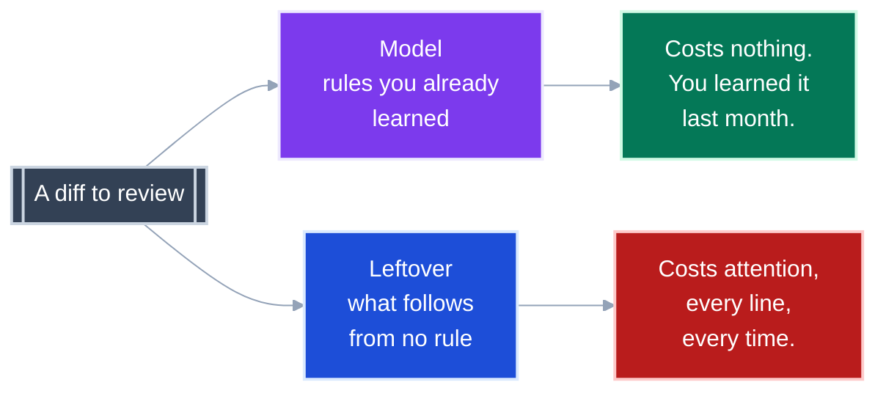
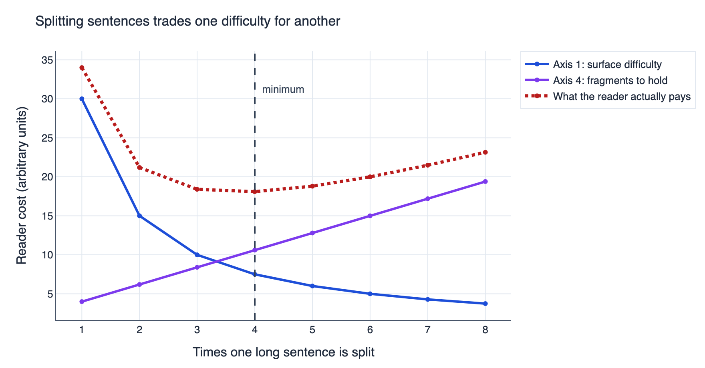
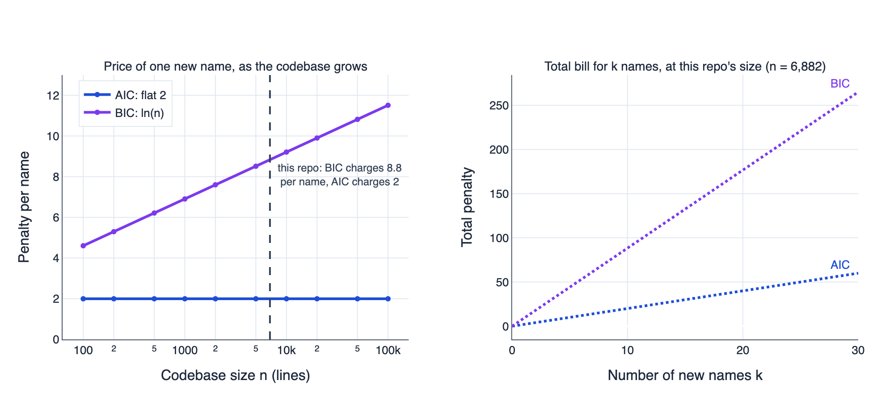
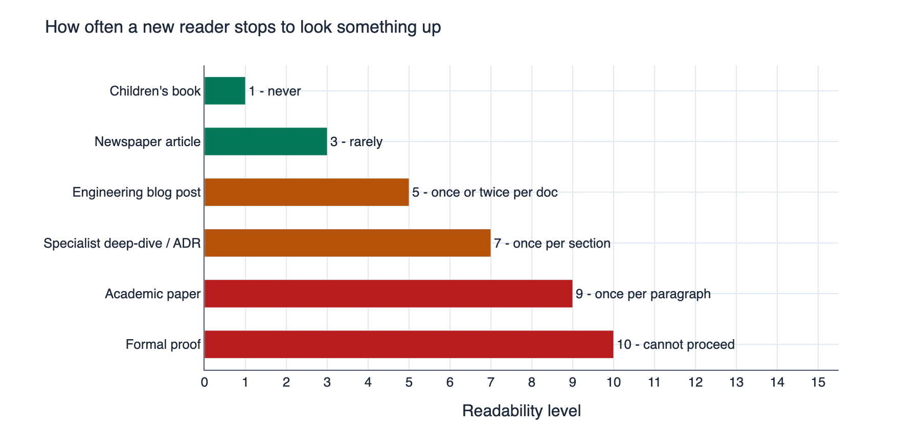

# Measuring maintainability: what we learned, and what is still open

**Status:** exploration, no decision made. **Before you start:** you need nothing but arithmetic.

This is the distillation of one long research session.
The question was whether "reviewable code" can be measured well enough to gate on, or to hand an AI as a target.
Everything below was either measured against this repository or traced to a primary source.

The full working set -- five research files, about 200 verified citations, and two long illustrative guides -- was collapsed into this file.
It is all recoverable:

```bash
git show 1751e95 --stat          # the snapshot before the tidy-up
git checkout 1751e95 -- docs/plans/maintainability/research/
```

---

<details>
<summary><b>Table of Contents</b></summary>
<!--TOC-->

- [Measuring maintainability: what we learned, and what is still open](#measuring-maintainability-what-we-learned-and-what-is-still-open)
  - [The gate we already have measures almost nothing](#the-gate-we-already-have-measures-almost-nothing)
  - [Cyclomatic complexity does not predict comprehension.
    Length does.](#cyclomatic-complexity-does-not-predict-comprehension-length-does)
  - [Most metric pairs are two springs](#most-metric-pairs-are-two-springs)
  - [Split a description into a model and a leftover](#split-a-description-into-a-model-and-a-leftover)
  - [You can always refactor more, and that is a theorem](#you-can-always-refactor-more-and-that-is-a-theorem)
  - [What one new name costs, and why it rises with codebase size](#what-one-new-name-costs-and-why-it-rises-with-codebase-size)
  - [The sharpest practical rule: deduplication is not tidying](#the-sharpest-practical-rule-deduplication-is-not-tidying)
  - [One number cannot do both jobs](#one-number-cannot-do-both-jobs)
  - [Prior art: what the industry already settled](#prior-art-what-the-industry-already-settled)
  - [The readability scale we use to talk about docs](#the-readability-scale-we-use-to-talk-about-docs)
  - [What is still open](#what-is-still-open)
  - [The compact rule](#the-compact-rule)
  - [References](#references)
  - [How conductance on a call graph measures maintainability](#how-conductance-on-a-call-graph-measures-maintainability)
    - [What the graph is](#what-the-graph-is)
    - [What conductance measures on it](#what-conductance-measures-on-it)
    - [Why it is a damper and length is not](#why-it-is-a-damper-and-length-is-not)
    - [How this raises model and lowers residual](#how-this-raises-model-and-lowers-residual)
    - [Why you cannot just minimise the leftover](#why-you-cannot-just-minimise-the-leftover)
    - [What this does not yet do](#what-this-does-not-yet-do)
  - [Session 2: what conductance is for, and what we still cannot extract](#session-2-what-conductance-is-for-and-what-we-still-cannot-extract)
    - [Why conductance, in one paragraph](#why-conductance-in-one-paragraph)
    - [What we still cannot extract, and the skepticism is correct](#what-we-still-cannot-extract-and-the-skepticism-is-correct)
    - [What would actually settle it](#what-would-actually-settle-it)
    - [The rest of what this session established](#the-rest-of-what-this-session-established)
    - [Where to pick this up](#where-to-pick-this-up)
  - [Conductance is a derivative, not a position](#conductance-is-a-derivative-not-a-position)
    - [The stopping rule we said did not exist](#the-stopping-rule-we-said-did-not-exist)
    - [What we are actually minimising](#what-we-are-actually-minimising)
  - [A folder is the weakest boundary, not the only one](#a-folder-is-the-weakest-boundary-not-the-only-one)
    - [The thought experiment that shows it](#the-thought-experiment-that-shows-it)
    - [Boundaries nest](#boundaries-nest)
    - [The cross-language boundary is real and already here](#the-cross-language-boundary-is-real-and-already-here)
  - [Measured at every boundary, with a second extractor](#measured-at-every-boundary-with-a-second-extractor)
    - [The cross-language edge is missing, and the tool proves it](#the-cross-language-edge-is-missing-and-the-tool-proves-it)
    - [What the second extractor settled](#what-the-second-extractor-settled)

<!--TOC-->
</details>

---

## The gate we already have measures almost nothing

This is the finding that started everything, and it is about this repository.

```
$ uvx ruff check src/ --select C901
All checks passed!
```

Zero violations across 310 functions, at `max-complexity = 10`.
Meanwhile two other tools, independently:

| Function | `ruff` `C901` | `radon` | `lizard` |
|---|---|---|---|
| `ClaudeSessionLog.to_result` | **3** | **26** | **26** |
| `_Ledger.assistant` | **8** | **21** | **21** |

The cause was verified by reading the installed `mccabe` 0.7.0 source.
Its AST visitor has **no handler for ternaries, comprehensions, or `and`/`or`**.
This codebase is written in exactly that style.

**Takeaway:** "We gate complexity at 10" is true of the mccabe count and vacuous as a description of this code.

---

## Cyclomatic complexity does not predict comprehension. Length does.

From an fMRI study measuring actual comprehension (Peitek et al., ICSE 2021), Kendall tau against measured understanding:

| Metric | vs correctness |
|---|---|
| **Lines of code** | **-.46** |
| Halstead volume | -.45 |
| McCabe cyclomatic | **-.09** |

Scalabrino et al. tested **121 metrics** against understandability.
None reached even a medium correlation.

**Takeaway:** If you want one cheap static number for "hard to read", it is line count, not complexity.
Cyclomatic complexity is the worst candidate tested.

---

## Most metric pairs are two springs

This is the most useful idea we produced, and it is original to this session.

A spring and a damper are **coupled**: the damper resists the motion the spring causes.
Two springs bolted in parallel is not a suspension, it is a stiffer spring.

**The test: is the pair conserved under the cheapest move?** Extraction must *transfer* quantity from one term to the other, not reduce both.

| Pair | Under extraction | Verdict |
|---|---|---|
| Complexity + lines of code | both go **down** | two springs |
| Complexity + nesting depth | both go **down** | two springs |
| Unit size + **unit count** | size down, count up | conserved |
| Complexity + **parameter count** | complexity down, params up | conserved |
| Complexity + **conductance** | complexity down, boundary edges up | conserved |

The first two are what everyone reaches for, and they damp nothing.

**Conductance** is the graph-theoretic version: boundary edges divided by total edge volume of a cluster.
Low conductance is a deep module, high conductance is a shallow one, and it is computable from an LSP `callHierarchy` today.

**Takeaway:** Before pairing two metrics, ask whether the cheapest refactor moves them in opposite directions.
If not, you have added stiffness, not control.

---

## Split a description into a model and a leftover

The mental model that made the rest cohere.

Any description of anything splits in two.
The **model** is the part that generalises, like the equations of motion in physics: one formula covering a large range of cases.
The **leftover** is what does not fit: the exceptions and corner cases.



This is not an analogy we invented.
Grunwald and Vitanyi use exactly it.
A sequence of observations of heavenly bodies splits into `p`, the laws of gravity, and `d`, the measurement errors.

**Minimum Description Length** (Rissanen, 1978) makes it countable: minimise `L(H) + L(D given H)`, where `L` is length, `H` is the model and `D` is the data.

Refactoring moves length between the two halves rather than deleting it.
Extract nothing and the leftover is enormous.
Extract everything and the model is three hundred names to learn.
Because the halves move in opposite directions, the sum has a bottom.



*Illustrative shape, not measured data.*

**Takeaway:** Reviewing cost is the leftover, never the total, so a metric that blends both halves into one number is measuring the wrong thing.

---

## You can always refactor more, and that is a theorem

**Kolmogorov complexity** `K(x)` is one number: the length of the shortest program that produces `x`.
Simple systems have low `K`, complex systems high `K`.
Every real complexity metric is an approximation to it.

`K` is not merely expensive to compute.
It is **uncomputable** -- no algorithm exists, at any cost.
Stronger than NP-hard.

The precise form is the useful part. `K` is *upper semi-computable*: you can keep finding shorter descriptions forever, and you can never know you have found the shortest.

**Takeaway:** "You can always refactor a bit more and nothing tells you to stop" is not a discipline problem.
It is a theorem, and it is why the damper has to come from outside the metric.

---

## What one new name costs, and why it rises with codebase size

Two standard criteria both charge a penalty per parameter.
Mapped to code, a parameter is **a name someone invented that you must now learn**.

```
AIC = 2k       - 2 ln(L)      penalty per name: 2
BIC = k ln(n)  - 2 ln(L)      penalty per name: ln(n)
```

`k` is how many names, `n` is how big the codebase is.



This repository is 6,974 lines. `ln(6974)` is **8.85**.
So `BIC` charges 8.85 per new name where `AIC` charges 2 -- **4.4 times more**.

**Takeaway:** The right price of a new abstraction is not a fixed threshold.
It rises with the size of the codebase it lands in, which is a calibration with a derivation behind it rather than a percentile.

---

## The sharpest practical rule: deduplication is not tidying

Two refactors that every complexity metric scores **identically**, and that differ completely.

| | Names added | Sites explained | `L(D given H)` | Verdict |
|---|---|---|---|---|
| Three duplicate blocks become one function | 1 | 3 | shrinks by ~2 copies | **always wins** |
| One nested block becomes one function | 1 | 1 | unchanged, relocated | pays `ln(n)`, gains nothing |

Deduplication genuinely shrinks the leftover.
Tidying moves it and bills you for the move.

The discriminator is **leverage**: how many sites does this one name save you from reading?

- Leverage 1: you tidied.
- Leverage 3+: you found a rule.

`_Shell` in this repo has leverage 3.
The ADR 0034 registry has leverage 6 and rising.
A wrapper around one ternary has leverage 1.

**Takeaway:** Leverage per name is computable from an LSP call graph today.
It is the one measurement here that separates the refactor worth doing from the one that only improves the score.

---

## One number cannot do both jobs

There are two questions you might ask a score.

*Will the next diff be easier to review?* -- a prediction. *Is this the right way to split the module?* -- an identification.

Yang (2005) proved no single criterion does both well.

**Takeaway:** A scorecard has to be multidimensional because a theorem says so, not because it is nicer that way.

---

## Prior art: what the industry already settled

Three findings that should stop us reinventing anything.

**Distribution beats per-unit caps.** The SIG maintainability model gates on the *percentage of code in each risk band*, across four mutually damping axes.
Its thresholds are calibrated on ~200 systems, and its 4-star bands are these:

| Axis | Band 1 | Band 2 | Band 3 |
|---|---|---|---|
| Unit complexity | <=20.2% of lines above CC 5 | <=7.3% above 10 | <=1.1% above 25 |
| Unit size | <=47.1% above 15 lines | <=23.1% above 30 | <=8.3% above 60 |
| Unit interfacing | <=15.0% with >=3 params | <=3.3% >=5 | <=0.9% >=7 |
| Module coupling | <=10.0% above 10 incoming | <=5.6% above 20 | <=1.9% above 50 |

**The threshold of 10 has no empirical parent.** McCabe called it "a reasonable, but not magical, upper limit".
NIST SP 500-235's claim that it "has significant supporting evidence" carries **no citation in its own document**.
Its actual recommended policy is softer than the folklore: limit to 10 **or provide a written explanation of why the limit was exceeded**.

**The vendors moved to ratchets.** Google's Tricorder abandoned whole-codebase bug-filing after **84% of filed bugs were never fixed**, and now gates only the change under review.
SonarSource's own docs say they do not recommend adding conditions for overall code to a quality gate.

**Takeaway:** Three rules, and this repo's ADR habit already implements the third.

- Gate the change, not the codebase.
- Gate a distribution, not a unit.
- Let an exceedance buy its way out with a written reason.

---

## The readability scale we use to talk about docs

A side product, and the shared vocabulary for reviewing anything written here.
The level is **how often a competent-but-new reader must stop and look something up**.



| Level | Anchor | Stops |
|---|---|---|
| 1 | Children's book | Never |
| 3 | Newspaper article | Rarely |
| **5** | **Good engineering blog post** | **Once or twice per document** |
| 7 | Specialist deep-dive, an ADR | Once per section |
| 9 | Academic paper | Once per paragraph |
| 10 | Formal proof | Cannot proceed without training |

Say the level and the target together: *"this is a 9, make it a 5"*.
The reader sets the number, never the author.

Two lessons that cost us a rewrite:

- **A sentence-length gate makes writing worse when you satisfy it by compressing rather than by adding beats.** The only move that lowers difficulty without raising it elsewhere is another beat with a picture.
- **Count only terms a reader cannot learn by doing.** `--dry-run` is free because you can run it. `L(D given H)` is not.
  By that measure this repo's `README.md` carries 1 formal term and the MDL guide carried 30.

**Takeaway:** Declare prerequisites in the first paragraph, and define every symbol at first use.
A missing definition costs a reader more than a hard idea does.

---

## What is still open

No decision was made.
Four options remain, and the evidence points unevenly.

| Option | What it is | Strongest point against |
|---|---|---|
| **Enforced gate portfolio** | Opposing per-unit caps in `make check`: `C901` plus `PLR0913` args, `PLR0915` statements, `PLR1702` nesting | Every threshold is a convention; per-unit maxima are what the industry moved away from |
| **Distribution gate** | SIG-style risk profiles over four damping axes | No Python implementation exists; at 6,974 lines one function moves a band by ~1% |
| **Change ratchet** | `complexipy --diff` fails only on regression | Ratcheting has no peer-reviewed evaluation; agents rewrite whole files, so "the diff" is often the module |
| **Doctrine, no gate** | Delete the gate that measures nothing; route exceedances through an ADR with an owner and a review date | Nothing stops drift; relies on someone reading |

**The cheapest high-value change is none of the four:** add a function-length limit.
It is the best-evidenced static predictor of comprehension difficulty there is, and it costs one line of `ruff` config.

It would also cost nothing to adopt.
This repo's longest functions are 70 / 49 / 45 / 42 NLOC.
A cap at 50 binds exactly one of the 310, `pytest_addoption`, which is an argparse registration block.
That is the argument for adopting it now rather than later, when the debt is real.

**The most promising new measurement is leverage per name**, from an LSP call graph.
It is the only candidate here that separates deduplication from tidying, and nothing in the literature does it yet.

---

## The compact rule

> Cyclomatic complexity scores branching per unit, and extraction only moves that branching, so a gate on it has no floor.
> Reviewing cost is the leftover after the rules you already know, never the total, so score the split rather than a blended number.
> Pair a metric only with one that rises when it falls.
> Price every new name explicitly, because the cheapest move an optimiser can make is always to add one.

---

## References

The full bibliography, with verbatim quotations and an explicit could-not-verify list, is in the snapshot commit.

```bash
git checkout 1751e95 -- docs/plans/maintainability/research/
```

| Source | Contributes |
|---|---|
| Peitek et al., *ICSE 2021* | the fMRI comprehension correlations |
| Scalabrino et al., *TSE* | 121 metrics, none correlating |
| Landman, Serebrenik and Vinju (2016) | complexity vs lines, R-squared 0.40 over 17.6M methods |
| McCabe (1976); Watson and McCabe, *NIST SP 500-235* | the threshold of 10, and its missing citation |
| Heitlager, Kuipers and Visser (2007); SIG Evaluation Criteria v17.0 | the risk-profile model and its bands |
| Alves, Ypma and Visser, *ICSM 2010* | deriving thresholds from benchmark percentiles |
| Rissanen, *Automatica* 14(5), 1978; Grunwald, *The MDL Principle*, 2007 | the two-part code |
| Schwarz, *Annals of Statistics* 6(2), 1978; Akaike (1974) | `BIC` and `AIC` |
| Yang, *Biometrika* 92(4), 2005 | no single criterion does both jobs |
| Vereshchagin and Vitanyi, *IEEE TIT* 50(12), 2004 | the minimal sufficient statistic, and why code golf loses |
| Sadowski et al., *ICSE-SEIP 2018* | Google's review data and the Tricorder result |
| Ousterhout, *A Philosophy of Software Design* (2018) | deep versus shallow modules |

**Status note.** Nobody has published work applying description-length ideas to source-code reviewability.
The mapping from `L(H) + L(D given H)` onto code is ours, and it is not a cited result.

---

## How conductance on a call graph measures maintainability

This section answers three questions asked after the first draft.
The measurements behind it are in [scorecard.md](scorecard.md), which computes everything named here against this repository.

### What the graph is

An LSP gives you a call graph for free. `textDocument/prepareCallHierarchy` and `callHierarchy/incomingCalls` return, for any name, the places that call it.
Run that over every callable and you have a directed graph: **each node is a name, each edge is one call site**.

This repository has 312 callables and 380 call edges.

### What conductance measures on it

Conductance scores a *set* of nodes, not a unit of code.

```
cut(S)   edges with exactly one endpoint in S
vol(S)   edge endpoints incident to S
phi(S) = cut(S) / min(vol(S), vol(rest))
```

Take the set to be one folder.
Then `cut` is the calls that leave the folder, and `vol` is all the calls the folder participates in.
So `phi` is **the share of a module's call traffic that crosses its own boundary**.

A `phi` near 0 means a module you can read on its own.
A `phi` near 1 means a module whose every line sends you somewhere else.
That is the same thing a reviewer means by a module being self-contained, and it is now a number.

### Why it is a damper and length is not

This is the part that matters for gating.

Every metric we already gate on is a **count**: lines, statements, branches, nesting.
Counts fall when you subdivide, and subdivision is what extraction *is*.
So a gate on any count can always be satisfied by extracting, without changing the program at all.
That is the "no floor" problem, and it is why the existing gate measures nothing.

Conductance is a **ratio**.
Subdividing a module raises `cut` and `vol` together, so the ratio does not fall for free.
An extraction that genuinely groups related code lowers it, and an extraction that only moves code around raises it.

> The rule that generalises the whole two-springs table: a spring is a count, and a damper has to be a ratio.

### How this raises model and lowers residual

Here is the connection back to [Split a description into a model and a leftover](#split-a-description-into-a-model-and-a-leftover).

A folder structure is not filing.
It is a **model** of the code, and it makes exactly one prediction: *a call stays inside its folder*.

Every call that crosses a folder boundary is a prediction that model got wrong.
It is a fact the reader has to carry individually, because no rule produced it.
That is `L(D given H)`, the leftover, made countable.

So the two halves have concrete meanings on this graph.

| Half | On a call graph | Lower is better because |
|---|---|---|
| `L(H)`, the model | how many folders you must learn | each one is a name with a price, exactly like `BIC`'s `ln(n)` |
| `L(D given H)`, the leftover | the calls that cross a folder boundary | each one is an exception you memorise |

**Conductance of the declared partition is the leftover, normalised.** That is the link between the two documents.
A codebase whose folders match its call graph has a small leftover, which is what "high model, low residual" means in practice.
A codebase whose folders cut through cohesive clusters makes you memorise the difference.

### Why you cannot just minimise the leftover

The trap is worth stating, because we walked into it.

A community detection algorithm such as `graph_leiden` will happily lower the leftover by inventing more clusters.
At the limit, one cluster per name has no leftover at all and explains nothing.
Comparing two partitions by their leftover alone therefore rewards shredding the codebase.

Both halves have to be scored.
Doing that over this repository's 276 connected names:

| Partition | Clusters | `L(H)` | `L(D given H)` | **Bits saved per boundary** |
|---|---|---|---|---|
| One cluster, no architecture | 1 | 0 | 3081 | 0 |
| **The declared folders** | **8** | 828 | 2446 | **90.7** |
| One cluster per file | 37 | 1438 | 2216 | 24.0 |
| Leiden communities | 85 | 1769 | 1746 | 15.9 |
| One cluster per name | 276 | 2238 | 3081 | 0 |

Read the last column.
The eight hand-drawn folders save 90.7 bits of leftover for every boundary they ask you to learn.
A file boundary saves 24.0 and a Leiden community saves 15.9.

That is the same shape as leverage per name, asked of a boundary instead of a name.

**Takeaway:** conductance turns "does this structure match how the code actually works" into one measurable number.
The two-part code stops that number from being gamed by adding structure.

### What this does not yet do

Three honest limits, expanded in [scorecard.md](scorecard.md).

- No thresholds exist.
  Every band is a guess, and nothing like the SIG calibration has been done for conductance.
- The measure degenerates below a volume floor.
  A module with no internal calls scores 1.0 and a module whose callers are out of tree scores 0.0, and both are noise.
- Nothing here is validated against review effort.
  These are better arguments than cyclomatic complexity, which is not the same as being better predictors.

---

## Session 2: what conductance is for, and what we still cannot extract

Two questions survived the last session's explanations.
They are answered first, because the rest of this section only matters if these land.

The code that produced everything below is in [tools/](tools/).
It was lifted into this folder so it runs without the `.claude` skill tree.

### Why conductance, in one paragraph

Every other code metric scores something you can see by opening a file.
Lines, branches, parameters, nesting: all of them are properties of the text in front of you.

**Conductance scores the thing you cannot see by reading.** That is the whole claim.

When you open a module you cannot tell how much of it reaches outside itself.
That information is spread across every other file in the repository.
Conductance is that number, and nothing else on the list is it.

Concretely, it answers one question a reviewer genuinely cannot answer alone.

> If I change this module, how much of the rest of the codebase do I need to hold in my head?

`verify/` scores 0.091, so the answer there is "almost none". `<root>` scores 0.756, so the answer there is "most of it".

That is why the word for what we are measuring is *reviewability* rather than *quality*.


**What it does not do yet.** There is no threshold separating a good score from a bad one.
Conductance cannot gate anything today.
It ranks modules against each other in an order an architect recognises.
That is the entire demonstrated value.
Anyone who tells you a `phi` of 0.4 is a problem is making that up.

### What we still cannot extract, and the skepticism is correct

The skepticism about open-source extraction of a program's real call structure is **right**.
This session produced evidence for that position rather than against it.

Every one of these was found by accident, while doing something else.

| What happened | How it failed |
|---|---|
| The skill's index recorded 0 references | `semanticTokens` is a Pylance feature, pyright returns empty, code read `if not data: return 0` |
| `index` reported success with an empty graph | exit code 0, `files_indexed: 0`, error buried in the JSON payload |
| Closing each file after indexing it | a server answers a position in a closed file with an empty result, not an error |
| Pointing the server at a subdirectory | pyright resolved fewer imports and found **189 edges instead of 380** |
| Matching a caller by line alone | a parameter is a definition on the same line as its function, so the wrong symbol matched |
| 187 phantom TypeScript symbols | `map() callback` reported as a named function |
| 39 renderers invisible | reached through a `Record<string, fn>` dispatch table |

Six of those seven produce a **plausible wrong answer rather than an error**.
That is the actual problem, and it is worse than the tooling simply being absent.

There is a further gap that is not a bug in anything.

- **Dynamic dispatch is invisible by construction.** A lookup table has no static call edge.
- **Registry and decorator indirection is invisible.** `pluggy` calls this repo's pytest hooks and no static edge exists.
- **We under-count call sites by a third.** 380 distinct edges against 515 actual sites, because `fromRanges` was being discarded.

**So treat every graph in this work as a lower bound, never a census.**

### What would actually settle it

We never did the one test that would.
Nothing here has been checked against a call graph somebody wrote down by hand.

The honest next step is a **ground-truth fixture**.
A small program whose every call is known, committed with an expected edge list, asserted against per language.
Two implementations of the same *metric* agreeing says nothing about whether the input graph is right.
We have that agreement exactly, against `sqlite-muninn`, and it does not settle this.

**Takeaway:** the metric arithmetic is cross-validated and the extraction is not.
The next piece of work is a fixture, not a feature.

### The rest of what this session established

**`sqlite-muninn` 0.6.0 implements `graph_conductance`**, from [issue 31](https://github.com/neozenith/sqlite-muninn/issues/31) raised during this session.
Its C implementation and our Python one agree to 0.00046 across 14 clusters in two languages.
That is rounding.
It scores any caller-supplied labelling, which is the operation Leiden cannot do.

**Speed is not the reason to use it.** A single-pass Python implementation beats it at every size we tested.
Crossing the SQL boundary costs more than dict operations on data already in memory.

The 8 to 11 times speedup it appears to offer is entirely against our own naive `O(k*E)` loop.
Use it because the graph already lives in SQLite, and because it composes with Leiden and PageRank in one query.
Do not use it because it is fast.

**The measurement survives the call-site correction.** Weighting each edge by its true site count moves `phi` by at most 0.059.

No layer moves into a different band.
The conductance numbers in [scorecard.md](scorecard.md) and [scorecard-webapp.md](scorecard-webapp.md) stand.
The leverage numbers in both are conservative by about a third.

**Both codebases beat every alternative partition.** The hand-drawn folders beat per-file and Leiden.
That is measured as bits of residual saved per boundary.
That holds in Python and in TypeScript.
Python scores 90.7 and the webapp 46.5.
The difference is what a lint-enforced layering rule buys over organising by convention.

### Where to pick this up

- **To re-run anything:** [tools/](tools/), which is self-contained. `lsp.py` is the amended fork of the skill's indexer and its docstring lists every amendment with the failure it was hiding.
- **To understand the metric:** [scorecard.md](scorecard.md).
- **To see it on a second language:** [scorecard-webapp.md](scorecard-webapp.md).
- **To see forty rearrangements scored:** [experiments.md](experiments.md).
- **To see the parameter space and what is unexplored:** [parameter-space.md](parameter-space.md).
- **The one thing worth building next:** the ground-truth fixture described above.

---

## Conductance is a derivative, not a position

This is the framing that finally made the metric usable, and it came from the reader rather than the measurement.

**Conductance has no fixed threshold and never will.** A folder of UI primitives is *supposed* to leak.
Everything uses it.
A parser is not.
The same number is a pass for one and a failure for the other, so there is no line to draw.

**Read the change instead.** Compare a module to itself across a diff.
The job it does has not changed, so the job cancels out.
What is left is the direction of travel.

```
model/   phi 0.34  ->  0.41     this change made it leakier
```

That is a regression signal that needs no threshold, only a previous value.
Position is unreadable and velocity is readable, which is the whole of the idea.

### The stopping rule we said did not exist

[You can always refactor more, and that is a theorem](#you-can-always-refactor-more-and-that-is-a-theorem) records that nothing tells you when to stop.
A saturating derivative does.

When each further refactor moves conductance less than the one before it, the work has stopped paying.
You stop because you stopped travelling, not because you arrived somewhere.

### What we are actually minimising

Not the shortest description of the code.
That is code golf, and [Kolmogorov complexity](#you-can-always-refactor-more-and-that-is-a-theorem) says the shortest program producing a behaviour is unreadable.

The target is Vereshchagin and Vitanyi's **minimal sufficient statistic**.
Shrink the *model* half until it explains everything it can, and leave the rest.
What remains is irreducible, and reviewing cost is that remainder.

So the plateau and the minimum are the same thing seen from two sides.
The plateau is the minimal sufficient statistic, observed from outside.

`K` is uncomputable, so you can never know you have arrived.
You can see that you have stopped moving.
The derivative is the only observable proxy for a destination that is provably unreachable.

| Question | Instrument |
|---|---|
| Did this change make it worse? | the sign of the change in `phi` |
| Should I keep refactoring? | the size of that change, falling |
| Am I at the minimum? | unanswerable, and that is the theorem |

**The one catch.** Extraction moves conductance in both directions.
Pulling genuinely shared code into a shared module raises it while improving the codebase.
So a change in `phi` flags *look at this*, never *this is wrong*.

**Takeaway:** conductance is an instrument for measuring motion, so gate on the delta and never on the value.

---

## A folder is the weakest boundary, not the only one

Everything above scored folders, because folders were the partition sitting in front of us.
That was convenient and it is not the interesting structure.

### The thought experiment that shows it

Take `src/pytest_xharness_eval/` and flatten it.

- **Every module in one folder.** Worse, and it should register as worse.
  It should not register as a catastrophe, because nothing about the code changed.
- **Every module in one file.** Worse again.
  Still capable of being a well-structured codebase with a minimal, correct expression of the same behaviour.

If a metric reports either of those as a large regression, the metric is scoring filing rather than code.
The structure that survives both moves is the one worth measuring.

### Boundaries nest

A call site crosses a boundary at several levels at once, and each level is its own partition.

| Level | The boundary | Crossed when |
|---|---|---|
| Function | a scope | any call at all |
| Class | the receiver | a call leaves the object |
| Module | a file | a call leaves the file |
| Folder | a directory | a call leaves the package |
| Language | a process or a wire | a request, or a written and re-read document |

Conductance is defined on any partition, so it can be computed at every one of these.
We computed one and drew conclusions about architecture from it.

**The open question is which level carries the signal.** It is empirical and we have not asked it.
Our expectation is the middle of the table rather than either end.
A function boundary is crossed by definition, so it cannot discriminate.
A folder boundary is filing, which a reviewer can change without touching a line of logic.

### The cross-language boundary is real and already here

A frontend calling a REST endpoint is a call site.
The compiler cannot see it, both sides depend on it, and breaking it breaks the system.

This repository has exactly that edge, with no HTTP involved. `emit/index.py` writes `report/index.json`. `report-ui/src/lib/types.ts` declares the shape it reads back, and [CLAUDE.md](../../../CLAUDE.md) names them as a pair that must change together.

That is a call across a language boundary mediated by a document rather than a wire.
Scoring the two codebases separately treats that edge as absent from both.
That is the whole problem with measuring per-language and stopping there.

**Takeaway:** conductance is a function of a partition, so the question is never "what is the score".
It is "at which boundary", and folders are the weakest candidate on the list.

---

## Measured at every boundary, with a second extractor

The prediction in the section above was that the signal sits in the middle of the boundary table, and that folders are the weakest candidate.
Both codebases were re-extracted with tree-sitter and scored at every level.

`inside %` is the share of call edges that do **not** cross that boundary.
A boundary almost nothing crosses cannot discriminate, and neither can one almost everything crosses.

| Level | Python `src/` | TypeScript `report-ui/src/` |
|---|---|---|
| language | 100% | 100% |
| folder | 74% | 61% |
| **file** | **63%** | **39%** |
| class | 40% | 39% |

The folder row separates the two codebases by 13 points and the file row by 24.
The file boundary discriminates roughly twice as well as the folder, on the only two codebases we have.
That is weak evidence and it points the way the intuition said it would.

The class row collapses to about 40% for both, which is what a boundary that is crossed by almost everything looks like.
It is approaching the function level, where a crossing is the definition of a call.

### The cross-language edge is missing, and the tool proves it

Scoring both trees together, 635 callables and 767 edges:

| Level | Clusters | Inside % |
|---|---|---|
| **language** | **2** | **100%** |
| folder | 18 | 65% |
| file | 99 | 46% |
| class | 143 | 40% |

**Zero edges cross the language boundary.** By the graph, `src/pytest_xharness_eval/` and `report-ui/src/` are unrelated programs that happen to share a repository.

That is false. `emit/index.py` writes `report/index.json` and `report-ui/src/lib/types.ts` declares the shape it reads back, which [CLAUDE.md](../../../CLAUDE.md) already requires to change together.
No parser can see that edge, because it is a contract rather than a call.

**Takeaway:** a cross-language score is not a matter of parsing both languages, which we now do.
The edges that matter are the ones no grammar contains, so they have to be declared.

### What the second extractor settled

`treesitter.py` resolves by name, `callgraph.py` resolves by type, and they disagree on about half the union of their edges.

| | LSP | tree-sitter | agreed | tree-sitter precision | tree-sitter recall |
|---|---|---|---|---|---|
| Python | 380 | 225 | 207 | 92% | 54% |
| TypeScript | 247 | 542 | 246 | 45% | **100%** |

On Python the LSP is the better instrument, because pyright resolves types and a grammar cannot.
On TypeScript tree-sitter found every edge the LSP found, and 296 more.
That is the first real explanation for the 57% orphan rate in [scorecard-webapp.md](scorecard-webapp.md).

The webapp numbers in that document were computed on a graph missing more than half its edges.
The conclusions there about which folders are deep should be treated as provisional until it is re-run.

**Takeaway:** two extractors that disagree by half are two lower bounds.
The ground-truth fixture is now the blocking piece of work rather than a nice-to-have.
