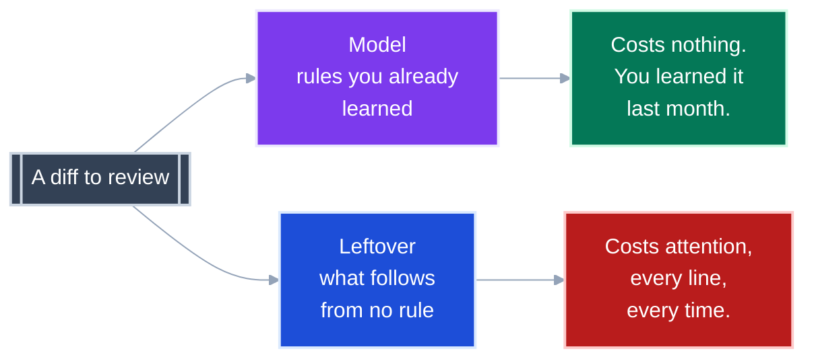

# Measuring maintainability: what we learned, and what is still open

**Status:** exploration, no decision made. **Before you start:** you need nothing but arithmetic.

This is the distillation of one long research session on whether "reviewable code" can be measured well enough to gate on, or to hand an AI as a target.
Everything below was either measured against this repository or traced to a primary source.

The full working set -- five research files, about 200 verified citations, and two long illustrative guides -- was collapsed into this file.
It is all recoverable:

```bash
git show 1751e95 --stat          # the snapshot before the tidy-up
git checkout 1751e95 -- docs/plans/maintainability/research/
```

---

<details>
<summary><b>Table of Contents</b></summary>
<!--TOC-->

- [Measuring maintainability: what we learned, and what is still open](#measuring-maintainability-what-we-learned-and-what-is-still-open)
  - [The gate we already have measures almost nothing](#the-gate-we-already-have-measures-almost-nothing)
  - [Cyclomatic complexity does not predict comprehension. Length does.](#cyclomatic-complexity-does-not-predict-comprehension-length-does)
  - [Most metric pairs are two springs](#most-metric-pairs-are-two-springs)
  - [Split a description into a model and a leftover](#split-a-description-into-a-model-and-a-leftover)
  - [You can always refactor more, and that is a theorem](#you-can-always-refactor-more-and-that-is-a-theorem)
  - [What one new name costs, and why it rises with codebase size](#what-one-new-name-costs-and-why-it-rises-with-codebase-size)
  - [The sharpest practical rule: deduplication is not tidying](#the-sharpest-practical-rule-deduplication-is-not-tidying)
  - [One number cannot do both jobs](#one-number-cannot-do-both-jobs)
  - [Prior art: what the industry already settled](#prior-art-what-the-industry-already-settled)
  - [The readability scale we use to talk about docs](#the-readability-scale-we-use-to-talk-about-docs)
  - [What is still open](#what-is-still-open)
  - [The compact rule](#the-compact-rule)
  - [References](#references)

<!--TOC-->
</details>

---

## The gate we already have measures almost nothing

This is the finding that started everything, and it is about this repository.

```
$ uvx ruff check src/ --select C901
All checks passed!
```

Zero violations across 310 functions, at `max-complexity = 10`.
Meanwhile two other tools, independently:

| Function | `ruff` `C901` | `radon` | `lizard` |
|---|---|---|---|
| `ClaudeSessionLog.to_result` | **3** | **26** | **26** |
| `_Ledger.assistant` | **8** | **21** | **21** |

The cause was verified by reading the installed `mccabe` 0.7.0 source.
Its AST visitor has **no handler for ternaries, comprehensions, or `and`/`or`**.
This codebase is written in exactly that style.

**Takeaway:** "We gate complexity at 10" is true of the mccabe count and vacuous as a description of this code.

---

## Cyclomatic complexity does not predict comprehension. Length does.

From an fMRI study measuring actual comprehension (Peitek et al., ICSE 2021), Kendall tau against measured understanding:

| Metric | vs correctness |
|---|---|
| **Lines of code** | **-.46** |
| Halstead volume | -.45 |
| McCabe cyclomatic | **-.09** |

Scalabrino et al. tested **121 metrics** against understandability.
None reached even a medium correlation.

**Takeaway:** If you want one cheap static number for "hard to read", it is line count, not complexity.
Cyclomatic complexity is the worst candidate tested.

---

## Most metric pairs are two springs

This is the most useful idea we produced, and it is original to this session.

A spring and a damper are **coupled**: the damper resists the motion the spring causes.
Two springs bolted in parallel is not a suspension, it is a stiffer spring.

**The test: is the pair conserved under the cheapest move?** Extraction must *transfer* quantity from one term to the other, not reduce both.

| Pair | Under extraction | Verdict |
|---|---|---|
| Complexity + lines of code | both go **down** | two springs |
| Complexity + nesting depth | both go **down** | two springs |
| Unit size + **unit count** | size down, count up | conserved |
| Complexity + **parameter count** | complexity down, params up | conserved |
| Complexity + **conductance** | complexity down, boundary edges up | conserved |

The first two are what everyone reaches for, and they damp nothing.

**Conductance** is the graph-theoretic version: boundary edges divided by total edge volume of a cluster.
Low conductance is a deep module, high conductance is a shallow one, and it is computable from an LSP `callHierarchy` today.

**Takeaway:** Before pairing two metrics, ask whether the cheapest refactor moves them in opposite directions.
If not, you have added stiffness, not control.

---

## Split a description into a model and a leftover

The mental model that made the rest cohere.

Any description of anything splits in two.
The **model** is the part that generalises, like the equations of motion in physics: one formula covering a large range of cases.
The **leftover** is what does not fit: the exceptions and corner cases.



This is not an analogy we invented.
Grunwald and Vitanyi use exactly it: a sequence of observations of heavenly bodies splits into `p`, the laws of gravity, and `d`, the measurement errors.

**Minimum Description Length** (Rissanen, 1978) makes it countable: minimise `L(H) + L(D given H)`, where `L` is length, `H` is the model and `D` is the data.

Refactoring moves length between the two halves rather than deleting it.
Extract nothing and the leftover is enormous.
Extract everything and the model is three hundred names to learn.
Because the halves move in opposite directions, the sum has a bottom.


*Illustrative shape, not measured data.*

**Takeaway:** Reviewing cost is the leftover, never the total, so a metric that blends both halves into one number is measuring the wrong thing.

---

## You can always refactor more, and that is a theorem

**Kolmogorov complexity** `K(x)` is one number: the length of the shortest program that produces `x`.
Simple systems have low `K`, complex systems high `K`.
Every real complexity metric is an approximation to it.

`K` is not merely expensive to compute.
It is **uncomputable** -- no algorithm exists, at any cost.
Stronger than NP-hard.

The precise form is the useful part. `K` is *upper semi-computable*: you can keep finding shorter descriptions forever, and you can never know you have found the shortest.

**Takeaway:** "You can always refactor a bit more and nothing tells you to stop" is not a discipline problem.
It is a theorem, and it is why the damper has to come from outside the metric.

---

## What one new name costs, and why it rises with codebase size

Two standard criteria both charge a penalty per parameter.
Mapped to code, a parameter is **a name someone invented that you must now learn**.

```
AIC = 2k       - 2 ln(L)      penalty per name: 2
BIC = k ln(n)  - 2 ln(L)      penalty per name: ln(n)
```

`k` is how many names, `n` is how big the codebase is.


This repository is 6,882 lines. `ln(6882)` is **8.8**.
So `BIC` charges 8.8 per new name where `AIC` charges 2 -- **4.4 times more**.

**Takeaway:** The right price of a new abstraction is not a fixed threshold.
It rises with the size of the codebase it lands in, which is a calibration with a derivation behind it rather than a percentile.

---

## The sharpest practical rule: deduplication is not tidying

Two refactors that every complexity metric scores **identically**, and that differ completely.

| | Names added | Sites explained | `L(D given H)` | Verdict |
|---|---|---|---|---|
| Three duplicate blocks become one function | 1 | 3 | shrinks by ~2 copies | **always wins** |
| One nested block becomes one function | 1 | 1 | unchanged, relocated | pays `ln(n)`, gains nothing |

Deduplication genuinely shrinks the leftover.
Tidying moves it and bills you for the move.

The discriminator is **leverage**: how many sites does this one name save you from reading?

- Leverage 1: you tidied.
- Leverage 3+: you found a rule.

`_Shell` in this repo has leverage 3.
The ADR 0034 registry has leverage 6 and rising.
A wrapper around one ternary has leverage 1.

**Takeaway:** Leverage per name is computable from an LSP call graph today, and it is the one measurement that separates the refactor worth doing from the one that only improves the score.

---

## One number cannot do both jobs

There are two questions you might ask a score.

*Will the next diff be easier to review?* -- a prediction. *Is this the right way to split the module?* -- an identification.

Yang (2005) proved no single criterion does both well.

**Takeaway:** A scorecard has to be multidimensional because a theorem says so, not because it is nicer that way.

---

## Prior art: what the industry already settled

Three findings that should stop us reinventing anything.

**Distribution beats per-unit caps.** The SIG maintainability model gates on the *percentage of code in each risk band*, across four mutually damping axes, with thresholds calibrated on ~200 systems.
Its 4-star bands:

| Axis | Band 1 | Band 2 | Band 3 |
|---|---|---|---|
| Unit complexity | <=20.2% of lines above CC 5 | <=7.3% above 10 | <=1.1% above 25 |
| Unit size | <=47.1% above 15 lines | <=23.1% above 30 | <=8.3% above 60 |
| Unit interfacing | <=15.0% with >=3 params | <=3.3% >=5 | <=0.9% >=7 |
| Module coupling | <=10.0% above 10 incoming | <=5.6% above 20 | <=1.9% above 50 |

**The threshold of 10 has no empirical parent.** McCabe called it "a reasonable, but not magical, upper limit".
NIST SP 500-235's claim that it "has significant supporting evidence" carries **no citation in its own document**.
Its actual recommended policy is softer than the folklore: limit to 10 **or provide a written explanation of why the limit was exceeded**.

**The vendors moved to ratchets.** Google's Tricorder abandoned whole-codebase bug-filing after **84% of filed bugs were never fixed**, and now gates only the change under review.
SonarSource's own docs say they do not recommend adding conditions for overall code to a quality gate.

**Takeaway:** Gate the change, not the codebase; gate a distribution, not a unit; and let an exceedance buy its way out with a written reason -- which is the policy this repo's ADR habit already implements.

---

## The readability scale we use to talk about docs

A side product, and the shared vocabulary for reviewing anything written here.
The level is **how often a competent-but-new reader must stop and look something up**.


| Level | Anchor | Stops |
|---|---|---|
| 1 | Children's book | Never |
| 3 | Newspaper article | Rarely |
| **5** | **Good engineering blog post** | **Once or twice per document** |
| 7 | Specialist deep-dive, an ADR | Once per section |
| 9 | Academic paper | Once per paragraph |
| 10 | Formal proof | Cannot proceed without training |

Say the level and the target together: *"this is a 9, make it a 5"*.
The reader sets the number, never the author.

Two lessons that cost us a rewrite:

- **A sentence-length gate makes writing worse when you satisfy it by compressing rather than by adding beats.** The only move that lowers difficulty without raising it elsewhere is another beat with a picture.
- **Count only terms a reader cannot learn by doing.** `--dry-run` is free because you can run it. `L(D given H)` is not.
  By that measure this repo's `README.md` carries 1 formal term and the MDL guide carried 30.

**Takeaway:** Declare prerequisites in the first paragraph and define every symbol at first use, because a missing definition costs a reader more than a hard idea does.

---

## What is still open

No decision was made.
Four options remain, and the evidence points unevenly.

| Option | What it is | Strongest point against |
|---|---|---|
| **Enforced gate portfolio** | Opposing per-unit caps in `make check`: `C901` plus `PLR0913` args, `PLR0915` statements, `PLR1702` nesting | Every threshold is a convention; per-unit maxima are what the industry moved away from |
| **Distribution gate** | SIG-style risk profiles over four damping axes | No Python implementation exists; at 6,882 lines one function moves a band by ~1% |
| **Change ratchet** | `complexipy --diff` fails only on regression | Ratcheting has no peer-reviewed evaluation; agents rewrite whole files, so "the diff" is often the module |
| **Doctrine, no gate** | Delete the gate that measures nothing; route exceedances through an ADR with an owner and a review date | Nothing stops drift; relies on someone reading |

**The cheapest high-value change is none of the four:** add a function-length limit.
It is the best-evidenced static predictor of comprehension difficulty there is, this repo's largest files are 478 / 472 / 468 lines, and it costs one line of `ruff` config.

**The most promising new measurement is leverage per name**, from an LSP call graph.
It is the only candidate here that separates deduplication from tidying, and nothing in the literature does it yet.

---

## The compact rule

**Cyclomatic complexity scores branching per unit, and extraction only moves that branching, so a gate on it has no floor.** **Reviewing cost is the leftover after the rules you already know, never the total, so score the split rather than a blended number.** **Pair a metric only with one that rises when it falls, and price every new name explicitly, because the cheapest move an optimiser can make is always to add one.**

---

## References

The full bibliography, with verbatim quotations and an explicit could-not-verify list, is in the snapshot commit.

```bash
git checkout 1751e95 -- docs/plans/maintainability/research/
```

| Source | Contributes |
|---|---|
| Peitek et al., *ICSE 2021* | the fMRI comprehension correlations |
| Scalabrino et al., *TSE* | 121 metrics, none correlating |
| Landman, Serebrenik and Vinju (2016) | complexity vs lines, R-squared 0.40 over 17.6M methods |
| McCabe (1976); Watson and McCabe, *NIST SP 500-235* | the threshold of 10, and its missing citation |
| Heitlager, Kuipers and Visser (2007); SIG Evaluation Criteria v17.0 | the risk-profile model and its bands |
| Alves, Ypma and Visser, *ICSM 2010* | deriving thresholds from benchmark percentiles |
| Rissanen, *Automatica* 14(5), 1978; Grunwald, *The MDL Principle*, 2007 | the two-part code |
| Schwarz, *Annals of Statistics* 6(2), 1978; Akaike (1974) | `BIC` and `AIC` |
| Yang, *Biometrika* 92(4), 2005 | no single criterion does both jobs |
| Vereshchagin and Vitanyi, *IEEE TIT* 50(12), 2004 | the minimal sufficient statistic, and why code golf loses |
| Sadowski et al., *ICSE-SEIP 2018* | Google's review data and the Tricorder result |
| Ousterhout, *A Philosophy of Software Design* (2018) | deep versus shallow modules |

**Status note.** Nobody has published work applying description-length ideas to source-code reviewability.
The mapping from `L(H) + L(D given H)` onto code is ours, and it is not a cited result.
