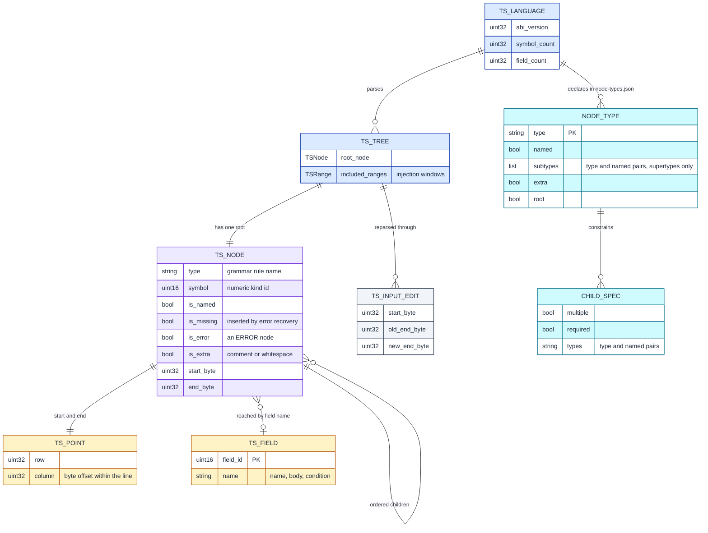
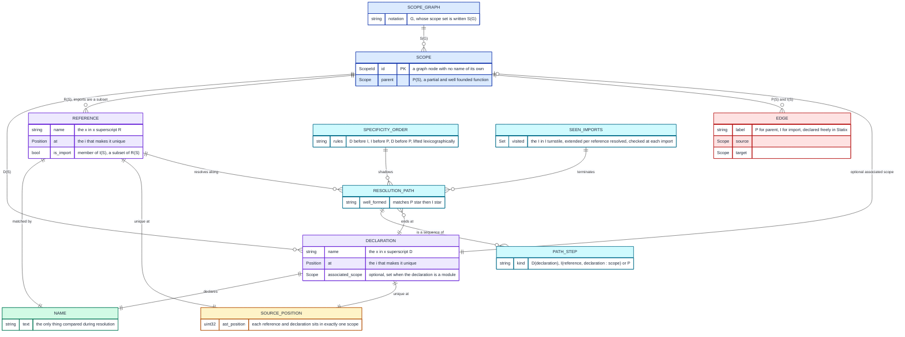
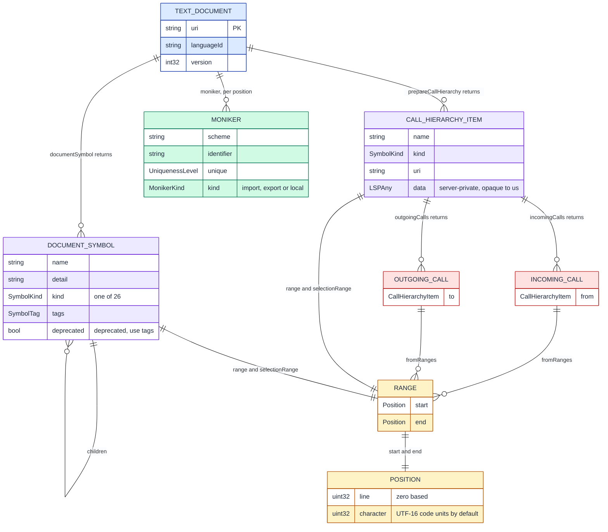
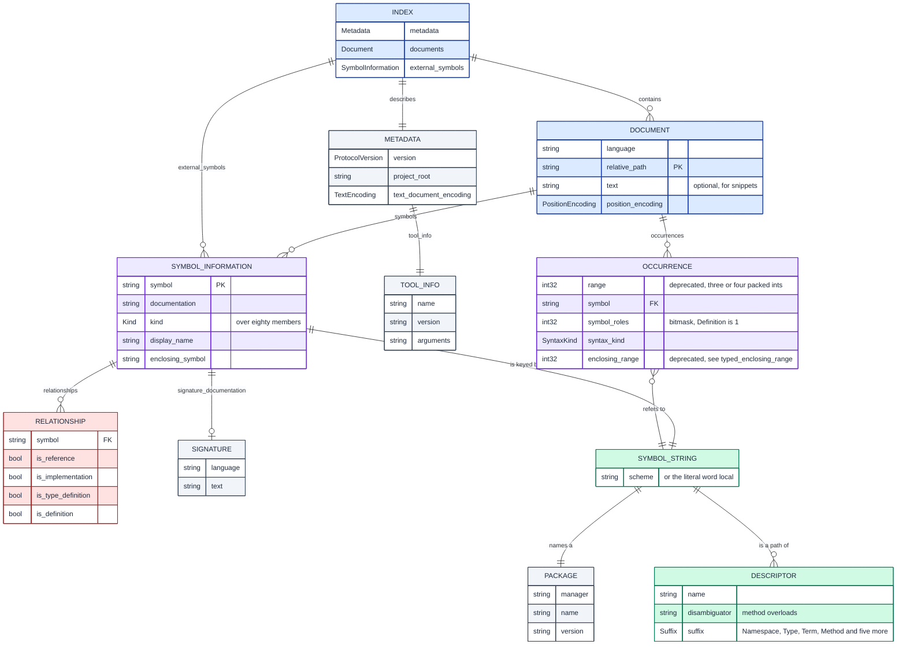

# AST data models: the primitives each graph provider actually stores

**Status:** reference for this directory only. **Before you start:** [extraction-apis.md](extraction-apis.md).

[extraction-apis.md](extraction-apis.md) catalogues what an LSP and tree-sitter can be *asked* for.
This file is the layer beneath it, and asks what each provider *stores*.
Five providers can hand this work a graph, and each one keeps a different set of primitives.
The entity model decides what a metric can be computed from, so it is modelled here before any extractor is chosen.

Every diagram is an ERD of one provider's own type names, transcribed from its schema, header file or specification.
Where a provider's type is opaque, as `TSTree` and `TSLanguage` are, the attributes are its public accessors rather than declared fields.
Three entities are named for a shape the provider does not name: `CHILD_SPEC`, `SYMBOL_STRING` and `TEXT_DOCUMENT`.

---

<b>Table of Contents</b>

<!--TOC-->

- [AST data models: the primitives each graph provider actually stores](#ast-data-models-the-primitives-each-graph-provider-actually-stores)
  - [The five providers at a glance](#the-five-providers-at-a-glance)
  - [The primitive every provider must supply](#the-primitive-every-provider-must-supply)
  - [Reading the diagrams](#reading-the-diagrams)
  - [tree-sitter: a tree of typed byte ranges](#tree-sitter-a-tree-of-typed-byte-ranges)
  - [scope-graphs: name resolution as a path search](#scope-graphs-name-resolution-as-a-path-search)
  - [stack-graphs: name binding as a stack machine](#stack-graphs-name-binding-as-a-stack-machine)
  - [LSP: no index, only answers](#lsp-no-index-only-answers)
  - [SCIP: a document and its occurrences](#scip-a-document-and-its-occurrences)
  - [Providers not modelled here](#providers-not-modelled-here)
  - [What the five models agree on](#what-the-five-models-agree-on)
  - [What this changes for the open questions](#what-this-changes-for-the-open-questions)
  - [References](#references)

<!--TOC-->

---

## The five providers at a glance

| Provider | Unit stored | Symbol identity | Resolution it performs | Wire format |
|---|---|---|---|---|
| tree-sitter | a syntax node, as a byte range with a grammar type | none, a node has only its text | none | in-memory C structs |
| scope-graphs | a scope, with its declarations and references | the name plus its AST position | full name binding, by path search | a formalism, so whatever realises it |
| stack-graphs | a push, pop or scope node, per file | a `fully_qualified_name` on `SourceInfo` | full name binding, by path search | one SQLite database, a serialised graph per file |
| LSP | nothing, the server answers per position | optional, a `Moniker` if the server offers one | full, with type inference | JSON-RPC 2.0 messages |
| SCIP | an occurrence inside a document | a structured, human-readable string | full, performed by the indexer | Protobuf |

**The column that matters is symbol identity.** tree-sitter offers none, and LSP offers one only if the server implements `textDocument/moniker`.
Every name-collision defect in `tools/treesitter.py` traces back to that, because it keys a callable on `(name, is_method)` and drops the ambiguity.

[examples/](examples/README.md) runs one Python and one React codebase through the four of these with a runnable extractor, and records what each actually emitted.
LSP is one of the four, and it is the one that stores nothing, so its row was measured by asking a live server.

---

## The primitive every provider must supply

A call graph needs six primitives, and every provider names them differently.
This table is the translation layer, and it is the reason an extractor can be swapped at all.

| Primitive | tree-sitter | scope-graphs | stack-graphs | LSP | SCIP |
|---|---|---|---|---|---|
| File | the buffer, implicit | not modelled, a scope is the unit | `File` | `uri` on a `TextDocumentIdentifier` | `Document.relative_path` |
| Position | `TSPoint`, a row and a column | the AST position `i` | `lsp_positions::Span` | `Position`, a line and a character | `Occurrence.range`, a packed int32 array |
| Node identity | a `TSNode` pointer, not stable across edits | the name paired with its AST position | `NodeID`, a file plus a `local_id` | none, the position is the identity | the symbol string |
| Symbol name | the node's source text | the name on a declaration or a reference | `Handle<Symbol>`, an arena index | `name` on a `DocumentSymbol` | the descriptor grammar |
| Edge | parent and child only | a labelled scope-to-scope edge | `Edge`, carrying `precedence` | `fromRanges` on a call | `Relationship` |
| Kind | the grammar rule name | declaration, reference or import | the `Node` enum variant | the `SymbolKind` enum | the `Kind` enum |

**Only SCIP gives a symbol an identity a reader can write down unaided**, through the descriptor grammar.
stack-graphs can supply one as `SourceInfo.fully_qualified_name`, but its `Handle<Symbol>` is an arena index private to a single `StackGraph`.
scope-graphs names a declaration by its scope and AST position, which is writable but not portable.

---

## Reading the diagrams

Colour encodes the role a primitive plays, and it is the same role in every diagram.

| Colour | Role | Example |
|---|---|---|
| Blue | the container a reader opens | `Document`, `StackGraph`, `Index` |
| Violet | the positioned thing | `TSNode`, `Occurrence`, `NODE` |
| Emerald | symbol identity | `Symbol`, `Moniker`, `SYMBOL_STRING` |
| Amber | position and span | `TSPoint`, `Position`, `SourceInfo` |
| Red | a relationship between two symbols | `Edge`, `Relationship`, `PATH_STEP` |
| Cyan | the rule layer that builds the graph | `NodeType`, `PartialPath`, `SPECIFICITY_ORDER` |
| Slate | metadata and tooling | `Metadata`, `Package`, `DebugEntry` |

Field types are the provider's own, so a `uint32` means that provider declares a `uint32`.

---

## tree-sitter: a tree of typed byte ranges

Every node is a byte range plus a grammar rule name, and nothing else.
There is no symbol table, no scope and no identity that survives a reparse.
The static schema in `node-types.json` is the only place a grammar declares what a node may contain.

`is_missing` and `is_error` are the recovery primitives, and they are the reason parsing never fails.
`included_ranges` is the whole injection mechanism, so an embedded language is a second tree over the same buffer.

**`node-types.json` declares shapes and no roles.** Its top-level keys are `type`, `named`, `fields`, `children`, `subtypes`, `extra` and `root`.
Nothing in it marks a definition or a call.
The role vocabulary lives in `tags.scm`, described in [extraction-apis.md](extraction-apis.md), and that is what could replace the sets `tools/treesitter.py` hard-codes.

---

## scope-graphs: name resolution as a path search

A scope graph is the formalism stack-graphs grew out of, and its core is the smallest of the five.
Three entities and two edge labels are the whole of the graph, and resolution is a path search over them.
The diagram is larger than that core because it also draws the resolution machinery, which adds paths, steps, an order and a seen set.
A declaration and a reference are distinguished by AST position, so two functions named `greet` are two entities.

A reference resolves to a *visible* declaration, which is a reachable one that no more specific path competes with.
Specificity is the entire shadowing mechanism, so a local binding beats an imported one without a rule of its own.
`SEEN_IMPORTS` is the termination device, because a cyclic import chain would otherwise be searched forever.

**Statix replaces the two fixed labels with a declared alphabet.** A query then carries a regular expression over those labels and a well-formedness predicate on the data.
It also carries a `min` order, which does the job the fixed specificity rules do here.

---

## stack-graphs: name binding as a stack machine

A stack graph turns name resolution into a path search over a graph with eight node kinds.
A push node is a reference, a pop node is a definition, and a scope node bounds visibility.
The search carries a symbol stack and a scope stack, and a path is valid when both empty out correctly.

```mermaid
%%{init: {'theme':'base'}}%%
erDiagram
    STACK_GRAPH ||--o{ FILE : owns
    STACK_GRAPH ||--o{ SYMBOL : interns
    STACK_GRAPH ||--o{ NODE : owns
    FILE ||--o{ NODE : "scopes all but Root and JumpTo"
    NODE ||--|| NODE_ID : "identified by"
    NODE }o--o| SYMBOL : "push and pop nodes carry"
    NODE ||--o{ EDGE : "outgoing"
    NODE ||--o| SOURCE_INFO : "annotated by"
    NODE ||--o{ DEBUG_ENTRY : "annotated by"
    NODE ||--o{ PARTIAL_PATH : "starts and ends"

    STACK_GRAPH {
        Arena nodes
        Arena symbols
        Arena files
    }
    FILE {
        InternedStringContent name PK
    }
    SYMBOL {
        InternedStringContent content PK
    }
    NODE {
        string variant "Root, JumpTo, Scope, DropScopes, PushSymbol, PushScopedSymbol, PopSymbol, PopScopedSymbol"
        bool is_definition "pop nodes only"
        bool is_reference "push nodes only"
        bool is_exported "scope nodes only"
    }
    NODE_ID {
        Handle file PK "absent on Root and JumpTo"
        uint32 local_id PK
    }
    EDGE {
        Handle source
        Handle sink
        int32 precedence "higher shadows lower"
    }
    SOURCE_INFO {
        Span span
        Span definiens_span "what the definition covers"
        ControlledOption syntax_type
        ControlledOption containing_line
        ControlledOption fully_qualified_name
    }
    PARTIAL_PATH {
        Handle start_node
        Handle end_node
        PartialSymbolStack symbol_stack_precondition
        PartialSymbolStack symbol_stack_postcondition
        PartialScopeStack scope_stack_precondition
        PartialScopeStack scope_stack_postcondition
        PartialPathEdgeList edges
    }
    DEBUG_ENTRY {
        InternedString key
        InternedString value
    }

    classDef container fill:#dbeafe,stroke:#1e40af,color:#1e293b
    classDef occurrence fill:#ede9fe,stroke:#6d28d9,color:#1e293b
    classDef identity fill:#d1fae5,stroke:#047857,color:#1e293b
    classDef position fill:#fef3c7,stroke:#b45309,color:#1e293b
    classDef relation fill:#fee2e2,stroke:#b91c1c,color:#1e293b
    classDef rule fill:#cffafe,stroke:#0e7490,color:#1e293b
    classDef meta fill:#f1f5f9,stroke:#334155,color:#1e293b

    class STACK_GRAPH,FILE container
    class NODE occurrence
    class SYMBOL,NODE_ID identity
    class SOURCE_INFO position
    class EDGE relation
    class PARTIAL_PATH rule
    class DEBUG_ENTRY meta
```

`PARTIAL_PATH` is the primitive that makes the whole thing incremental.
Each file is reduced to path fragments with a precondition and a postcondition, and those fragments are stitched later.
A file that changes invalidates only its own fragments, so no whole-repository reindex is needed.

The rules that build these nodes are written in tree-sitter-graph, using the `type` attribute.
Its values are `push_symbol`, `pop_symbol`, `push_scoped_symbol`, `pop_scoped_symbol`, `scope` and `drop_scopes`.

**Precedence on an edge is how shadowing is expressed.** A local binding outranks an import because its edge carries the higher integer.

---

## LSP: no index, only answers

LSP has no persistent entity model, which is the whole point of listing it here.
The server holds its own index and never exposes it, so the only primitives are the message types.
Every one of them is anchored to a position rather than to a symbol.

`character` counts UTF-16 code units unless the client negotiates `positionEncoding`.
An extractor that assumes byte offsets silently mislocates every symbol after a non-ASCII character.

**`fromRanges` is the only cardinality LSP hands back for free.** It separates a distinct caller from a call site, which is [GR-SIT-10](GLOSSARY.md#gr-sit-10-call-site-weight).

---

## SCIP: a document and its occurrences

SCIP is the batch form of the same information, organised per document rather than as one graph.
A symbol is a structured string, so two indexers agree without sharing an id space.
That string is the single design decision that separates it from LSIF.

A symbol string is a scheme, a package, and then one descriptor per nesting level.
A descriptor's suffix is punctuation, so `/` is a namespace, `#` a type, `.` a term and `().` a method.
A purely local symbol is the word `local` followed by an id, and it never leaves its document.

`symbol_roles` is a bitmask whose members are `Definition`, `Import`, `WriteAccess`, `ReadAccess`, `Generated`, `Test` and `ForwardDefinition`.

**`RELATIONSHIP` is the only typed symbol-to-symbol edge in any of the five models.** It carries implementation and type-definition edges that a call graph alone cannot express.

---

## Providers not modelled here

These were surveyed and set aside, each for a stated reason.

| Provider | Primitive it adds | Why it is not modelled |
|---|---|---|
| tree-sitter-graph | a graph node and edge built by a rule that matched a query | it is the rule language `tree-sitter-stack-graphs` is written in, and everything it creates is a `NODE` or an `EDGE` in the stack-graphs diagram above |
| LSIF | a vertex or an edge with an opaque id, a string or a number, and a `resultSet` hub | superseded by SCIP, which replaced the opaque id with a readable symbol string |
| Kythe | a five-tuple `VName`, and containment as an edge rather than a field | no Python or TypeScript indexer of it is packaged for this repository |
| Code Property Graph, as used by Joern | one graph joining the AST, the control-flow graph and the program-dependence graph | its frontends are per-language and security-oriented, and no Python or TypeScript frontend matches this repository |
| srcML | XML that wraps source text in element tags, preserving every byte | it is a syntax markup, and adds no name resolution over tree-sitter |
| ast-grep | tree-sitter patterns written in the target language's own syntax | it is a query surface over tree-sitter, not a separate data model |
| universal-ctags | a tag line per definition, with a scope field | definitions only, so it has no reference and no edge |
| Glean | a typed fact database with its own schema language | it needs per-language indexers of the same kind SCIP already has |
| Babelfish UAST | a language-independent annotated tree | the project is archived |

**Only the Code Property Graph adds a primitive none of the five have.** Control flow and data dependence are the two edges a pure call graph cannot express.

---

## What the five models agree on

Three observations hold across every model above, and each one is a constraint on this work.

**Position is always a pair, and the units are never the same.** tree-sitter counts bytes, LSP counts UTF-16 code units, SCIP negotiates all three, and scope-graphs counts AST positions.
An extractor that mixes two of them produces ranges that look valid and point at the wrong text.

**Containment is a field in three models and a scope in two.** tree-sitter, LSP and SCIP nest a symbol inside its parent, which is why a boundary tree comes out of them for free.
scope-graphs and stack-graphs group only by scope, and a scope is reached by an edge rather than read off a field.

**Every model stores references, and none stores absence.** A symbol nothing calls is indistinguishable from a symbol whose caller the indexer failed to resolve.
That is the orphan-rate problem in [GR-ORP-08](GLOSSARY.md#gr-orp-08-orphan-rate), and no data model here solves it.

---

## What this changes for the open questions

Each row names a question from [OPEN_QUESTIONS.md](OPEN_QUESTIONS.md).

| Question | What the entity models say |
|---|---|
| G2, which extractor to trust per language | stack-graphs is the only provider that resolves names without a language server, and `PARTIAL_PATH` is why it can do so per file |
| G3, dispatch tables and registries | a stack graph edge comes from a rule that matched a query, so a declared edge is a rule rather than a special case in an extractor |
| G4, cross-language contracts | no model here is global by construction, because a SCIP symbol carries its own `scheme` and a stack graph its own `File` |
| G6, call sites against distinct callers | `fromRanges` in LSP carries it with duplicates, SCIP carries it as one occurrence per site, and tree-sitter only as a match count |
| The `defs`, `classes` and `calls` sets hard-coded in `tools/treesitter.py` | `tags.scm` declares definition and call roles per grammar, so the sets can be derived where a grammar ships one |

---

## References

| Source | Contributes |
|---|---|
| [tree-sitter, static node types](https://tree-sitter.github.io/tree-sitter/using-parsers/6-static-node-types.html) | the `node-types.json` schema |
| [tree-sitter, basic parsing](https://tree-sitter.github.io/tree-sitter/using-parsers/2-basic-parsing.html) | `TSNode` and `TSPoint` |
| [A Theory of Name Resolution, ESOP 2015](https://doi.org/10.1007/978-3-662-46669-8_9) | the scope graph tuple, the resolution calculus, well-formed paths and the specificity order |
| [Statix scope graph constraints](https://spoofax.dev/references/statix/scope-graphs/) | the declared label alphabet and the declaration assertion syntax |
| [Statix queries](https://spoofax.dev/references/statix/queries/) | the query form, its label regular expression, its data predicate and the `min` order |
| [stack-graphs, graph module](https://docs.rs/stack-graphs/latest/stack_graphs/graph/index.html) | the eight node variants, `NodeID`, `Edge` and `SourceInfo` |
| [stack-graphs, partial module](https://docs.rs/stack-graphs/latest/stack_graphs/partial/index.html) | `PartialPath` and its four stack conditions |
| [tree-sitter-stack-graphs](https://docs.rs/tree-sitter-stack-graphs/latest/tree_sitter_stack_graphs/) | the `type` attribute values and the graph DSL globals |
| [SCIP protobuf schema](https://github.com/scip-code/scip/blob/main/docs/scip.md) | every message, enum and the symbol string grammar |
| [Joern, the Code Property Graph](https://docs.joern.io/code-property-graph/) | the joined AST, CFG and PDG model |

Schemas were read on 14 September 2026.
The colour legend and the primitive cross-walk are ours, not a cited result.
