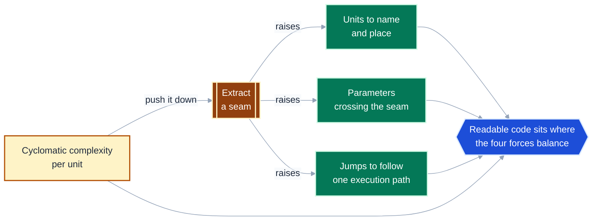
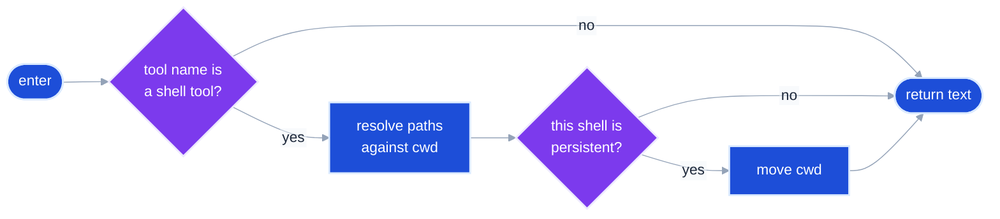
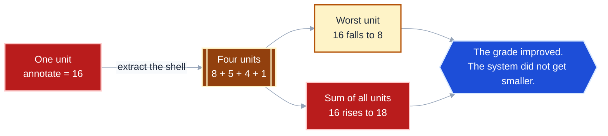
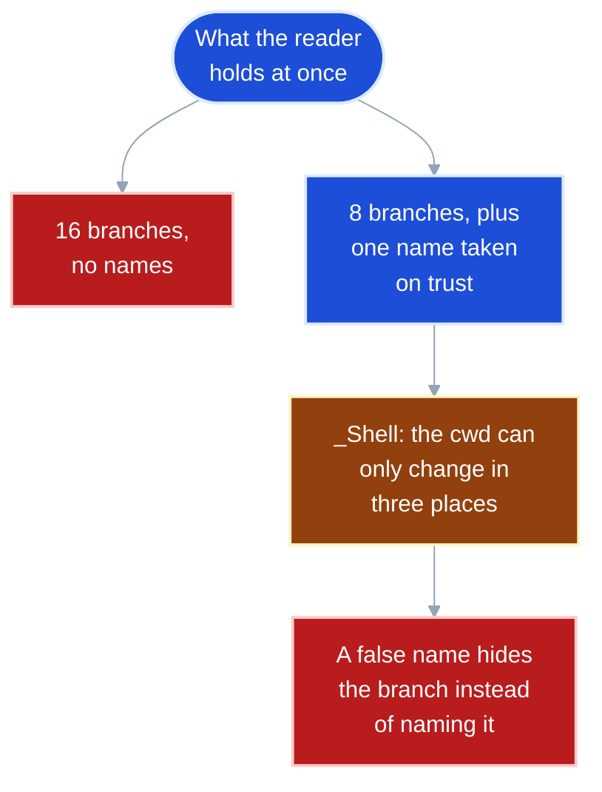
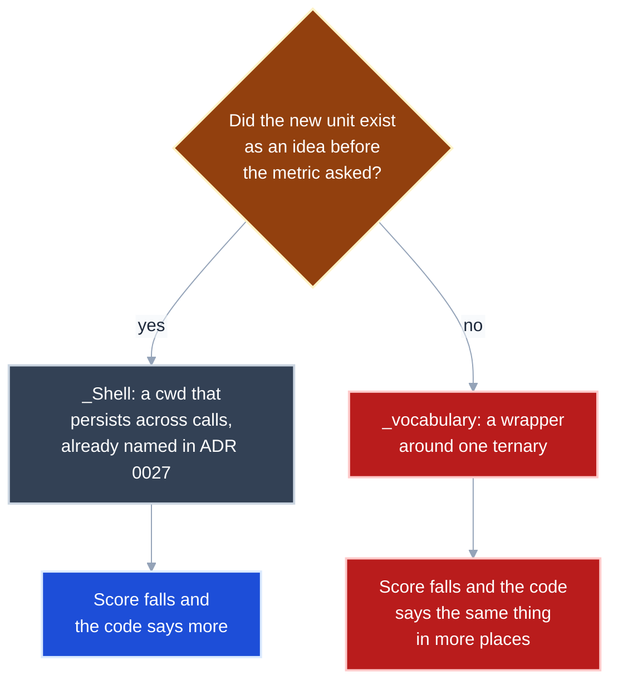
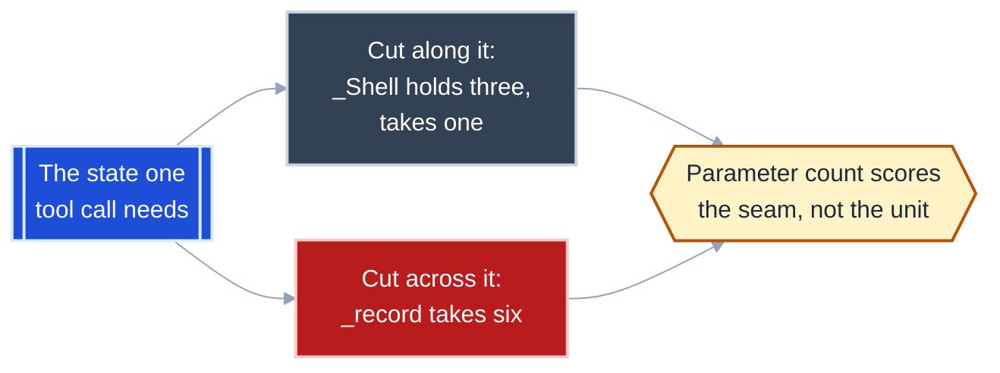
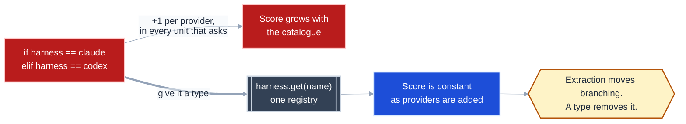
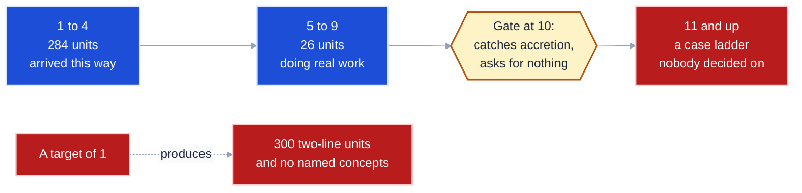

# Cyclomatic complexity is a smoke alarm, not a target

You probably arrived believing that lowering a function's cyclomatic complexity
makes the code more maintainable. One boundary matters more than any other here:
**cyclomatic complexity is a per-unit count of branching, and every refactor that
lowers it moves that branching somewhere else rather than removing it.** The
metric detects accretion. It does not measure readability, and it has no minimum
you want to reach.

This guide is about the tension that follows from that. Terms in code font name
an exact thing -- a tool (`ruff`), a rule (`C901`), a function in this repository
(`annotate`), a measured number. Plain language names its role: a *unit* is any
function or method the tool scores; a *seam* is a boundary you introduce to split
one unit into several.

Every number below was measured against `src/pytest_xharness_eval/` with
`ruff --select C901` and `radon cc`, not estimated.

---

## Pushing one number down pushes three others up

What actually happens when you take a high score and "fix" it? The extraction
that lowers branching is the same act that adds a unit, a parameter list, and a
jump. None of those is free.



**Takeaway:** A refactor that improves the score is never free, so "the number
went down" is evidence of a trade, not evidence of an improvement.

---

## The number counts decision points, and the control-flow graph agrees

Formally, cyclomatic complexity is the count of linearly independent paths
through a unit: `M = E - N + 2P` over its control-flow graph. Nobody computes it
that way, because a shortcut is exact: **`M = 1 + the number of decision points`.**

Here is `_Shell.text_of`, a method with exactly two decisions, drawn as its
control-flow graph:



Count the graph: 6 nodes, 7 edges, one connected component. `M = 7 - 6 + 2 = 3`.
Count the decisions: two `if`s, so `1 + 2 = 3`. `ruff --select C901` scores this
method **3**. All three agree, and they always will.

**Takeaway:** The score is a property of the branching alone -- it is blind to
line count, nesting depth, name quality, and how much the unit is actually doing.

---

## Extraction relocates complexity, and the total goes up

This repository's worst-scoring function was `derive/skillcov.py::annotate` at
`ruff` **9** and `radon` **16** (grade C). Extracting the persistent-shell
bookkeeping into a `_Shell` dataclass drops it to `radon` **8** (grade B).

Measure the whole neighbourhood, not just the function you touched:



Pushing further to grade A costs more again, and the pattern is monotonic:

| Variant | `annotate` | Units | Sum of all units |
|---|---|---|---|
| As committed | 16 (C) | 1 | **16** |
| Extract `_Shell` | 8 (B) | 4 | **18** |
| Also extract `_record`, `_vocabulary` | 5 (A) | 6 | **20** |

Read this as: **the grade is a per-unit statistic, so it improves precisely by
spreading the same branching across more units, plus the call sites that join
them.**

**Takeaway:** Never report "I reduced complexity" from a per-unit score alone --
measure the sum across the units you created, and expect it to rise.

---

## What you trade branches for is a name you must trust

If the branching does not go away, what does the reader actually gain? A smaller
working set: fewer branches held at once, in exchange for a name taken on trust.
That trade is only good when the name is true.



**Takeaway:** Trust is the currency you spend on every extraction, so a seam
whose name you would not defend in review has cost you more than the score
gained.

---

## A seam earns its score only if it names something already there

Two extractions from the same refactor, both lowering `annotate`'s number by the
same mechanism, are not equally good. One names a thing the design already
believed in; the other exists to move a point off a tally.



The test is documentary. `_Shell` has a paragraph of design behind it -- the
persistent shell whose working directory survives between tool calls. Write the
docstring for `_vocabulary` and it reads "returns the argument, or the default":
a sentence that adds nothing the signature did not already say.

**Takeaway:** If you cannot write a docstring for the new unit that says
something its signature does not, you have gamed the metric rather than
simplified the code.

---

## Six parameters is the alarm that you cut across the grain

There is a second measurement that keeps the first one honest, and it is free:
count what has to cross the seam. State that always travels together is an
object; forcing it through an argument list means the cut ran across the data
flow instead of along it.



The two signatures from the same refactor:

```python
# along the grain: three values fixed for the whole walk, one that varies
_Shell(skill, workspace, vocab).text_of(tool)

# across it: every value re-threaded on every call
_record(text, tool, skill, rows, turn, vocab)
```

Read this as: **`_Shell` found a boundary the data already had; `_record` had to
carry the data across a boundary it did not.**

**Takeaway:** When a lower complexity score arrives with a longer parameter list,
the seam is in the wrong place -- and cyclomatic complexity alone will never
tell you so.

---

## Only a type deletes branching; extraction just moves it

There is one refactor that genuinely removes decision points rather than
relocating them, and it is not extraction. When the branches are *cases of one
axis* -- one per provider, per format, per state -- a type can absorb them, and
the score stops growing when the catalogue does.



That is ADR 0034 in this repository, and it is enforced rather than remembered:
a `ruff` `TID251` rule fails the build if anything outside `harness/` imports a
provider module by name. The rule does not mention complexity, but it is what
keeps every unit's score flat while providers are added.

**Takeaway:** Before extracting, ask whether the branches are variations of one
idea -- if they are, the seam is a workaround and the type is the fix.

---

## Set the threshold as a ratchet, never as a target

A gate answers one question: has a unit accreted branching nobody chose? It is
not a goal to optimise toward, because the distribution of a healthy codebase is
already almost entirely low -- 310 units in `src/`, scored by `ruff`:



Ninety-two percent of this codebase never approaches the gate. The gate exists
for the two units at 9 -- `annotate` and `parse_price_lines` -- which are one
`elif` away from failing, and which are exactly the kind of function that grows a
case at a time.

`ruff` reports only units *over* the threshold, which hides the distribution. Set
the threshold to zero to score everything:

```bash
uvx ruff check src/ --select C901 --config 'lint.mccabe.max-complexity=0' \
  --output-format concise
```

**Takeaway:** Gate at 10 and read the distribution occasionally; a codebase whose
units all score 1 has not removed its branching, it has hidden the branching in
its call graph.

---

## Three tools, three different definitions of the same word

Only now that the invariant is stated is the comparison safe to look at. The
`ruff` and `radon` columns below were measured on a probe file; the third is from
the Cognitive Complexity specification rather than measured here.

| Construct | `ruff` `C901` (mccabe) | `radon cc` | Cognitive complexity |
|---|---|---|---|
| `if` / `elif` | +1 | +1 | +1, plus +1 per enclosing level |
| `for` / `while` | +1 | +1 | +1, plus nesting |
| each `except` handler | +1 | +1 | +1, plus nesting |
| each `match` case | +1 | +1 | +1 for the whole `match` |
| `and` / `or` | **0** | +1 each | +1 per run of like operators |
| ternary `x if c else y` | **0** | +1 | +1, plus nesting |
| comprehension | **0** | +1, and +1 per `if` | +1, plus nesting |
| `assert` | **0** | +1 | 0 |
| `with` | 0 | 0 | 0 |
| an early `return` guard | +0 | +0 | rewarded, not charged |

`ruff` measures **structural branching**: how many ways control can flow.
`radon` measures **predicate density**: how many conditions a reader evaluates.
Cognitive complexity measures **nesting-weighted effort**, which is why it is the
only one of the three that distinguishes ten flat guard clauses from three
clauses nested three deep.

**Takeaway:** A complexity number is meaningless without the tool that produced
it -- `annotate` is 9, 16, or something else again depending only on who is
counting.

---

## Diagnosis: which force is out of balance

| Symptom | Force out of balance | First thing to inspect |
|---|---|---|
| A unit fails the gate after a small feature | branching per unit | The newest `if`. If it is another *case* of an existing axis, it wants a type, not a seam |
| Grade improved, reviewers still call the module hard | jumps per path | Follow one execution path end to end and count the positions you visit |
| The new helper needs five or more parameters | parameters per seam | The argument list. Values that always travel together are an object |
| Every unit scores 1-2 and nobody can find anything | units to name | Units per concept in the module; more than about three means the seams name steps, not things |
| Score is fine, the unit is still 200 lines | none -- `C901` does not measure size | Line count and nesting depth; reach for cognitive complexity or a length rule |
| Two tools disagree wildly on one unit | measurement, not code | Whether the unit is dense in `and` / `or` / ternaries, which only `radon` charges for |
| The score climbs every time a provider is added | the missing type | Whether a registry lookup can replace the dispatch entirely |

---

## The compact rule

**Cyclomatic complexity scores one unit's branching, and extraction only moves
that branching across a boundary you chose -- so measure the sum, not the unit
you touched.** **Accept the lower score only when the new unit names something
the design already believed in, because the name is what the reader now takes on
trust.** **When the branches are cases of one growing axis, no seam will help:
that is a type waiting to be written.**

---

## References

- T. J. McCabe, "A Complexity Measure," *IEEE Transactions on Software
  Engineering* SE-2(4), 1976 -- the original `M = E - N + 2P` definition and the
  first proposal of 10 as an upper bound.
- A. H. Watson and T. J. McCabe, *Structured Testing: A Testing Methodology Using
  the Cyclomatic Complexity Metric*, NIST Special Publication 500-235, 1996 --
  where the threshold of 10 is argued rather than asserted.
- G. Ann Campbell, *Cognitive Complexity: A New Way of Measuring Understandability*,
  SonarSource white paper, 2018 -- the nesting-weighted alternative; the column
  above is from the specification, not measured in this repository.
- [Ruff rule `C901` (`complex-structure`)](https://docs.astral.sh/ruff/rules/complex-structure/)
  -- configured here as `[tool.ruff.lint.mccabe] max-complexity = 10`.
- [Radon documentation](https://radon.readthedocs.io/en/latest/intro.html) --
  the grade bands used above: A 1-5, B 6-10, C 11-20, D 21-30, E 31-40, F 41+.
- ADR 0034 (`docs/adrs/`) -- the registry that removes provider branching in this
  repository, enforced by the `TID251` rule in `pyproject.toml`.
