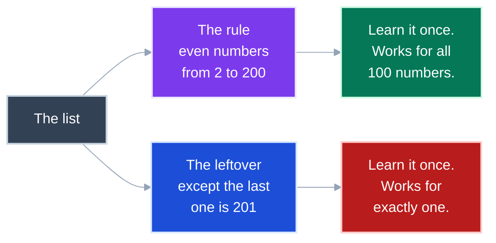
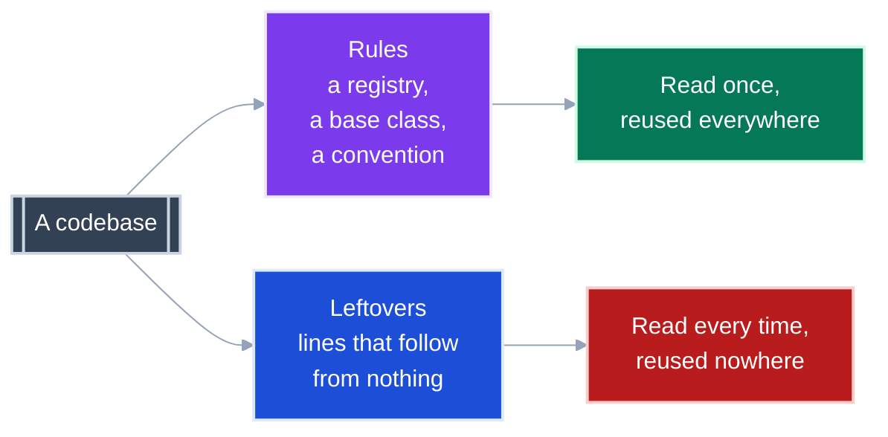
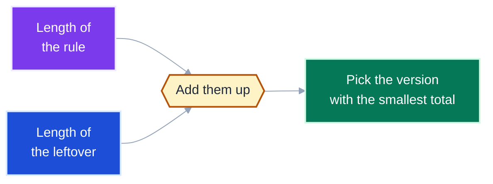
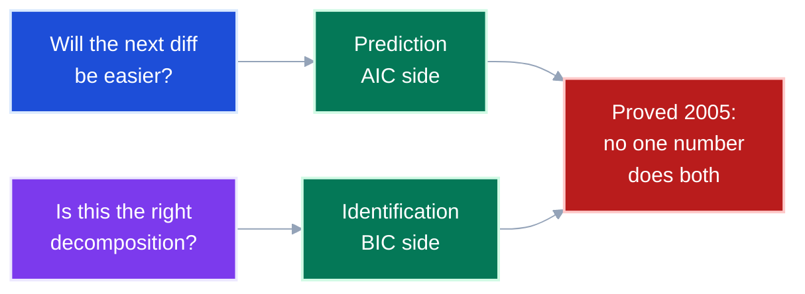
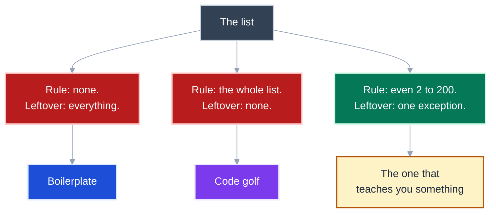

# Reviewability is the leftover, not the total

**Before you start.** You need nothing but arithmetic.
Where a formula appears, the sentence before it says the same thing in words, and you can skip the formula.

You probably arrived believing that shorter code is easier code.
One boundary matters more than any other here: **the theory of "shortest description" says the shortest version is usually the worst one.** Code golf is not a gap in that theory.
It is an example inside it, and the theory's answer is the thing you actually want to measure.

Terms in code font name an exact quantity.
Plain language names its role.
A *rule* is something you learn once and reuse.
A *leftover* is something you have to take in one case at a time.

---

<details>
<summary><b>Table of Contents</b></summary>
<!--TOC-->

- [Reviewability is the leftover, not the total](#reviewability-is-the-leftover-not-the-total)
  - [Start with a list of numbers, not with code](#start-with-a-list-of-numbers-not-with-code)
  - [Now break the pattern, and a second part appears](#now-break-the-pattern-and-a-second-part-appears)
  - [The two parts have standard names](#the-two-parts-have-standard-names)
  - [Code splits the same way](#code-splits-the-same-way)
  - [Reviewing cost is the leftover, not the total](#reviewing-cost-is-the-leftover-not-the-total)
  - [The shortest possible description has a name](#the-shortest-possible-description-has-a-name)
  - [You can never compute it](#you-can-never-compute-it)
  - [MDL is the approximation you can actually run](#mdl-is-the-approximation-you-can-actually-run)
  - [Extracting a function moves length between the two parts](#extracting-a-function-moves-length-between-the-two-parts)
  - [Because the parts move opposite ways, there is a bottom](#because-the-parts-move-opposite-ways-there-is-a-bottom)
  - [What does one new name cost?](#what-does-one-new-name-cost)
  - [One number cannot answer two different questions](#one-number-cannot-answer-two-different-questions)
  - [Code golf wins the "shortest total" contest](#code-golf-wins-the-shortest-total-contest)
  - [The fix: the smallest rule that still explains everything](#the-fix-the-smallest-rule-that-still-explains-everything)
  - [People prefer predictable code, not short code](#people-prefer-predictable-code-not-short-code)
  - [Diagnosis: which half is out of balance](#diagnosis-which-half-is-out-of-balance)
  - [The compact rule](#the-compact-rule)
  - [References](#references)

<!--TOC-->
</details>

---

## Start with a list of numbers, not with code

Here is a list.

```
2, 4, 6, 8, 10, ... 196, 198, 200
```

You can write that list down two ways.

Write out all one hundred numbers.
Or write five words: **"even numbers from 2 to 200"**.

Both descriptions are exact.
Someone reading either one can rebuild the list perfectly.
One is a hundred numbers long and one is five words long.

**Takeaway:** The short version is short because it found the rule, not because it left anything out.

---

## Now break the pattern, and a second part appears

Change the last number.

```
2, 4, 6, 8, 10, ... 196, 198, 201
```

The five-word description no longer works.
But you do not throw it away.
You keep it and add a note.

> **"even numbers from 2 to 200, except the last one is 201"**

That description now has two parts, and they do different jobs.



**Takeaway:** A rule pays you back every time it applies, and a leftover pays you back once.

---

## The two parts have standard names

You will meet these two names everywhere in this document.
They are the same two parts from the list above.

| Plain name | Standard name | The number list | Your code |
|---|---|---|---|
| The rule | `L(H)` | "even numbers from 2 to 200" | the abstractions you learn once |
| The leftover | `L(D given H)` | "except the last is 201" | the lines that follow no rule |

Three letters, and each one is one word.

| Letter | Means | In the list above |
|---|---|---|
| `L` | length of | how many characters it takes to write down |
| `H` | the rule | "even numbers from 2 to 200" |
| `D` | the data | the hundred numbers themselves |

So `L(H)` reads "how long the rule is".
And `L(D given H)` reads "how long the data is, once you already know the rule".

That second one is the important one, so read it slowly.
You know the rule.
The rule gets you 99 of the 100 numbers.
What is left to write down is the one exception, and that is `L(D given H)`.

**Takeaway:** `L`, `H` and `D` are length, rule and data, and this document never uses another symbol you have not been given.

---

## Code splits the same way

A codebase has rules too.
A registry, a base class, a naming convention, a layer boundary.
Learn one and it explains many files.

It also has leftovers.
Lines that follow from nothing, that you simply have to read.



`ADR 0034` in this repo is a rule.
"A harness is a class, the registry is the only dispatch." Learn it once and six modules stop surprising you.

**Takeaway:** Every codebase already has both parts; the question is only how big each one is.

---

## Reviewing cost is the leftover, not the total

Now the point of all this.

You review a diff.
The rules you already know cost you nothing, because you learned them last month.
The leftovers cost you attention, every single one, every single time.

So two diffs of exactly the same size can cost completely different amounts.

**Takeaway:** Measure the leftover, because that is the part you actually pay for.

---

## The shortest possible description has a name

Take anything at all.
Call it `x`.
Lots of different programs would print `x` and stop.
One of them is the shortest.

**`K(x)` is a number.** It is how many characters long that shortest program is.
Nothing else.

It is not a machine, not a program, and not a diff.
It is a length, the way "412" is the length of this paragraph in characters.

| If you see | Read it as |
|---|---|
| `x` | the thing you are describing |
| `K(x)` | the length of the shortest description of `x` |
| "`K` is high" | even the best description of this is long |
| "`K` is low" | there is a short description, so there is a pattern |

For the number list from the start of this document, `K` is small.
"Even numbers from 2 to 200" is a very short program.
For a hundred random numbers, `K` is large, because there is no rule to find and you must write them all out.

Three people found this idea separately: Solomonoff, Kolmogorov, and Chaitin, between 1960 and 1966.

**Takeaway:** `K(x)` is one number -- the length of the best possible description -- and low `K` means a pattern exists.

---

## You can never compute it

This sounds like a problem and it is the useful part.

No program can calculate `K(x)`.
Not a slow one, not a clever one.
It is impossible, and there is a proof.


**Takeaway:** Nobody is computing the true answer, so every metric in this space is an approximation and should be treated as one.

---

## MDL is the approximation you can actually run

`MDL` stands for **Minimum Description Length**.
Rissanen published it in 1978.

It replaces "find the shortest program", which is impossible, with something you can count.

> Add up the rule and the leftover.
> Pick whichever version makes that total smallest.

In symbols, minimise `L(H) + L(D given H)`.
Which is the same sentence, shorter.



**Takeaway:** `MDL` keeps the two parts separate instead of blending them, which is exactly what a single complexity score fails to do.

---

## Extracting a function moves length between the two parts

Here is where this touches your day job.

Pull three branches out into a helper.
The branches leave the caller, so the leftover shrinks.
But you invented a name, and now every reader must learn it, so the rule grows.

Nothing was deleted.
It moved.

**Takeaway:** Extraction is a transfer, not a saving, which is why the per-unit score always improves and the codebase often does not.

---

## Because the parts move opposite ways, there is a bottom

Now imagine doing it over and over.

Extract everything, down to two-line functions.
The leftover is almost nothing.
The rule is three hundred names you must learn.

Or extract nothing at all.
The rule is nothing.
The leftover is a two-thousand-line function.

Both are terrible, and they are terrible in opposite directions.


*Illustrative shape, not measured data.*

Somewhere between them the total is smallest.
That bottom is the regulator you have been looking for.

**Takeaway:** A score that charges nothing for new names has no bottom, so it can be pushed down forever while the code gets worse.

---

## What does one new name cost?

That is the whole design question, and statistics already answers it.

Two standard formulas both say: take how well the thing fits, then subtract a penalty for each new name you introduced.

```
AIC = 2k  - 2 ln(L)         penalty per name: 2
BIC = k ln(n) - 2 ln(L)     penalty per name: ln(n)
```

Read `k` as **how many names**.
Read `n` as **how big the codebase is**.
Ignore `ln(L)` entirely; it is the same in both and it is about fit, not names.

The interesting part is the penalty column, so here it is drawn.


Read the **left panel** across. `AIC`'s line is flat: one new name always costs 2, in a 100-line script and in a 100,000-line system alike. `BIC`'s line climbs, because `ln(n)` climbs.

Read the **right panel** for what that means in practice.
This repository is 6,882 lines, and `ln(6882)` is **8.8**.
So `BIC` charges 8.8 per new name where `AIC` charges 2.
That is **4.4 times more**, in this repo, today.

Add thirty new names and the two criteria disagree by roughly 200.
They will often pick different answers.

**Takeaway:** `BIC` says the right price of a new name is not a fixed threshold; it rises with the size of the codebase it lands in.

---

## One number cannot answer two different questions

There are two things you might want from a score.

*Will the next diff be easier to review?* That is a prediction.

*Is this the right way to split up the module?* That is an identification.

Yang proved in 2005 that no single criterion does both well.
You get one or the other.



**Takeaway:** Your scorecard has to be multidimensional because a theorem says so, not because it is nicer that way.

---

## Code golf wins the "shortest total" contest

Go back to the number list one last time.

There is a third way to describe it, and it is cheating.

> **"the list is: 2, 4, 6, ... 201"**

Call the whole thing one rule with no leftover at all.
This is technically a valid description.
By total length it can even be the winner.

And it teaches you nothing.
You learned one fact about one list, and it transfers to nothing else.



The theory has a formal name for that middle option.
Grunwald and Vitanyi call it out directly, and their word for it is that it is still "not sufficient to capture meaningful information".

**Takeaway:** "Shortest total" is a contest that cheating wins, so it is not the criterion you want.

---

## The fix: the smallest rule that still explains everything

So change what you are asking for.

Do not ask for the shortest total.
Ask for the **smallest rule that still accounts for all the structure**.

Everything left over after that is genuine one-off detail, and it is supposed to be there.

Two other measures, invented for unrelated reasons, punish golf the same way.

| Measure | What it counts | Golfed code |
|---|---|---|
| Total length | how short overall | **wins** |
| Logical depth | how long it takes to work out | loses |
| Sophistication | how big the rule half is | loses |
| Smallest sufficient rule | how big the rule half is, at the best fit | loses |

Three of the four agree.
Only the one that blends both halves into a single number is fooled.

**Takeaway:** Score the rule half on its own and golf stops winning automatically.

---

## People prefer predictable code, not short code

The theory says score the split.
The one direct study of real programmers agrees, and sharpens it.

Casalnuovo and colleagues took real Java and Python expressions in 2020.
They rewrote them into equivalent versions that mean exactly the same thing.
Then they asked programmers which they preferred.

Programmers picked the version a language model found **least surprising**.
Not the shortest one.

**Takeaway:** Writing what the codebase already says beats writing less of it, which is the opposite of what a length score rewards.

---

## Diagnosis: which half is out of balance

| What you notice | Which half | First thing to check |
|---|---|---|
| "What does this function even do?" asked repeatedly | rule too big | How many new names one diff introduces |
| Reviewers approve without really reading | leftover too big and too samey | Take three blocks; if they differ only in literals, a rule is missing |
| A clever one-liner draws a comment every time | golf | Is it the predictable form, or just the short one |
| Small diff, takes an hour | logical depth | Time until someone can restate it correctly |
| Every abstraction is used exactly once | the rule is not a rule | Count uses per name; one use means it never became a rule |
| Score improved, reviewers did not notice | the metric blended the halves | Is it a sum? Split it and report both |

---

## The compact rule

**A description has a rule half you learn once and a leftover half you pay for every time.** **Reviewing cost is the leftover, never the total.** **Never reward "shortest overall", because code golf wins that and teaches nothing.** **Charge for every new name, because a score that does not has no bottom.**

---

## References

Full citations, exact quotations and a could-not-verify list are in [`research/lit-mdl.md`](research/lit-mdl.md).

| Source | Contributes |
|---|---|
| Solomonoff (1964); Kolmogorov (1965); Chaitin (1966) | `K(x)`, found three times independently |
| Li and Vitanyi, *An Introduction to Kolmogorov Complexity* | why `K` cannot be computed |
| Rissanen, *Automatica* 14(5), 1978 | `MDL` and the two-part split |
| Grunwald, *The MDL Principle*, MIT Press, 2007 | the modern treatment |
| Schwarz, *Annals of Statistics* 6(2), 1978 | `BIC` |
| Akaike, *IEEE TAC*, 1974 | `AIC`. Primary text unreachable; formula from secondary sources |
| Yang, *Biometrika* 92(4), 2005 | no single criterion does both jobs. Reported from the title, not the proof |
| Vereshchagin and Vitanyi, *IEEE TIT* 50(12), 2004 | the smallest sufficient rule |
| Bennett (1988); Koppel (1987) | logical depth; sophistication |
| Casalnuovo et al., *Cognitive Science* 44(12), 2020 | programmers prefer predictable over short |

**Status note.** Nobody has published work applying logical depth or sophistication to how hard code is to read.
That bridge is drawn here, and it is not a cited result.
