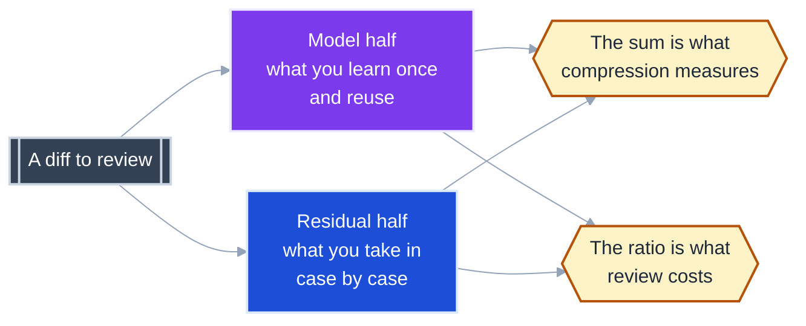
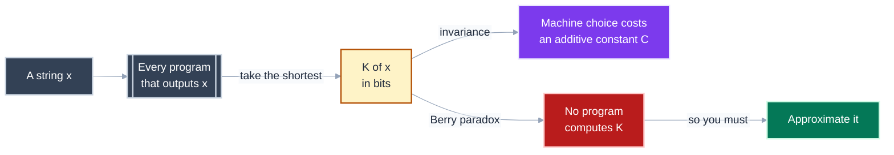
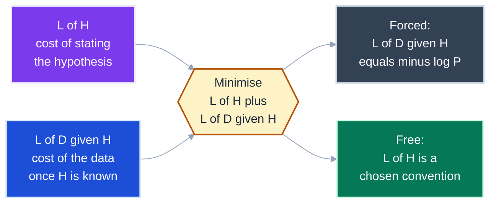
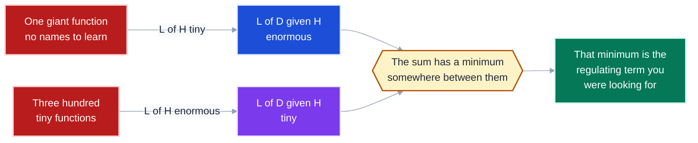
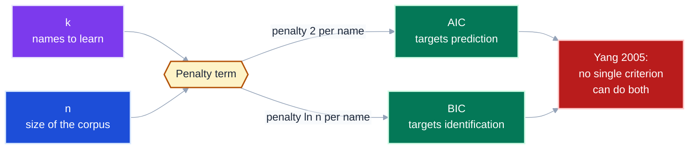
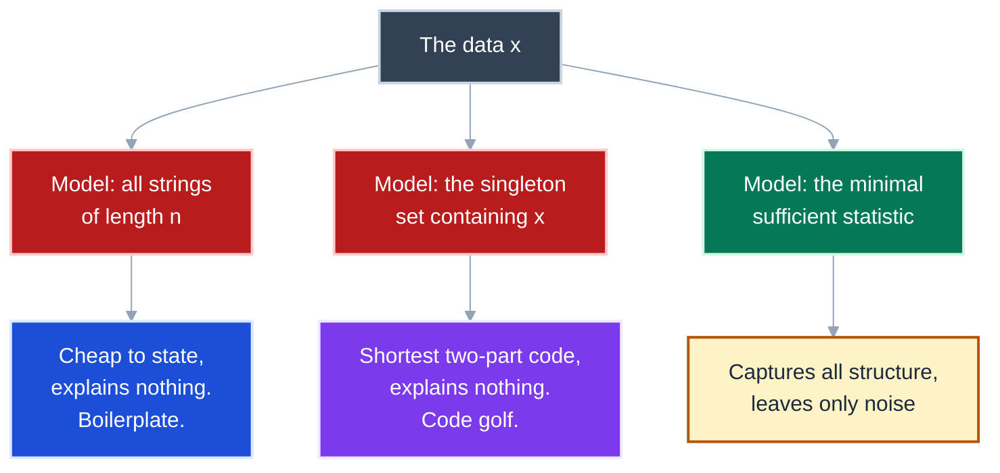
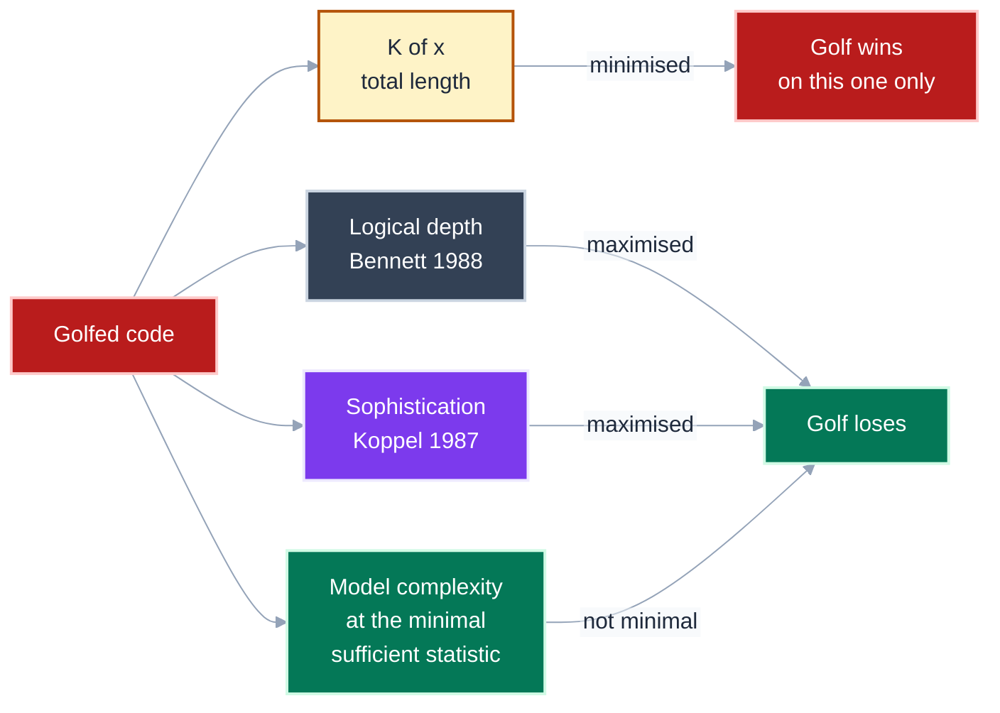
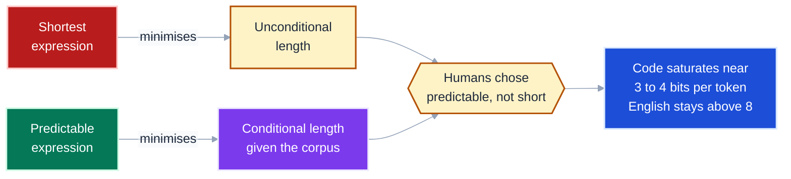

# Reviewability is the split, not the sum

You probably arrived believing that if description length measures complexity, then the shortest description is the best one.
One boundary matters more than any other here: **the theory that formalises "shortest description" explicitly rejects shortest-as-a-goal, and names the failure case in its own vocabulary.** Code golf is not a hole in the theory.
It is a worked example inside it, and the theory's answer to it is the thing you actually want to measure.

Terms in code font name an exact quantity from the literature -- `K(x)`, `L(H)`, `AIC`, `alpha`.
Plain language names its role: a *model* is what a reader learns once and reuses; a *residual* is what a reader must take in case by case.

Every formula below is cited to a primary source in [`research/lit-mdl.md`](research/lit-mdl.md), which also records what could not be verified.

---

## The whole thesis: one description, two halves, and only the halves matter

Any description of anything splits into a part that generalises and a part that does not.
Reviewing cost tracks the split between them, not the total.



**Takeaway:** Two diffs with identical total description length can differ completely in review cost, so any single-number compression score is measuring the wrong axis.

---

## `K(x)` is the shortest program, and you can never compute it

Kolmogorov complexity is the length in bits of the shortest program that outputs `x` on a fixed universal machine and halts.
Three people defined it independently: Solomonoff (1960, 1964), Kolmogorov (1965), and Chaitin (1966).

Two properties decide everything downstream.
The **invariance theorem** says the choice of machine costs you only an additive constant: `|K1(x) - K2(x)| <= C`, where `C` depends on the two machines and nothing else. **Uncomputability** says no program computes `K`, by a formalisation of Berry's paradox.



**Takeaway:** `K` is the right idea and an unusable instrument, so every practical score in this document is an approximation to it and inherits that status honestly.

---

## MDL is the computable stand-in, and it arrives already split in two

Rissanen's Minimum Description Length principle replaces "the shortest program" with a **two-part code** you can actually count: minimise `L(H) + L(D|H)` over candidate hypotheses `H`.

The second term is not a free choice. `L(D|H) = -log P(D|H)` is forced by a consistency argument.
The first term, `L(H)`, is genuinely arbitrary in crude MDL, which is exactly where a per-codebase convention gets to live.



**Takeaway:** MDL hands you the spring and the damper as two named terms, not one blended score.
The arbitrary term is the one you get to calibrate.

---

## The two terms move in opposite directions, which is why a minimum exists

Map the two-part code onto refactoring and the regulator appears on its own.
Every abstraction you introduce is a sentence added to `L(H)` -- a name the reader must learn -- and a saving subtracted from `L(D|H)`.

Extraction does not reduce description length.
It **moves** description length across the split.



**Takeaway:** A metric that charges nothing for the model half has no minimum.
It will be optimised to absurdity, which is the failure of every per-unit complexity gate.

---

## `AIC` and `BIC` set the price of one name, and the price is the spring constant

Both criteria are the same shape: goodness of fit, plus a penalty that is linear in `k`, the number of parameters.
For code, `k` is the count of names a reader must hold.

```
AIC = 2k - 2 ln L         penalty per parameter: 2
BIC = k ln(n) - 2 ln L    penalty per parameter: ln(n)
```

`BIC` charges more as the dataset grows, which is the property you want: in a larger codebase, each additional name costs the reader more.



Two cautions that matter more than the formulae. **"MDL equals BIC" is wrong** -- Grunwald names it as an error in Burnham and Anderson (2002, p. 286); the asymptotic agreement holds only with `k` fixed and `n` going to infinity.
And Yang (2005) proves the two goals are exclusive.
*Will the next diff be easier to review* is a prediction question.
*Is this the right decomposition* is an identification question.
One number cannot serve both.

**Takeaway:** Pricing a name is the whole design decision.
`BIC`'s `ln(n)` says that price rises with codebase size rather than staying a fixed threshold.

---

## Code golf has a formal name, and it is the singleton model

Here is the objection stated in the theory's own terms.
Models are finite sets; the data `x` is one member.
Two degenerate models are always available.



Grunwald and Vitanyi (2008), section 6.1.2, say it directly:

> "Both the largest set {0,1}^n [having low complexity of about K(n)] and the
> singleton set {x} [having high complexity of about K(x)], while certainly
> statistics for x, would indeed be considered poor explanations."

And the sentence that settles it:

> "the fact that {x} is still an optimal set for x shows that it is still not
> sufficient by itself to capture the notion of 'meaningful information'."

Read this as: **golfed code is the singleton model.**
It achieves the shortest two-part code by pushing everything into the model half and leaving no residual.
It has therefore learned nothing that transfers to the next diff.

**Takeaway:** "Shortest total description" is not a criterion the theory endorses, because the degenerate model wins it.

---

## The fix is minimality, and three independent measures agree

The theory refines its criterion from *shortest two-part code* to **minimal sufficient statistic**.
Among the models achieving the shortest code, take the one with the smallest model complexity `alpha`.

Two other measures, defined for unrelated reasons, punish golf the same way.
Bennett's **logical depth** counts the running time of the near-shortest program.
Koppel's **sophistication** counts the size of the model half alone.



Kolmogorov's **structure function** `h_x(alpha)` makes the point geometric: it plots fit quality against a budget on model complexity.
The theory's own criterion is the *shape of that curve*, not a scalar.

**Takeaway:** Every measure that scores the model half separately punishes golf, and only the measure that blends both halves into one number rewards it.

---

## Humans prefer the predictable expression, not the short one

The theory says score the split.
The one direct human study agrees, and it agrees on the sharper point that *predictable* and *short* are different things.

Casalnuovo et al.
(2020) generated meaning-preserving transformations of real Java and Python expressions and asked which people preferred.

> "we find that programmers do prefer more predictable variants, and that stronger
> language models like the transformer align more often and more consistently
> with these preferences."

This sits on top of Hindle et al. (2012), who measured that code is far more repetitive than English.
English falls from about 10 bits per token at unigram to under 8 at 10-gram.
Java saturates at tri- and 4-grams around 3 to 4 bits, against a uniform ceiling of 13 to 20 bits.



**Takeaway:** Predictability is conditional description length, cheap because the reader already holds the model.
That is why writing what the codebase already says beats writing less of it.

---

## What each measure does to the two failure poles

State the invariant before comparing, which the beats above have now done.

| Measure | Golfed code | Boilerplate | Scores the split? |
|---|---|---|---|
| `K(x)` / raw compression | **rewards** it | punishes it | no |
| Logical depth (Bennett) | punishes it | rewards it | partially |
| Sophistication (Koppel) | punishes it | rewards it | **yes, model half only** |
| Model complexity at the minimal sufficient statistic | punishes it | punishes it | **yes, both halves** |
| `BIC` penalty `k ln(n)` | punishes it | punishes it | **yes, via `k`** |
| Cyclomatic complexity per unit | neutral | neutral | no |

Note the last row.
A per-unit branch count is blind to both failure poles, which is why it can be optimised without bound.

---

## Diagnosis: which half is out of balance

| Symptom | Half out of balance | First thing to inspect |
|---|---|---|
| Reviewers ask "what does this function do?" repeatedly | `L(H)` too large | Count names introduced per diff; each is a `k` the reader pays for |
| Reviewers approve without reading | `L(D\|H)` too large and too uniform | Sample three residual blocks; if they differ only in literals, the model half is missing |
| A clever one-liner draws a comment every time | golf: model half swallowed the residual | Whether the expression is the *predictable* form or merely the short one |
| The diff is small but takes an hour | high logical depth | Time to first correct paraphrase, not line count |
| Every abstraction is used exactly once | model half is not sufficient | Reuse count per introduced name; one use means it is not a model |
| The score improves and reviewers do not | the metric blends the halves | Whether the score is a sum; if so, split it and report both |

---

## The compact rule

**Description length splits into a model half you learn once and a residual half you pay for every time.**
**Reviewing cost tracks that split, never the sum.**
**Score a diff by total length and the singleton model wins, which is code golf stated formally.**
**Price a name explicitly, because a metric that charges nothing for the model half has no minimum.**

---

## References

Full citations, verbatim quotations and a could-not-verify list are in [`research/lit-mdl.md`](research/lit-mdl.md).

| Source | Contributes |
|---|---|
| Solomonoff, *Information and Control* 7(1) and 7(2), 1964; Kolmogorov, *Problems of Information Transmission* 1(1):1-7, 1965; Chaitin, *JACM* 13(4):547-569, 1966 | the three independent formulations of `K` |
| Li and Vitanyi, *An Introduction to Kolmogorov Complexity and Its Applications*, Springer | invariance and uncomputability |
| Rissanen, "Modeling by shortest data description," *Automatica* 14(5):465-471, 1978 | the two-part code |
| Grunwald, *The Minimum Description Length Principle*, MIT Press, 2007; tutorial at [arXiv:math/0406077](https://arxiv.org/abs/math/0406077) | modern MDL, and the correction of "MDL equals BIC" |
| Schwarz, *Annals of Statistics* 6(2):461-464, 1978 | `BIC` |
| Akaike, *IEEE TAC*, 1974 | `AIC`. Primary text unreachable; formula reported from secondary sources |
| Yang, *Biometrika* 92(4):937-950, 2005 | the impossibility result. Reported from the title and the field's summary, not the proof |
| Vereshchagin and Vitanyi, *IEEE TIT* 50(12):3265-3290, 2004 | the structure function and the minimal sufficient statistic |
| Bennett, 1988 | logical depth. Year and pages are cited inconsistently across sources |
| Koppel, 1987 | sophistication |
| Hindle et al., *ICSE 2012* | the cross-entropy measurements |
| Casalnuovo et al., *Cognitive Science* 44(12), 2020, DOI [10.1111/cogs.12921](https://doi.org/10.1111/cogs.12921) | the human-preference study |

**Status note.** No published work applies logical depth, sophistication, or the structure function to source-code comprehensibility.
The bridge from this theory to a reviewability score is drawn here and in `research/lit-mdl.md`, and it is not a cited result.
