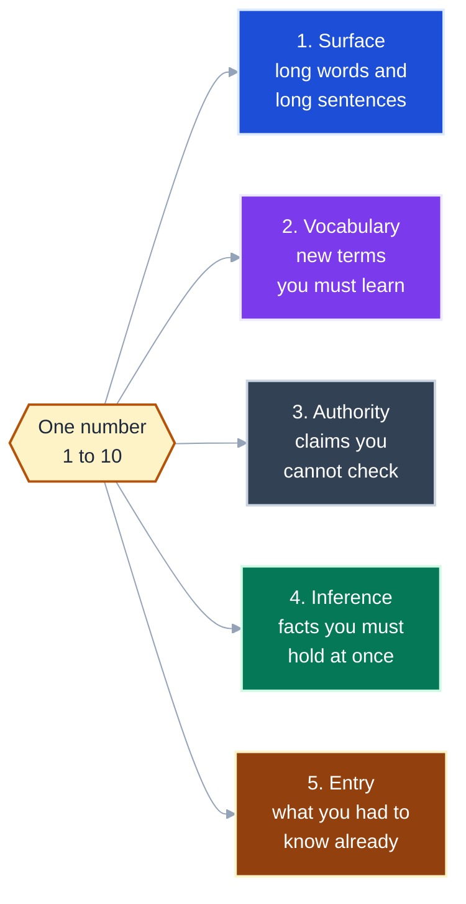
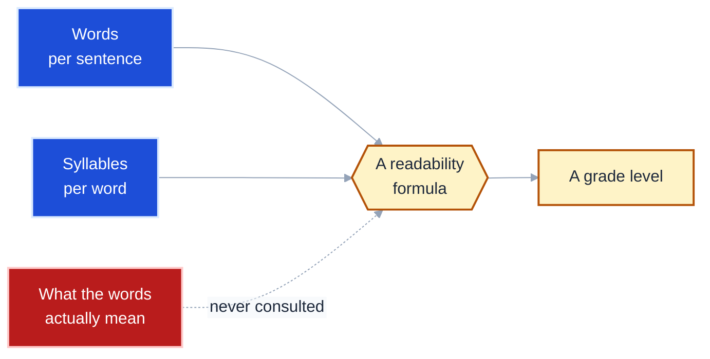
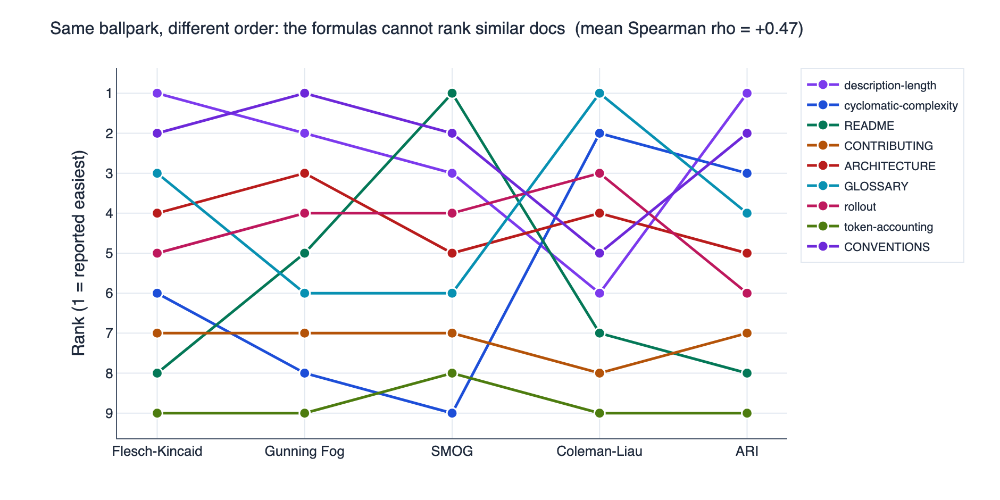
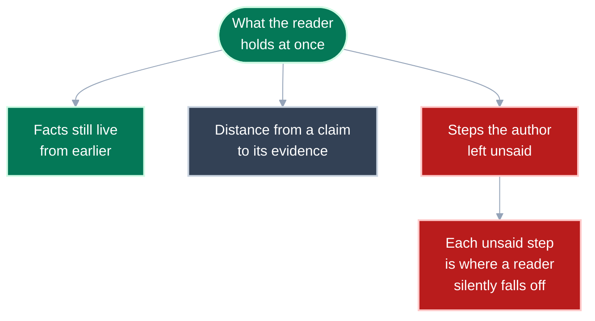
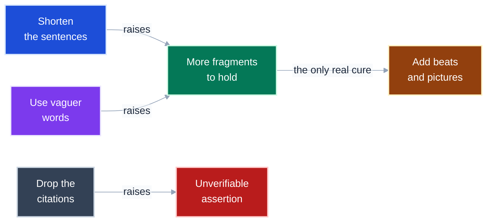

# Readability is a fit, not a height

You probably arrived wanting one number for "how hard is this to read".
One boundary matters more than any other: **reading level is not a property of a document.** It is a property of a document *and* a reader.
The same page is a 3 for one person and a 9 for another, and no formula can tell them apart.

So this guide gives you two things.
A **1-10 scale** you can say out loud, so "make this a 5" means something.
And **five axes** underneath it, so when a document is a 9 you know *which kind* of hard it is.

Terms in code font name an exact measured quantity -- `ASL`, `F-K`, `terms/1k`.
Plain language names its role.

---

<details>
<summary><b>Table of Contents</b></summary>
<!--TOC-->

- [Readability is a fit, not a height](#readability-is-a-fit-not-a-height)
  - [The scale: how often a new reader stops to look something up](#the-scale-how-often-a-new-reader-stops-to-look-something-up)
  - [The whole map: one scale, five axes beneath it](#the-whole-map-one-scale-five-axes-beneath-it)
  - [Axis 1: every readability formula measures the same two things](#axis-1-every-readability-formula-measures-the-same-two-things)
  - [The formulas agree on the ballpark and disagree on the order](#the-formulas-agree-on-the-ballpark-and-disagree-on-the-order)
  - [Axis 1 has a free exploit, and I took it](#axis-1-has-a-free-exploit-and-i-took-it)
  - [Axis 2: not how many terms, but how you are able to learn them](#axis-2-not-how-many-terms-but-how-you-are-able-to-learn-them)
  - [Axis 3: authority is how much you must take on trust](#axis-3-authority-is-how-much-you-must-take-on-trust)
  - [Axis 4: inference is how many facts you hold at once](#axis-4-inference-is-how-many-facts-you-hold-at-once)
  - [Axis 5: entry is the most valuable axis, and the cheapest to fix](#axis-5-entry-is-the-most-valuable-axis-and-the-cheapest-to-fix)
  - [The axes push against each other](#the-axes-push-against-each-other)
  - [How to move a document from a 9 to a 5](#how-to-move-a-document-from-a-9-to-a-5)
  - [The compact rule](#the-compact-rule)
  - [Scoring this document](#scoring-this-document)
    - [The same treatment applied elsewhere](#the-same-treatment-applied-elsewhere)
  - [References](#references)

<!--TOC-->
</details>

---

## The scale: how often a new reader stops to look something up

One question sets the level.
A reader who knows the field but not this document: how often do they have to stop?


| Level | Anchor | Stops to look something up |
|---|---|---|
| 1 | Children's book | Never |
| 3 | Newspaper article | Rarely |
| **5** | **Good engineering blog post** | **Once or twice in the whole document** |
| 7 | Specialist deep-dive, a solid ADR | Once per section |
| 9 | Academic paper in the subfield | Once per paragraph |
| 10 | Formal proof | Cannot proceed without prior training |

The reader sets the number, not the author.
If you got lost, it was a 9, and no measurement overrules that.

**Takeaway:** Say the number and the target together -- "this is a 9, make it a 5" -- because the gap is the instruction.

---

## The whole map: one scale, five axes beneath it

The scale is what you say.
The axes are what you fix.



**Takeaway:** Only axis 1 has tooling, and it is the axis that matters least.

---

## Axis 1: every readability formula measures the same two things

Flesch, Flesch-Kincaid, Gunning Fog, SMOG, Coleman-Liau, ARI.
Six names, and they all take the same two inputs.

How long are the sentences.
How long are the words.

```
F-K grade = 0.39 x (words per sentence) + 11.8 x (syllables per word) - 15.59
```

That is the whole instrument.
It never reads a single word for meaning.



**Takeaway:** A formula cannot tell `L(D|H)` from `elephant`, because both are one short token to it.

---

## The formulas agree on the ballpark and disagree on the order

Here is what happens when you run five of them over the nine docs in this repo.
Each line is one document.
A flat line would mean the formulas agree about it.



The lines cross constantly. `README.md` is ranked 8th easiest by Flesch-Kincaid and **1st** by SMOG.
Mean agreement across all ten pairs is `rho = +0.47`, and one pair is *negative*.

The cause is in the data.
Every doc here sits between 17.6 and 23.2 words per sentence.
That is a narrow band, and ranking inside a narrow band is mostly noise.

**Takeaway:** Use a formula to check you are in the right ballpark, never to decide which of two similar documents is harder.

---

## Axis 1 has a free exploit, and I took it

Split every long sentence at its comma.
The formula's grade drops.
Nothing got easier.

This is not hypothetical.
The prose gate on this repo caps sentences at 25 words.
Satisfying it pushed me to *compress* sentences in `description-length.md` rather than add more of them, and that is what made it unreadable.


*Illustrative curve, not measured data -- the shape is the claim, not the units.*

Fewer words per sentence means more sentences to hold in your head.
Push far enough and the reader pays more, not less.

**Takeaway:** Any single readability number can be optimised to absurdity, so treat a low score as a smoke alarm rather than a goal.

---

## Axis 2: not how many terms, but how you are able to learn them

The obvious measure is to count technical terms.
That measure is wrong, and it is worth seeing why, because the wrong version inverts the answer.

Terms come in two kinds, and only one of them is expensive.

| Kind | How you learn it | Examples | Cost |
|---|---|---|---|
| **Operational** | by doing | `--dry-run`, `pytest`, `cell`, `harness` | low: run it and you know it |
| **Formal** | only by being taught | `K(x)`, `L(D given H)`, `BIC`, logical depth | high: no amount of use teaches you |

Counting them together made the most demanding document in this repo look like the lightest.
Splitting them gives the answer a reader would recognise.

| Document | operational terms | **formal terms** | formal per 1k |
|---|---|---|---|
| `description-length.md` | 2 | **30** | **16.3** |
| `readability.md` | 10 | 5 | 3.3 |
| `cyclomatic-complexity.md` | 35 | 5 | 3.0 |
| `README.md` | 74 | **1** | **0.6** |

`README.md` carries 74 technical terms and is not hard, because you can run every one of them. `description-length.md` carries 30 formal terms and is hard, because you cannot run any of them.

**Takeaway:** Count only the terms a reader cannot learn by doing, and define every one of those at the point you first use it.

---

## Axis 3: authority is how much you must take on trust

Some sentences you can check by reading on.
Others rest on a name and a year.

> Peitek et al. (2021) found McCabe complexity correlates at tau = -0.09.

You cannot verify that from the page.
You either accept it or you go and read the paper, and going to read the paper is a stop.

`description-length.md` names **17 researchers and about 8 journals** in 1,700 words.
Nothing else in this repo asks for that much trust.

**Takeaway:** Citations make a claim honest and make the page harder, which is a real trade rather than a defect.

---

## Axis 4: inference is how many facts you hold at once

This is the axis nobody measures and everybody feels.

Three things drive it.
How many facts must be live in your head at the same time.
How far apart a claim sits from its support.
How many steps the author left for you to make silently.



The cure is more beats, not shorter sentences.
One idea per section, and each section using only what came before.

**Takeaway:** When a reader says "I was lost after the first section", that is axis 4, and no amount of sentence-splitting will fix it.

---

## Axis 5: entry is the most valuable axis, and the cheapest to fix

The other four axes describe the page.
This one describes the door, and it is where documents actually fail.

An undeclared assumption does not slow a reader down.
It stops them, silently, and they blame themselves rather than the page.

Here are three real failures from the first draft of `description-length.md`, reported by its reader.

| What the reader hit | What went wrong | The fix |
|---|---|---|
| "`L(D given H)` when `L`, `D` and `H` are never defined" | `L` and `H` were defined. `D` never was. | A three-row table: `L` is length, `H` is the rule, `D` is the data |
| "is `K` a machine? is it a diff of a machine?" | `K` was introduced as *the length of the shortest program*, so the program stole the sentence | Say it flat: **`K` is a number**, not a machine |
| "`AIC` and `BIC` could have used line charts" | The penalty was asserted in a sentence and never shown | Two panels: flat 2 against `ln(n)` |

Notice that none of the three is a hard idea.
Each is a *missing sentence*, and each cost a reader the whole document.

This is the only axis where **naming the difficulty is the entire fix**.
A reader told "this assumes you can read `-log P` as a cost in bits" can decide to continue or to go and read something else first.
A reader who is not told just feels stupid and closes the tab.

**Takeaway:** Put the prerequisites in the first paragraph and define every symbol at first use, because a missing definition costs more than a hard idea.

---

## The axes push against each other

You cannot lower all five.
Lowering one raises another, which is why a single score has no minimum.



Only one move lowers the level without raising anything. **Add another beat.** More sections, each doing less, with a picture.

**Takeaway:** Length is not difficulty -- a longer document with more beats is easier than a short dense one.

---

## How to move a document from a 9 to a 5

| Symptom | Axis | What to change |
|---|---|---|
| "I don't know this word" | 2 vocabulary | Define it at first use, in the sentence that uses it |
| "I can't check that" | 3 authority | Move the citation to a footnote or a references table |
| "I was fine, then lost" | 4 inference | Split the section into two beats, add a picture to each |
| "I didn't know where to start" | 5 entry | Add a prerequisites line to the opening |
| "It reads like a telegram" | 1 surface, over-optimised | Put the connecting words back and add a beat |
| Formula says grade 10, reader says 9/10 | 1 vs 4 | Trust the reader; the formula cannot see axis 4 |

---

## The compact rule

**Say the level and the target out loud, because "this is a 9, make it a 5" is an instruction and "make it clearer" is not.** **A readability formula sees only sentence length and word length, so a low score proves nothing about whether anyone understood.** **The only move that lowers difficulty without raising it somewhere else is adding another beat.**

---

## Scoring this document

Measured with `tmp/readability.py` and `tmp/conceptload.py`:

| Axis | This document | Note |
|---|---|---|
| 1 surface | `F-K` 6.8, `ASL` 13.0 | Short sentences, but not compressed ones |
| 2 vocabulary | 5 formal terms, 10 operational | Every axis name defined where introduced |
| 3 authority | 1 in-body citation | The bibliography is 13 names, but you never need it to read on |
| 4 inference | 11 beats, 4 diagrams, 3 charts | One axis per beat, nothing used before defined |
| 5 entry | none needed | No maths here beyond an average |

### The same treatment applied elsewhere

`description-length.md` was rebuilt using this framework after a reader rated it a 9.
What changed, measured:

| | Before | After |
|---|---|---|
| `F-K` grade | 10.8 | **6.1** |
| Words per sentence | 17.6 | **11.0** |
| Beats | 8 | **15** |
| Diagrams | 8 | 6 + 1 chart |
| Researchers named in the body | 17 | **6** |
| Prerequisites stated | no | **yes** |

The surface number fell, but that is not what fixed it.
The beat count nearly doubled and the citations moved to a table.

**Takeaway:** More beats and fewer in-body citations is the repeatable move; the falling grade level is a side effect, not the cause.

**Self-assessed: a 4.** Tell me if it reads higher, because your number is the one that counts.

---

## References

| Source | Contributes |
|---|---|
| Flesch (1948); Kincaid et al. (1975); Gunning (1952); McLaughlin, SMOG (1969); Coleman and Liau (1975) | the axis-1 formulas |
| Dale and Chall (1948) | the one classic formula with a vocabulary term, the ancestor of axis 2 |
| Graesser, McNamara et al., Coh-Metrix | the ~100-measure modern instrument, and the cohesion measures behind axis 4 |
| McNamara, Kintsch, Songer and Kintsch (1996), *Cognition and Instruction* | the reverse cohesion effect: high-knowledge readers learn more from low-cohesion text. Cited from memory, not verified this session |

**Status note.** The axis-1 numbers here were measured on this repo.
The five-axis split is a working framework built for this project, not a published taxonomy.
