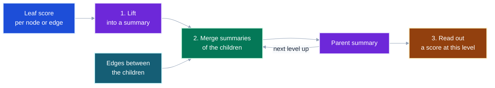
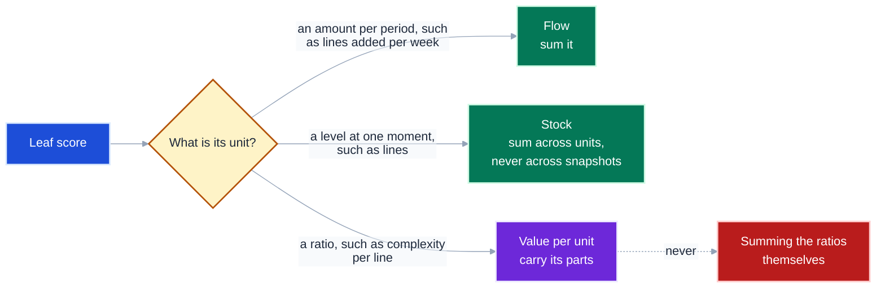
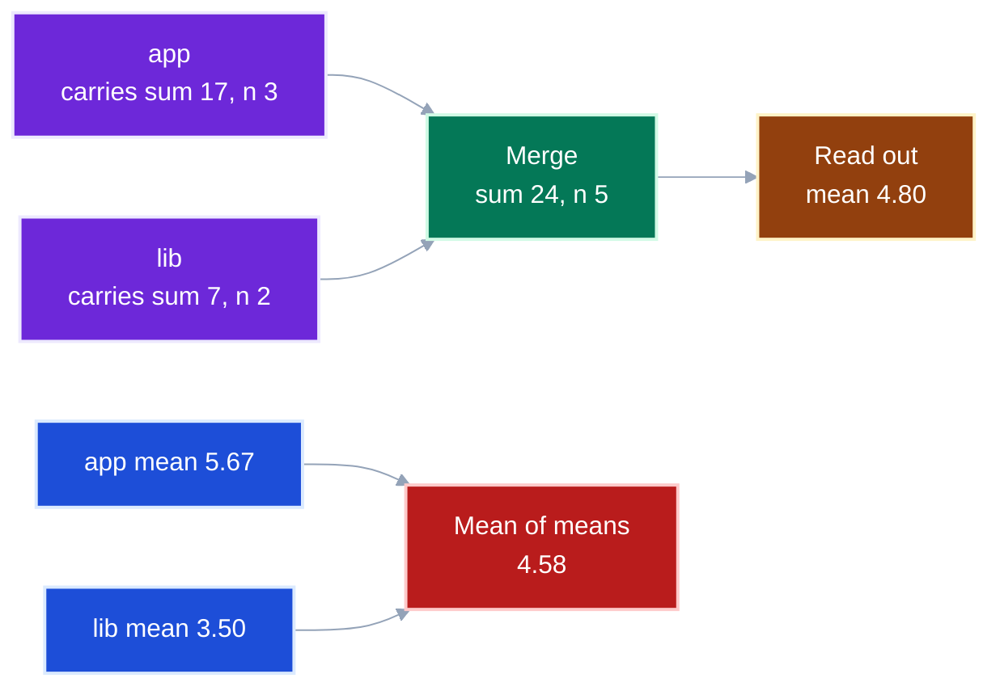
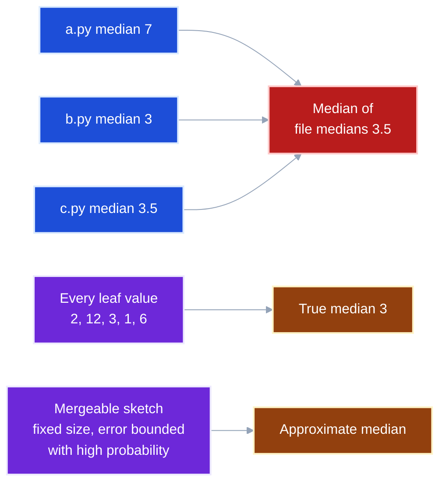
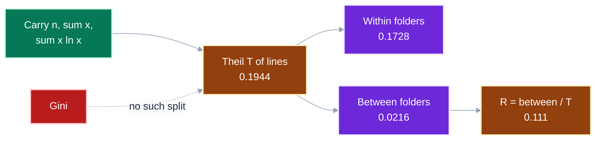
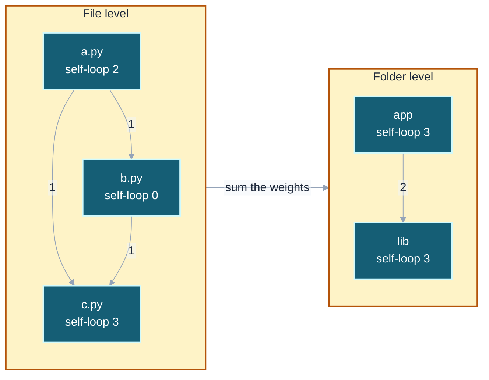
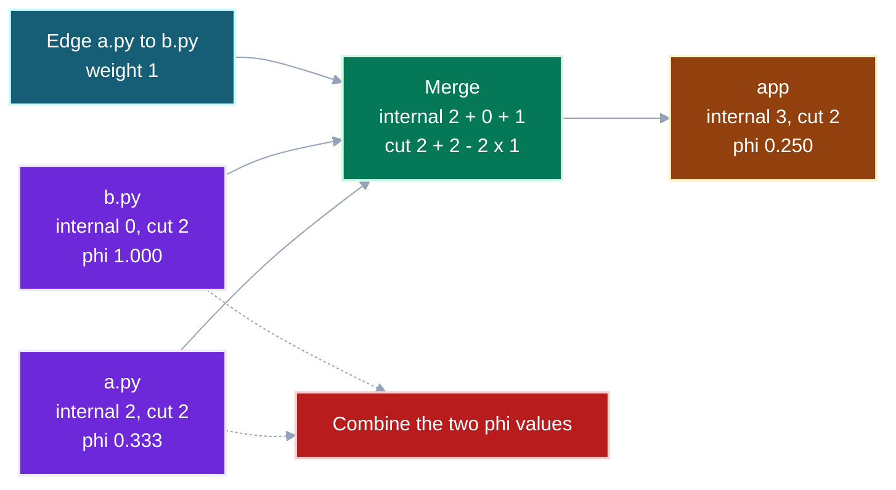
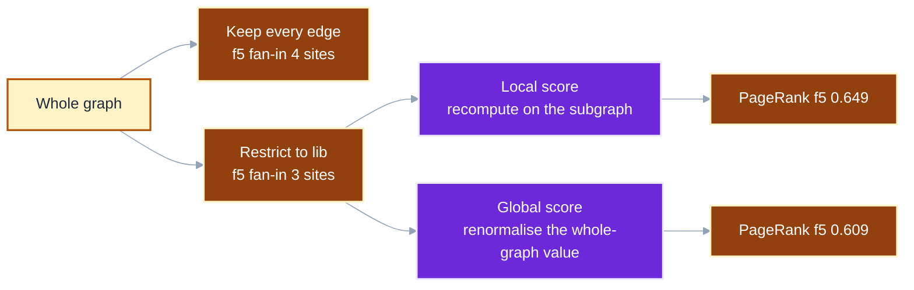

# Score aggregation: scoring a graph, then scoring it again as it collapses

**Status:** research distilled into a guide, nothing here is adopted yet. **Before you start:** [GLOSSARY.md](GLOSSARY.md#gr-con-01-conductance-phi) for conductance.

You were close if you expected a parent's score to be a function of its children's scores.
**It is a function of what each child carries**, and a graph score also needs the edges that run between the children.
A folder's mean complexity cannot be rebuilt from its files' means alone, and its conductance cannot be rebuilt from its files' conductances.
Both can be rebuilt exactly, if each level carries the right summary instead of the finished number.

This guide explains how to choose that summary, so any node, edge, level or subgraph can be scored from one pass over the leaves.

Terms in code font name an exact quantity or formula, such as `cut(S)`.
Plain words name the role a quantity plays, such as the summary a level carries.

---

<details>
<summary><b>Table of Contents</b></summary>
<!--TOC-->

- [Score aggregation: scoring a graph, then scoring it again as it collapses](#score-aggregation-scoring-a-graph-then-scoring-it-again-as-it-collapses)
  - [The worked example used throughout](#the-worked-example-used-throughout)
  - [Every roll-up lifts, merges, then reads out](#every-roll-up-lifts-merges-then-reads-out)
  - [A score's unit decides which merges are legal](#a-scores-unit-decides-which-merges-are-legal)
  - [Carry a fixed-size summary, never the finished score](#carry-a-fixed-size-summary-never-the-finished-score)
  - [A median needs every leaf, or a mergeable sketch](#a-median-needs-every-leaf-or-a-mergeable-sketch)
  - [Inequality splits exactly into within and between](#inequality-splits-exactly-into-within-and-between)
  - [Collapsing a graph sums its edges into a quotient](#collapsing-a-graph-sums-its-edges-into-a-quotient)
  - [A graph score needs the edges between siblings](#a-graph-score-needs-the-edges-between-siblings)
  - [A subgraph is restricted, not rolled up](#a-subgraph-is-restricted-not-rolled-up)
  - [The score record: one design that serves every level](#the-score-record-one-design-that-serves-every-level)
  - [How the aggregations compare](#how-the-aggregations-compare)
  - [When a rolled-up score looks wrong](#when-a-rolled-up-score-looks-wrong)
  - [The compact rule](#the-compact-rule)
  - [What this changes for the open questions](#what-this-changes-for-the-open-questions)
  - [References](#references)

<!--TOC-->
</details>

---

## The worked example used throughout

Five functions sit in three files, and the files sit in two folders.
Each function carries two leaf scores, and each call edge carries its number of call sites.

| Function | File | Folder | Lines | Cyclomatic complexity |
|---|---|---|---|---|
| `f1` | `a.py` | `app` | 10 | 2 |
| `f2` | `a.py` | `app` | 40 | 12 |
| `f3` | `b.py` | `app` | 20 | 3 |
| `f4` | `c.py` | `lib` | 5 | 1 |
| `f5` | `c.py` | `lib` | 25 | 6 |

The calls are `f1 -> f2` with 2 sites, and `f2 -> f3`, `f3 -> f4` and `f2 -> f5` with 1 site each.
`f4 -> f5` has 3 sites.

Every number below was computed from this example by a script, not worked by hand.

---

## Every roll-up lifts, merges, then reads out

What does it take to score one level of a hierarchy from the level below?



The shape is a theorem, not a convenience.
Deep Sets proves that, over a countable universe, a function of a set is permutation-invariant exactly when it can be written `rho(sum of phi(x))`.
`phi` is the lift, the sum is the merge, and `rho` is the read-out.
Leaf scores repeat, so they form a multiset, and Xu and colleagues prove the same form for bounded multisets.
The theorem guarantees the shape but not a small summary, because its proof packs a whole set into one real number.
How large the lift must be is a separate question, and the next beats answer it.

**Takeaway:** a scoring design is three choices: the lift, the merge and the read-out.
The edge input is what makes a graph different from a list.

---

## A score's unit decides which merges are legal

Can every score be added up a hierarchy?

Lenz and Shoshani name three kinds of summary attribute, flow, stock and value per unit, and make type compatibility a condition for summarising.
The merge rules in the diagram are this guide's reading of those kinds.
This repository calls flows and stocks extensive, and values per unit intensive.



Two more conditions come from the same paper, and both concern the hierarchy rather than the score.
**Disjointness** requires each child to roll up into exactly one parent.
**Completeness** requires every child to roll up into some parent.

A scope tree meets disjointness, because each scope has at most one lexical parent.
It meets completeness only when every scope below the root has a parent, so the tree must have a single root.
An import graph can break both, so a score rolled up along imports can count some functions twice and others never.

**Takeaway:** check the unit before the merge, and check that the hierarchy is a partition before trusting any total.

---

## Carry a fixed-size summary, never the finished score

Why does the mean of the folder means not equal the repository mean?

Gray and colleagues sort aggregates by how much a sub-aggregate must carry.
A **distributive** aggregate carries itself, as `SUM`, `COUNT`, `MIN` and `MAX` do.
An **algebraic** aggregate carries a fixed-size tuple, as `AVG` carries a sum and a count.



The mean of means weights `lib`'s two functions as heavily as `app`'s three, which is why it lands low.

Two aggregates from the software metrics literature are algebraic, although neither paper frames them that way.
A SIG-style risk profile carries lines per risk band, so a folder's percentages are read out from summed band totals.
Squale's global mark is `-log_l(mean of l^-IM)`, so it carries a count and a sum of `l^-IM`.

```
merge app and lib, lines per band      read out
app   low 30   moderate  0   high 40
lib   low  5   moderate 25   high  0
repo  low 35   moderate 25   high 40   ->  35% low, 25% moderate, 40% high
```

Read this as: **the percentages at every level come from totals that simply add, so nothing is re-read from the leaves**.
The bands in this example are illustrative, not the SIG thresholds.

**Takeaway:** store the tuple a score is built from, and a parent's score is exact at any depth.

---

## A median needs every leaf, or a mergeable sketch

What happens to a score with no fixed-size summary?

Gray and colleagues call it **holistic**, and name median, mode and rank.
No constant-size tuple describes a sub-aggregate, so a parent must see every leaf value again.
The Deep Sets form still applies, but only with a lift as large as the data.



A mergeable summary restores the fixed size by giving up exactness.
Agarwal and colleagues define one as a summary where two can merge into a summary of the union, keeping the same size and error guarantee.
They give mergeable summaries for heavy hitters and for quantiles, so a median or a percentile can roll up approximately.
The fully mergeable quantile summary is randomised, so its error bound holds with high probability rather than always.

**Takeaway:** a holistic score either re-reads the leaves at every level, or carries a sketch and states its error bound.

---

## Inequality splits exactly into within and between

Can a single number say whether a problem is spread evenly or concentrated in one folder?

An inequality index scores how unevenly a quantity is spread, and some indices decompose by group.
Shorrocks derived the class that splits additively into a weighted sum of within-group values plus a between-group term.
Theil's index is one of them, and Serebrenik and van den Brand chose it over Gini for software metrics for that reason.



`R` is the share of the inequality a partition explains, and Mordal and colleagues define and recommend it for exactly this question.
Here the folder split explains 11% of the spread in function length, so the unevenness lives inside folders.

Theil's T is also algebraic, which is derived here rather than taken from those papers.
With `s = sum x` and `n` the count, `T = (sum x ln x) / s - ln(s / n)`, so three running totals rebuild it at any level.

**Takeaway:** use a decomposable index when the question is where a problem lives, and read `R` for each candidate partition.

---

## Collapsing a graph sums its edges into a quotient

What does an edge score become when its two ends merge into one group?

Collapsing a partition gives a **quotient graph**, with one node per group.
Louvain builds it by summing the weights of the edges between two communities, and an edge inside one community becomes a self-loop.
DiffPool writes the same step as `A' = S^T A S`, where `S` assigns nodes to clusters.
Here `A` is the directed matrix of call sites, so the diagonal of `A'` is each group's internal weight.



The edge `a.py -> b.py` becomes part of `app`'s self-loop, which is why `app` holds 3 where its files held 2 and 0.
The self-loop is not bookkeeping noise, because it is the internal weight every cohesion score needs.

**Takeaway:** an edge score is distributive under collapse, and the quotient graph is the summary a level carries for its edges.

---

## A graph score needs the edges between siblings

Why can a folder's conductance not be rebuilt from its files' conductances?

Conductance is `cut(S) / min(vol(S), vol(rest))`, with `vol(S) = 2 x internal + cut`.
Merging two siblings turns the edges between them from cut into internal weight, and neither sibling's score records that weight.



No average of 0.333 and 1.000 gives 0.250, because the answer depends on the edge between them.
Graph OLAP names this case: rolling up inside one network merges objects and can change its topology, unlike rolling up separate snapshots.
Its classification of measures, though, covers only roll-up across snapshots, and leaves roll-up inside one network to future work.
Its closest worked example is maximum flow across snapshots, which is not distributive but is algebraic over the summed capacity graph.

The merge rule is exact for a hard partition.
Internal weight is the siblings' internal weights plus the edges between them, and cut is their cuts minus twice those edges.
Total volume is carried once at the root, which supplies `vol(rest)`.
The rule is derived here and checked by execution, and it makes conductance algebraic given one global total.

**Takeaway:** a topological score can be rebuilt from the quotient graph and one global total, so carry the quotient, never the score.

---

## A subgraph is restricted, not rolled up

Is scoring one folder on its own the same as reading that folder's row from the whole-graph roll-up?

Graph OLAP separates the two operations.
**Roll-up** merges groups and keeps every edge's weight somewhere.
**Topological slice and dice** selects a subgraph, and every edge with an end outside it disappears.



`f2 -> f5` starts in `app`, so restricting to `lib` drops that call site.
A score built from edges, such as fan-in, restricts cleanly by filtering the edge list.
A score built from the whole graph's structure, such as PageRank, has two honest answers, and neither is a filter of the other.

**Takeaway:** decide whether a subgraph score is local or global before computing it, and label which one a report shows.

---

## The score record: one design that serves every level

Every beat above reduces to one data structure.
A group carries a node summary and its row of the quotient graph, its edges to every other group at its level.
Every score is a read-out over those.

```json
{
  "group": "app",
  "node_summary": {
    "n": 3, "lines": 70,
    "cc_sum": 17, "cc_max": 12,
    "lines_per_band": {"low": 30, "moderate": 0, "high": 40},
    "squale_l9": {"n": 3, "sum_l_pow_neg_im": "..."},
    "theil_lines": {"n": 3, "sum_x": 70, "sum_x_ln_x": "..."},
    "cc_quantile_sketch": "a mergeable summary with a stated error"
  },
  "internal_weight": 3,
  "edges_to": {"lib": 2}
}
```

Read this as: **every node field merges by addition, except `max` and the sketch, which merge by their own associative rule**.
`edges_to` merges by re-keying each target to its parent, and a target that becomes the merged group itself moves into `internal_weight`.
At file level `a.py` carries `{"b.py": 1, "c.py": 1}` and `b.py` carries `{"c.py": 1}`, which merge into `app` above.
A new score costs one new field and one read-out, and no level is ever recomputed from the leaves.

| Read-out | From |
|---|---|
| mean complexity | `cc_sum / n` |
| risk profile | `lines_per_band / lines` |
| Squale global mark | `-log_9(sum_l_pow_neg_im / n)` |
| Theil T of lines | `sum_x_ln_x / sum_x - ln(sum_x / n)` |
| conductance | `internal_weight`, `edges_to` and the root's total volume |
| median complexity | the sketch, approximately |

---

## How the aggregations compare

Compare them only after the rule is clear, because the class decides what a level must carry.

| Aggregation | Class | What a level carries | Merges exactly? |
|---|---|---|---|
| sum, count, max, min | distributive | the value | yes |
| mean | algebraic | sum and count | yes |
| SIG-style risk profile | algebraic | lines per band | yes |
| Squale global mark | algebraic | count and sum of `l^-IM` | yes |
| Theil T | algebraic, decomposable | count, sum, sum of `x ln x` | yes, and splits into within and between |
| Gini | holistic, and not additively decomposable | every value | yes, but only from every value |
| median, percentile | holistic | every value, or a mergeable sketch | approximately, with a sketch |
| edge weight under collapse | distributive | the quotient graph | yes |
| conductance, modularity | algebraic given one global total, derived here | internal weight, `edges_to`, and the root's total | yes, for a hard partition |
| PageRank, betweenness | holistic over structure | the whole graph | no, recompute |

Which aggregation to report is a separate question from which ones merge.
Zhang and colleagues tested 11 aggregation schemes for defect prediction.
Summation alone gave the best model in 11% of projects, and all schemes together did in 40%.
They cite Landman and colleagues' finding that summation inflates the correlation between lines of code and complexity.

---

## When a rolled-up score looks wrong

| Symptom | Likely stage | First value to inspect |
|---|---|---|
| a parent's mean differs from recomputing over the leaves | merge | whether means were averaged instead of summing numerators and counts |
| a total counts some functions twice | hierarchy | whether each child has exactly one parent |
| a folder looks cohesive while every file looks shallow | graph merge | the edges between sibling files, which became internal weight |
| a folder's median moves when nothing in it changed | merge | whether medians were taken of child medians |
| a subgraph's score disagrees with the whole-graph report | restriction | whether one is local and the other global |
| a correlation that held for functions fails for folders | read-out | the level of the claim, which is the ecological fallacy Posnett and colleagues describe |

---

## The compact rule

**Carry the summary a score is built from, never the score**.
**Collapse edges into a quotient graph**, because a graph score needs the edges between siblings.
**A subgraph score is local or global**, and a report must say which.

---

## What this changes for the open questions

| Question | What the aggregation research says |
|---|---|
| [G6](OPEN_QUESTIONS.md#1-is-the-call-graph-right), call sites against distinct callers | call-site weight merges exactly as an edge weight, but a count of distinct callers per group does not, and needs a set or a sketch |
| [C1](OPEN_QUESTIONS.md#3-how-is-a-score-calibrated), risk bands for conductance and leverage | a band profile is algebraic, so benchmark bands roll up to any level once they exist |
| [C6](OPEN_QUESTIONS.md#3-how-is-a-score-calibrated), file against folder boundary | Theil's `R` scores how much of a quantity's spread each boundary explains, without a threshold |
| [D2](OPEN_QUESTIONS.md#4-what-gate-if-any-do-we-adopt), a distribution gate | the SIG profile needs only lines per band carried per scope, so no leaf is re-read at gate time |
| [V1](OPEN_QUESTIONS.md#2-does-any-score-predict-review-effort), validation against review effort | validate at the level a reviewer sees, because a relationship at one level need not hold at another |

---

## References

| Source | What it contributes |
|---|---|
| Zaheer et al., [Deep Sets](https://arxiv.org/abs/1703.06114), *NeurIPS 2017* | Theorem 2: over a countable universe, a permutation-invariant set function is `rho(sum of phi(x))` |
| Xu et al., [How Powerful are Graph Neural Networks?](https://arxiv.org/abs/1810.00826), *ICLR 2019* | Lemma 5: for bounded multisets from a countable universe, some lift makes a sum unique, and the mean aggregator is not injective |
| Gray et al., [Data Cube](https://www.dcc.fc.up.pt/~michel/cubeby.pdf), *Data Mining and Knowledge Discovery* 1(1), 1997 | distributive, algebraic and holistic aggregates |
| Lenz and Shoshani, [Summarizability in OLAP and statistical data bases](https://www.semanticscholar.org/paper/Summarizability-in-OLAP-and-statistical-data-bases-Lenz-Shoshani/72d5b3fec9a116f119a213633a2a75c96567d5ea), *SSDBM 1997* | disjointness, completeness, and flow, stock and value-per-unit |
| Chen et al., [Graph OLAP](https://sites.cs.ucsb.edu/~xyan/papers/icdm08_grapholap.pdf), *ICDM 2008* | informational against topological roll-up, slice and dice, and maximum flow as algebraic |
| Blondel et al., [Fast unfolding of communities in large networks](https://arxiv.org/abs/0803.0476), *J. Stat. Mech.* 2008 | the quotient network: summed weights, internal edges as self-loops |
| Ying et al., [DiffPool](https://arxiv.org/abs/1806.08804), *NeurIPS 2018* | `A' = S^T A S` and `X' = S^T Z` as coarsening |
| Agarwal et al., [Mergeable Summaries](https://dl.acm.org/doi/10.1145/2213556.2213562), *PODS 2012* | fixed-size, bounded-error summaries that merge, for heavy hitters and quantiles |
| Shorrocks, [The Class of Additively Decomposable Inequality Measures](https://www.jstor.org/stable/1913126), *Econometrica* 48(3), 1980 | which inequality indices split into within and between |
| Serebrenik and van den Brand, [Theil index for aggregation of software metrics values](https://www.researchgate.net/publication/224185145_Theil_index_for_aggregation_of_software_metrics_values), *ICSM 2010* | Theil over Gini for software metrics, because it decomposes |
| Mordal et al., [Software quality metrics aggregation in industry](https://rmod-files.lille.inria.fr/Team/Texts/Papers/Mord12b-Official-JSoft-MetricAggregation.pdf), *J. Softw. Evol. Proc.* 25, 2013 | Squale's global mark, aggregation requirements, and the `R` index |
| Heitlager, Kuipers and Visser (2007), and Alves, Ypma and Visser, *ICSM 2010* | risk profiles weighted by lines of code, as cited in [README.md](README.md) |
| Zhang et al., [The Use of Summation to Aggregate Software Metrics Hinders the Performance of Defect Prediction Models](https://rebels.cs.uwaterloo.ca/journalpaper/2016/07/23/the-use-of-summation-to-aggregate-software-metrics-hinders-the-performance-of-defect-prediction-models.html), *TSE* 43(5), 2017 | 11 aggregation schemes compared for defect prediction |
| Landman, Serebrenik and Vinju, *ICSME 2014* | the finding, as Zhang et al. cite it, that summation inflates the correlation between lines of code and complexity |
| Posnett, Filkov and Devanbu, [Ecological inference in empirical software engineering](https://ieeexplore.ieee.org/document/6100074/), *ASE 2011* | the ecological fallacy at file, package and module level |
