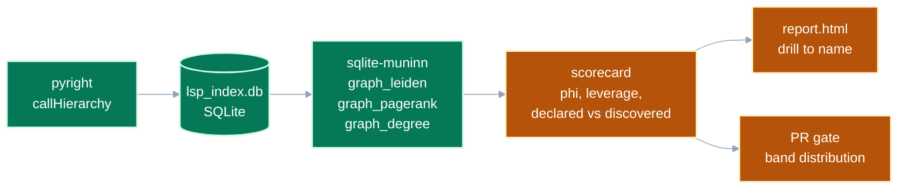

# A reviewability scorecard, and the tool that would compute it

**Status:** exploration, no decision made.
**Before you start:** you need [README.md](README.md) in this directory, and arithmetic.
**Every number here was measured** against `src/pytest_xharness_eval/` on 2026-09-10, by the scripts named in [How these numbers were produced](#how-these-numbers-were-produced).

[README.md](README.md) left two things open.
It found that most metric pairs are two springs rather than a spring and a damper.
It had no rule for telling which pairs damp.
It named conductance and leverage as the promising candidates, and computed neither.

This document supplies the rule, computes both against this repository, and proposes the scorecard they make.

---

<details>
<summary><b>Table of Contents</b></summary>
<!--TOC-->

- [A reviewability scorecard, and the tool that would compute it](#a-reviewability-scorecard-and-the-tool-that-would-compute-it)
  - [The rule we were missing: springs are extensive, dampers are intensive](#the-rule-we-were-missing-springs-are-extensive-dampers-are-intensive)
  - [What conductance is](#what-conductance-is)
  - [What conductance is not: the volume floor](#what-conductance-is-not-the-volume-floor)
  - [This repository, measured](#this-repository-measured)
  - [Leverage is the same question asked of one name](#leverage-is-the-same-question-asked-of-one-name)
  - [The two axes disagree, and the disagreement is the damping](#the-two-axes-disagree-and-the-disagreement-is-the-damping)
  - [What the graph found without being told](#what-the-graph-found-without-being-told)
  - [A folder structure is a model](#a-folder-structure-is-a-model)
  - [The scorecard](#the-scorecard)
  - [The tool](#the-tool)
  - [Scoring a pull request](#scoring-a-pull-request)
  - [How these numbers were produced](#how-these-numbers-were-produced)
  - [What is still open](#what-is-still-open)

<!--TOC-->
</details>

---

## The rule we were missing: springs are extensive, dampers are intensive

[README.md](README.md) tested candidate pairs one at a time.
It asked whether the cheapest refactor moves the two terms in opposite directions.
That test is right, and it is slow, because it gives no clue where to look next.

Thermodynamics has the general form.

An **extensive** quantity scales with the amount of stuff.
Cut the system in half and each half has less of it.
Volume, mass and energy are extensive.
In code: lines, statements, branches, nesting depth and parameters.

An **intensive** quantity is a ratio of two extensive ones.
Cut the system in half and each half has the *same* value.
Pressure, temperature and density are intensive.
In code: conductance, leverage, duplication rate.

Now the point.

> Extraction is subdivision.
> It is the operation that lowers every extensive per-unit metric for free, without changing what the program does.

That is the "no floor" result from [README.md](README.md), restated in a way that names its own cure.
A gate built only on extensive metrics is always satisfiable by subdivision, and subdivision is free.
So the damper cannot be extensive.
It has to be a ratio, because subdivision does not move a ratio.

This explains every row of the two-springs table at once, rather than one row at a time.

| Pair from [README.md](README.md) | Kinds | Why it behaves that way |
|---|---|---|
| complexity + lines | extensive + extensive | subdivision lowers both, so two springs |
| complexity + nesting | extensive + extensive | subdivision lowers both, so two springs |
| unit size + unit count | conjugate factors | their product is total lines, which subdivision conserves |
| complexity + conductance | extensive + intensive | subdivision cannot move the ratio |

**Takeaway:** to find a damper, do not search for a metric that rises.
Search for a ratio.

---

## What conductance is

Conductance scores a *cluster* in a graph, not a unit of code.
For a set of nodes `S`:

```
cut(S)   edges with exactly one endpoint in S       the boundary
vol(S)   edge endpoints incident to S               an internal edge counts 2, a boundary edge 1
phi(S) = cut(S) / min(vol(S), vol(rest))            conductance, between 0 and 1
```

`phi` near 0 is a cluster that mostly talks to itself.
`phi` near 1 is a cluster where nearly every edge leaves.
Ousterhout calls these deep and shallow modules, and this is the arithmetic version of that distinction.

The two graphs below have **the same node count and the same volume**, and differ only in where the edges go.

```cytoscape
{ "elements": [
  { "data": { "id": "deep", "label": "deep module   phi 0.091" } },
  { "data": { "id": "A", "parent": "deep", "label": "A" } },
  { "data": { "id": "B", "parent": "deep", "label": "B" } },
  { "data": { "id": "C", "parent": "deep", "label": "C" } },
  { "data": { "id": "D", "parent": "deep", "label": "D" } },
  { "data": { "id": "E", "parent": "deep", "label": "E" } },
  { "data": { "id": "call1", "label": "caller", "variant": "alt" } },
  { "data": { "source": "call1", "target": "A", "label": "1 boundary" } },
  { "data": { "source": "A", "target": "B" } },
  { "data": { "source": "A", "target": "C" } },
  { "data": { "source": "B", "target": "D" } },
  { "data": { "source": "C", "target": "D" } },
  { "data": { "source": "D", "target": "E" } }
], "layout": { "name": "dagre", "rankDir": "LR" }, "height": 340 }
```

Five internal edges and one boundary edge.
`vol` is `2 x 5 + 1 = 11`, `cut` is `1`, so `phi` is `1/11 = 0.091`.

```cytoscape
{ "elements": [
  { "data": { "id": "shallow", "label": "shallow module   phi 0.818" } },
  { "data": { "id": "P", "parent": "shallow", "label": "P" } },
  { "data": { "id": "Q", "parent": "shallow", "label": "Q" } },
  { "data": { "id": "R", "parent": "shallow", "label": "R" } },
  { "data": { "id": "S", "parent": "shallow", "label": "S" } },
  { "data": { "id": "T", "parent": "shallow", "label": "T" } },
  { "data": { "id": "x1", "label": "caller 1", "variant": "alt" } },
  { "data": { "id": "x2", "label": "caller 2", "variant": "alt" } },
  { "data": { "id": "x3", "label": "caller 3", "variant": "alt" } },
  { "data": { "source": "P", "target": "Q" } },
  { "data": { "source": "x1", "target": "P" } },
  { "data": { "source": "x1", "target": "Q" } },
  { "data": { "source": "x1", "target": "R" } },
  { "data": { "source": "x2", "target": "R" } },
  { "data": { "source": "x2", "target": "S" } },
  { "data": { "source": "x2", "target": "T" } },
  { "data": { "source": "x3", "target": "P" } },
  { "data": { "source": "x3", "target": "S" } },
  { "data": { "source": "x3", "target": "T" } }
], "layout": { "name": "dagre", "rankDir": "LR" }, "height": 400 }
```

One internal edge and nine boundary edges.
`vol` is `2 x 1 + 9 = 11`, `cut` is `9`, so `phi` is `9/11 = 0.818`.

Same size, nine times the conductance.
No extensive metric can tell these two apart, because every extensive metric counts five nodes in both.

**Takeaway:** conductance measures where a boundary is drawn, which is the thing extraction moves and no per-unit count observes.

---

## What conductance is not: the volume floor

Eight files in this repository score `phi = 1.0`, a perfectly shallow module.
Among them are `model/verdict.py`, `model/clock.py` and `model/documents.py`.

Those scores are correct and meaningless.
`model/verdict.py` is a `StrEnum` and `model/clock.py` is a time source.
Neither has any internal call to make, so every edge leaves by construction.

A ratio with a small denominator is noise.
Conductance needs a minimum internal volume before it says anything, exactly as a coverage percentage on a three-line file says nothing.

There is a second, sharper version of the same trap.
`verify/facets.py` scores `phi = 0.0`, the deepest possible module, while **13 of its 17 names have no caller at all**.
It is not deep.
It is a public API whose callers live in consuming repositories, outside the graph we measured.

> Conductance is only meaningful relative to the graph you measured.
> A tool that cannot tell "no callers in scope" from "no callers" will award its best score to the code it understands least.

**Takeaway:** the scorecard's unit is the layer, not the file, and every cluster below a volume floor must report "not measurable" rather than a number.

---

## This repository, measured

The graph below is real.
It comes from 312 callable definitions and 380 call edges, extracted from `pyright` through `textDocument/prepareCallHierarchy` and `callHierarchy/incomingCalls`.
Each node is one architectural layer, each edge is a call from one layer into another, and the edge label is how many.

```cytoscape
{ "data": "data/layers.json" }
```

| Layer | Names | Internal | Boundary | `vol` | `phi` | Singleton rate | Mean leverage |
|---|---|---|---|---|---|---|---|
| `verify` | 60 | 35 | 7 | 77 | **0.091** | 0.25 | 0.58 |
| `derive` | 31 | 29 | 11 | 69 | **0.159** | **0.81** | 1.19 |
| `harness` | 68 | 65 | 26 | 156 | 0.167 | 0.50 | 1.16 |
| `model` | 69 | 45 | 88 | 178 | 0.494 | 0.41 | 1.87 |
| `plugin` | 34 | 25 | 49 | 99 | 0.495 | 0.44 | 0.74 |
| `emit` | 25 | 17 | 40 | 74 | 0.541 | 0.72 | 1.36 |
| `runtime` | 19 | 11 | 44 | 66 | 0.667 | 0.47 | 1.89 |
| `<root>` | 6 | 5 | 31 | 41 | 0.756 | 0.83 | 0.83 |

Read the extremes first.

`verify` is the deepest layer at `phi = 0.091`, which is what a self-contained grader toolkit should look like.
`runtime` and the two root entry points are the shallowest, which is what an entry point should look like.
`model` sits at `0.494` with 88 boundary edges, because it is the shared vocabulary that every layer above it imports.

That last one matters.
A high conductance is not automatically a defect.
`model` is *supposed* to be reached from everywhere, so its score describes its job rather than indicting it.

**Takeaway:** conductance ranks layers in an order an architect would recognise, which is the minimum bar before trusting it to grade anything.

---

## Leverage is the same question asked of one name

Conductance asks whether a *cluster* earns its boundary.
**Leverage** asks whether a *name* earns its own: how many distinct call sites does this one name save you from reading?

[README.md](README.md) named the discriminator and could not compute it.
It is the in-degree of a node in the call graph, so it costs one query.

- Leverage 0: no caller in the measured graph.
- Leverage 1: you tidied.
- Leverage 3 or more: you found a rule.

Across this repository the mean leverage is **1.22** and **47.8%** of names have exactly one caller.
The graph below is one layer, `derive`, with every name grouped into its leverage band.

```cytoscape
{ "data": "data/derive.json" }
```

`derive` is the interesting case, and it is why one number was never going to be enough.

Its conductance is **0.159**, the second-deepest layer in the repository.
Its singleton rate is **0.81**, the second-worst.
Those two facts are both true, and they describe different things.

`derive` is a pipeline.
A chain of steps that each call the next is maximally self-contained, so conductance loves it.
Every step in a chain is called exactly once, so leverage hates it.

Look at the empty band in that graph.
Not one of `derive`'s 31 names is reached from three places, and none is dead either.
For contrast `model` has 15 such names out of 69, which is what a shared vocabulary looks like.

**Takeaway:** conductance grades the boundary, leverage grades the granularity, and a module can pass one while failing the other.

---

## The two axes disagree, and the disagreement is the damping

Put a module's size on one axis and its conductance on the other, and the plane has four corners.

|  | small | large |
|---|---|---|
| **shallow (high `phi`)** | **Tidied.** Many thin names, each serving one caller. Every extensive metric is green. | **Fragmented.** Large and leaky. The worst corner. |
| **deep (low `phi`)** | **Deep.** Small interface, self-contained. The target. | **Dense.** Large but self-contained. Split it inwards, do not export. |

The prescription differs per corner, which is what makes this a scorecard rather than a score.

Now trace what extraction does to a position on that plane.
This is the part that does the damping.

| The move | Size | Conductance | Leverage of the new name | Where you land |
|---|---|---|---|---|
| Extract 3 duplicate blocks, same module | down | **down** | 3 | Dense towards Deep, a clear win |
| Extract 3 duplicate blocks, shared module | down | **up** | 3 | Deep towards Tidied, a real trade |
| Extract one nested block, same module | down | slightly down | 1 | nowhere, at the price of one name |
| Extract one nested block, shared module | down | **up** | 1 | Deep towards Tidied, pure loss |

Row two is the important one.
Moving genuinely shared code into a shared module is usually right, and it **raises** conductance.
Three call sites now cross a boundary they did not cross before.

So the two axes can be made to conflict, and no move maximises both.
That is not a flaw in the pair.
That is the definition of a damped pair, and it is the property [README.md](README.md) went looking for.

**Takeaway:** the scorecard's job is to price the trade and show the direction of travel.
It must never collapse that into one number an optimiser can climb.

---

## What the graph found without being told

The folders under `src/pytest_xharness_eval/` are a **declared** partition.
A person decided which names belong together, and [CLAUDE.md](../../../CLAUDE.md) writes the rule down.

A community detection algorithm computes a **discovered** partition from the call graph alone.
`graph_leiden` from [sqlite-muninn](https://pypi.org/project/sqlite-muninn/) does this in one query.

The obvious move is to score both with conductance and compare.
We did that first, and it is wrong.
The comparison it produces is reported in [A folder structure is a model](#a-folder-structure-is-a-model).
The reason it fails is the most useful thing in this document.

Here is the specific result that convinced us the measurement is real.

Leiden put seven names in one community at `phi = 0.25`.
Six live in `derive/skillcov.py`.
The seventh is `Shells.of`, in `model/registry.py`.

```cytoscape
{ "data": "data/community.json" }
```

[ADR 0039](../../adrs/index.md) declares `model/registry.py` **the one permitted exception** to the layering rule, because the shell vocabulary that `derive/skillcov.py` attributes with has to reach the registry.
Nobody told the algorithm that.
It read 380 call edges and rediscovered the documented exception as a cluster spanning the boundary.

Two other communities are worth naming.

- Community 16, `phi = 0.061`: eleven token-accounting properties on `RunResult`, plus `CellMetrics.of` from `emit/`. The tightest cluster in the repository, and it straddles a layer boundary.
- Community 13, `phi = 0.478`: ten names spanning four layers, tracing the session-log to result path. Loose, wide and exactly the pipeline the architecture describes.

**Takeaway:** the discovered partition is a second opinion on the architecture, expressed in the same units as the first.
That is what makes it arguable rather than merely interesting.

---

## A folder structure is a model

Folders are usually treated as filing.
They are not.
A folder structure is a **model** of the code, and it makes exactly one prediction.

> A call stays inside a folder.

Every call that crosses a folder boundary is a prediction the model got wrong.
It is a fact the reader has to carry individually, because no rule produced it.

That is precisely `L(D given H)` from [README.md](README.md), the leftover after the rules you already know.
So the folder structure is `H`, the call graph is `D`, and the boundary-crossing edges are the residual.
A codebase where the folders match the call graph has a small residual.
A codebase where they do not makes you memorise the exceptions.

**This is why the naive comparison fails.** It compares two residuals while ignoring what each model costs to state.
Scoring the declared and discovered partitions with conductance alone compares two `L(D given H)` values while ignoring their `L(H)`.
Leiden can always lower the residual by inventing more clusters.
At the limit, one cluster per name has no residual at all and explains nothing.
The two-part code is not optional here.
It is the only thing standing between this measurement and a metric that rewards shredding the codebase.

Scoring both halves, in bits, over the 276 names that appear in a call edge:

| Partition | Clusters | `L(H)` | `L(D given H)` | Residual saved | **Bits saved per boundary** |
|---|---|---|---|---|---|
| One cluster, no architecture | 1 | 0 | 3081 | 0% | 0 |
| **The declared folders** | **8** | 828 | 2446 | 20.6% | **90.7** |
| One cluster per file | 37 | 1438 | 2216 | 28.1% | 24.0 |
| Leiden communities | 85 | 1769 | 1746 | 43.3% | 15.9 |
| One cluster per name | 276 | 2238 | 3081 | 0% | 0 |

Read the last column, not the total.

The declared folders save **90.7 bits of residual for every boundary they ask you to learn**.
A file boundary saves 24.0.
A Leiden community saves 15.9.
By this measure the eight hand-drawn folders are the most efficient partition of the five, by a factor of 3.8 over the next best.

That is the same shape as leverage per name, asked of a boundary instead of a name.
It is also the same shape as the `BIC` penalty in [README.md](README.md).
A new cluster, like a new name, has to earn its own price.

**A caveat that the number cannot carry on its own.** The `total` column is not usable.
The `total` column is not usable, and we are reporting it rather than hiding it.
Under this coding scheme "one cluster" wins outright at 3081 bits.
Inside a single cluster of 276, the internal index costs exactly what a global index costs.
The scheme is degenerate at `k = 1`.
Tuning it until the folders won the total would be the laundering that [README.md](README.md) warns against.
The per-boundary column is what we are prepared to defend.

**Takeaway:** folder structure is a testable model of the call graph, and its residual is countable in bits.
A partition has to pay for every boundary it introduces.

---

## The scorecard

Every file in the repository, plotted as size against conductance.
This is the view that answers "which parts of this need attention", the way a coverage report does.

```plotly
{ "data": "data/quadrant.json" }
```

Marker size is the number of names in the file.
Hollow, faded markers are below the volume floor, where conductance does not yet mean anything.

The scorecard proper is three scopes, each pairing one extensive axis with one intensive one.

| Scope | Extensive axis (the spring) | Intensive axis (the damper) | Reported as |
|---|---|---|---|
| Name | lines in the function | leverage, weighted by `graph_pagerank` | risk band |
| Layer | names in the layer | conductance | risk band plus direction |
| Repository | clusters declared | bits of residual saved per boundary | one number, tracked over time |

Two design rules carry over from the prior art in [README.md](README.md).

- **Gate a distribution, not a unit.** Score the percentage of code in each risk band, in the style of the SIG model, rather than capping any single function.
- **Let an exceedance buy its way out.** A band breach that carries a written reason passes, which is the policy this repository's ADR habit already implements.

And one rule is new here.

> Never report an intensive metric without its denominator beside it.
> `phi = 0.0` on four internal edges is not a score.
> A scorecard that prints it as one has taught its reader to distrust every other cell.

---

## The tool

The substrate already exists in this repository, in two pieces that have not been joined.



The green boxes work today.
The amber boxes are the whole of the remaining build.

**The `lsp` skill is the right foundation and it has two defects.**

First, its index records **0 references** on this repository.
It derives references from `textDocument/semanticTokens`, which open-source `pyright` does not implement, because semantic tokens are a Pylance feature.
`callHierarchy` is the supported path, and it is what the call graph above uses.
It is also semantically better: a *call* graph rather than a token-coincidence graph.

Second, `index` exits **0** when no language server is found.
The failure is reported inside the JSON payload while the exit code says success.
A missing hard requirement should fail loudly.

**`sqlite-muninn` supplies the primitives the scoring layer needs**, which today would otherwise be hand-written recursive CTEs.

| Primitive | Use in the scorecard |
|---|---|
| `graph_degree` | leverage, directly |
| `graph_pagerank` | leverage weighted by how important the caller is |
| `graph_leiden` | the discovered partition, to compare against the folders |
| `graph_node_betweenness` | names that traffic has to route through |
| `graph_components` | reachability islands, and orphan detection |

`graph_pagerank` is a real improvement on raw in-degree.
In-degree treats every caller as equal.
PageRank weights a caller by its own importance, so a helper called once from a hot entry point outranks one called once from dead code.

The proposal is to lift `lsp_explorer.py` into `tools/lsp.py` in this repository and iterate there, with `callHierarchy` replacing semantic tokens and muninn behind the scoring queries.

---

## Scoring a pull request

The user-facing shape is a coverage report, and the analogy is close enough to steal wholesale.

| Coverage report | Reviewability report |
|---|---|
| line hit or miss | name leverage, from `graph_degree` |
| percentage per file | risk band per layer |
| drill down to a line | drill down to a name |
| `--diff` against a branch | the same, over changed files |
| `.coverage`, a SQLite file | `lsp_index.db`, a SQLite file |
| `fail_under` | band distribution thresholds |

One thing does not carry over, and it is the constraint that shapes the tool.

> Coverage can be computed from the diff alone.
> Conductance and leverage cannot.

A changed function's leverage depends on callers that did not change.
A layer's conductance depends on edges whose other end is nowhere near the diff.
So the **index must be global even when the report is local**.

That is not a limitation, it is a specification.
Index the repository once, update changed files incrementally, and filter the *report* rather than the *graph*.
The `lsp` skill already has `--cache-incremental` for exactly this.

A pull request then gets two numbers.

- The band distribution over the names it touched.
- The change in declared conductance for any layer it touched, which is the ratchet.

---

## How these numbers were produced

Four scripts, under `tmp/conductance/`, run in order.

| Script | What it does |
|---|---|
| `callgraph.py` | opens all 45 source files in `pyright`, walks `documentSymbol` for callables, then `prepareCallHierarchy` and `incomingCalls` for edges |
| `score.py` | conductance and leverage per layer and per file |
| `communities.py` | `graph_leiden` and `graph_pagerank` through `sqlite-muninn`, and the declared against discovered comparison |
| `mdl.py` | the two-part code in bits, for five candidate partitions |
| `payloads.py` | the cytoscape and plotly payloads this page renders |

```bash
uv tool install pyright                                        # the one prerequisite
uv run --with "lsprotocol>=2024.0.0" tmp/conductance/callgraph.py
uv run tmp/conductance/score.py
uv run --python 3.13 tmp/conductance/communities.py
uv run --python 3.13 tmp/conductance/mdl.py
uv run tmp/conductance/payloads.py
```

`sqlite-muninn` needs a Python built with loadable SQLite extensions.
The system Python on macOS is not, so `--python 3.13` selects a `uv`-managed build that is.

---

## What is still open

**The risk bands have no calibration.** Every threshold in the scorecard above is a guess.
Every threshold in the scorecard above is a guess.
The SIG bands were derived from about 200 systems, and nothing equivalent exists for conductance.
Deriving them from a benchmark of real repositories is the largest unfunded piece of work here.

**The volume floor has no derivation either.** Three internal edges is the figure used in the plot above.
Three internal edges is the figure used in the plot above, and it was chosen because it looked right.

**The coding scheme is a choice, and it changes the answer.** `L(H) = n log2(k)` with a global index for crossing edges is simple.
`L(H) = n log2(k)` with a global index for crossing edges is defensible and simple.
It is also degenerate at one cluster, and a different scheme could rank the five partitions differently.
The Map Equation used by Infomap is the standard treatment of this exact question, and adopting it would replace a judgement call with a citation.

**Leverage under-counts for a library.** 24.7% of names here have no caller in the graph.
24.7% of names in this repository have no caller in the graph, and most of those are the published grader surface that consuming repositories call.
The tool has to read something like `docs/rollout.md` to know which names are public, or every library will grade itself as mostly dead code.

**Nothing here is validated against review effort.** Conductance and leverage have not been tested at all.
[README.md](README.md) records that 121 metrics have been tested against understandability and none reached even a medium correlation.
Conductance and leverage have not been tested at all.
They are better *arguments* than cyclomatic complexity, and that is not the same as being better *predictors*.

**The honest summary.** We have a rule for finding dampers, and two computable metrics that satisfy it.
We now have a rule for finding dampers, two computable metrics that satisfy it, and a demonstration that they see real architecture.
We do not have thresholds, and we do not have evidence that the numbers predict anything about reviewing.
